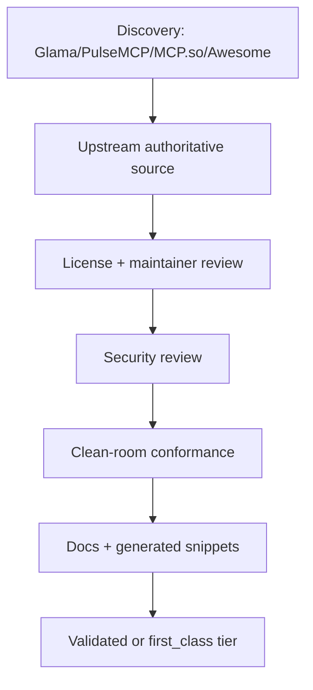

# MCP Strategy

## MCP role

MCP is the live-systems layer. Use it when value depends on current external state or runtime tool control.

## Promotion flow

## MCP retained categories

- browser automation and DOM/runtime validation
- live SaaS systems such as GitHub, Linear, Jira, Notion
- observability/incident telemetry
- current documentation lookup
- external search/research APIs
- cloud control planes
- database inspection where direct CLI would be unsafe or insufficient

## MCP-to-skill replacement rule

If a server only exposes static prompts, static docs, or deterministic local scripts, prefer converting it to a skill.

## Install preference

- Python servers: `uvx` or pinned `uvx --from <package>`.
- Node servers: `npx -y <package>`.
- Remote servers: Streamable HTTP with explicit auth model.

## Transport notes

The current MCP spec defines stdio and Streamable HTTP as standard transports. The planning docs should avoid new SSE-only support except as legacy compatibility.

## Security requirements

- no config entries with inline secrets
- env var references only
- least privilege tokens
- per-harness allowlists
- conformance tests that detect stdout pollution for stdio servers
