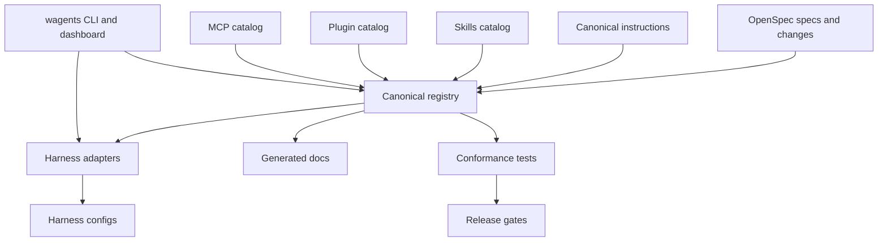

# Architecture Overview

## Target architecture

## Core abstractions

1. `Capability`: a thing the repo can expose: instruction, skill, plugin, MCP, agent, hook, OpenSpec workflow.
2. `Harness`: an AI client/runtime with config paths and supported capability types.
3. `Projection`: a rendered harness-specific artifact.
4. `SupportTier`: tested/maturity status.
5. `TrustTier`: provenance/security posture.
6. `OpenSpecChange`: durable change proposal/design/task/spec-delta unit.
7. `Transaction`: config write with backup and rollback.

## Implementation anchors

Known public repo anchors include `pyproject.toml`, `wagents/`, `config/`, `instructions/`, `skills/`, `mcp/`, `.claude/`, `.cursor/`, `.opencode/`, `.codex-plugin/`, `.agents/`, `tests/`, and `docs/`.

## Acceptance criteria

- Canonical registries exist and are schema-validated.
- Harness adapters render from registries instead of duplicate hand-maintained config.
- Docs pages render from registry data.
- CI fails when generated docs/configs are stale.
- Every first-class harness has golden fixtures.
- OpenSpec changes are required for structural changes.
