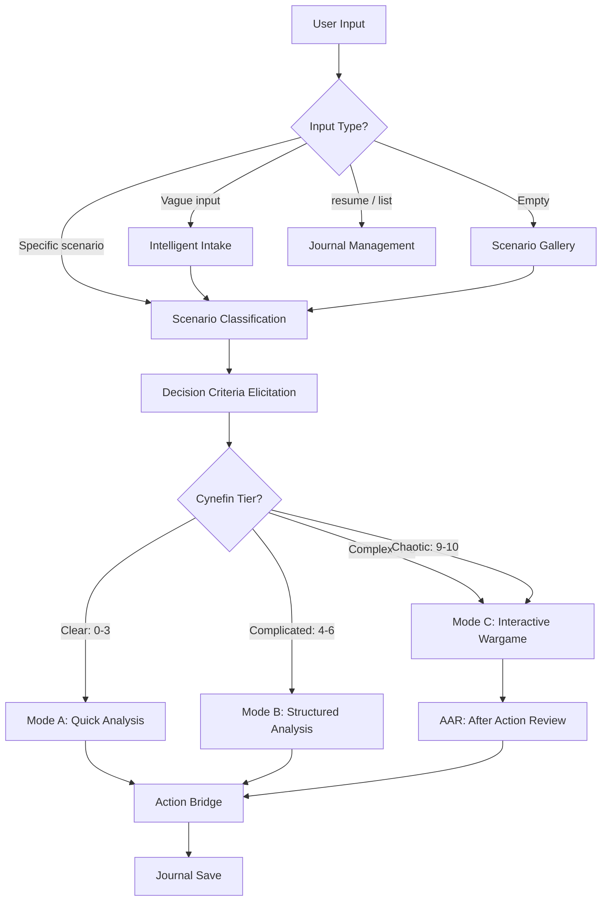

import { Badge, Tabs, TabItem, Card, CardGrid, LinkCard, Aside, Steps } from '@astrojs/starlight/components';

This guide covers the architecture, decision science foundations, and design rationale behind the `/wargame` skill. For usage instructions and the full specification, see the [auto-generated skill reference](/skills/wargame/).

---

## Architecture

The wargame skill is organized as a self-contained skill directory with reference documents that the LLM reads on demand during execution.

### File Tree

```
skills/wargame/
  SKILL.md                          # Main skill specification (dispatch, modes, rules)
  references/
    frameworks.md                   # 13 decision analysis frameworks + selection heuristics
    wargame-engine.md               # Actor model, turn structure, adjudication, protocols
    cognitive-biases.md             # 10 human + 4 LLM biases, sweep protocol, constitution
    output-formats.md               # 20+ display templates, box-drawing system, UX rules
    visualizations.md               # 3-tier viz system (Unicode, Mermaid, HTML dashboard)
  templates/
    dashboard.html                  # Composable HTML dashboard (~600 lines, 12+ views)
```

Reference files are loaded lazily -- the LLM reads each file only when its content is needed (e.g., `frameworks.md` during framework selection, `cognitive-biases.md` during bias sweeps). This keeps the active context budget lean while the full specification spans thousands of tokens.

### Mode Flow

Every invocation follows the same pipeline, branching at classification:



<Aside type="tip">
The user can override the classification tier at any point. If a Quick Analysis reveals unexpected complexity, the skill offers to re-classify upward.
</Aside>

---

## Features

### UX Features

<Tabs>
  <TabItem label="Intake">
    **Scenario Gallery** -- When invoked with no arguments, presents 8 pre-built scenarios spanning business, career, crisis, geopolitical, personal, startup, negotiation, and technology domains. Each scenario is tagged with its likely Cynefin tier.

    **Guided Intake** -- The `"guide me"` option walks the user through three sequential questions: situation and trigger, stakes and players, constraints and unknowns. Synthesizes answers into a concrete scenario description.

    **Intelligent Intake** -- For vague or general inputs, runs a three-phase protocol: (1) web research to gather domain context, (2) targeted interview informed by research findings, (3) alignment confirmation before classification. Degrades gracefully when web search is unavailable.
  </TabItem>
  <TabItem label="Journals">
    **YAML Frontmatter** -- Every journal uses machine-parseable YAML frontmatter with scenario title, tier, mode, difficulty, status, timestamps, criteria, actors, and domain tags. v1 fallback parsing for legacy journals.

    **Semantic Slugs** -- Filenames follow `{YYYY-MM-DD}-{domain}-{slug}.md` with 3-5 word semantic summaries (e.g., `2026-02-17-biz-supplier-acquisition-crisis.md`).

    **Filtered List** -- The `list` command supports AND-combined filters: `list active`, `list biz`, `list complex`. Reverse chronological sort.

    **Keyword Resume** -- Resume by number (`resume 3`), keyword (`resume supplier`), or auto-detect the single in-progress journal (`resume`).

    **Lifecycle** -- Archive journals older than 90 days, delete by number with confirmation, abandon in-progress wargames gracefully.

    **State Snapshots** -- HTML comment YAML blocks appended after each turn enable fast resume without full-journal reconstruction.
  </TabItem>
  <TabItem label="Session UX">
    **Progressive Disclosure** -- The `?` command reveals the full command menu only when requested, keeping the default interface clean.

    **Difficulty Levels** -- Four levels (optimistic, realistic, adversarial, worst-case) auto-mapped from tier but user-overridable. Affects actor behavior, inject frequency, adjudication friction, and analysis tone.

    **Transparent Classification** -- Every score includes a reasoning column explaining each dimension. "Why This Tier" and "What Would Change" sections make the classification auditable.

    **User Override Rights** -- The user can override tier, difficulty, end early, skip sections, or redirect analysis at any point. The skill acknowledges overrides without resistance.
  </TabItem>
</Tabs>

### Analysis Tools

14 in-session commands available at any decision point during active analysis or wargame sessions:

<Tabs>
  <TabItem label="Analysis">
    | Command | Purpose |
    |---------|---------|
    | `red team` / `challenge` | Build the strongest case against the preferred option -- weakest assumptions, concrete attack vectors, historical analog, counter-recommendation |
    | `what if <condition>` | Focused counterfactual tracing first, second, and third-order effects (max 3 per decision) |
    | `explore [N]` | Monte Carlo exploration with multi-axis diversity -- varies actor decisions, information states, random events, adjudication outcomes, and external context (default N=10) |
    | `sensitivity` | Parameter sensitivity tornado diagram ranking variables by outcome swing magnitude |
    | `calibrate` | Probability calibration audit -- checks base rate anchoring, overconfidence, Fermi decomposition |
  </TabItem>
  <TabItem label="Strategy">
    | Command | Purpose |
    |---------|---------|
    | `delphi` / `experts` | Synthetic expert panel with 3-5 domain experts, structured disagreement, convergence/divergence analysis, and crux identification |
    | `forecast` / `base rate` | Reference class forecasting with Fermi decomposition, base rate anchoring, and granular probability adjustment |
    | `negotiate` / `batna` | BATNA/ZOPA negotiation mapping -- reservation values, aspiration points, value creation opportunities, power dynamics |
    | `options` / `optionality` | Real options framing -- options created vs destroyed, exercise triggers, optionality ranking under uncertainty |
    | `cause` / `causal` | Lightweight causal diagram with feedback loops (reinforcing and balancing) and intervention point identification |
    | `morph` / `scenarios` | Morphological scenario generator -- cross-product of key dimensions, consistency filtering, cluster analysis, wild cards, robust moves |
  </TabItem>
  <TabItem label="Session">
    | Command | Purpose |
    |---------|---------|
    | `criteria` | Set or re-rank decision criteria at any time -- criteria propagate into option annotations, rankings, and quadrant charts |
    | `export` / `dashboard` | Render composable HTML dashboard with JSON-in-script pattern -- classification, turn, analysis, or AAR views |
    | `?` | Show categorized command menu |
  </TabItem>
</Tabs>

### Behavioral Realism

The Interactive Wargame mode models actors with behavioral parameters grounded in decision science:

<CardGrid>
  <Card title="Risk Posture">
    Qualitative risk profile (risk-seeking / risk-neutral / risk-averse) measured against each actor's reference point. Hawks default to risk-seeking; doves to risk-averse. Risk-averse actors reject favorable gambles to avoid losses; risk-seeking actors escalate after setbacks.
  </Card>
  <Card title="Attention Style">
    Cognitive bandwidth model (reactive / adaptive / agile). Reactive actors process one development at a time and satisfice under pressure. Agile actors process many signals in parallel. Bureaucrats default to reactive; disruptors to agile.
  </Card>
  <Card title="Bayesian Belief Updating">
    Each actor maintains probabilistic beliefs about other actors' intentions. Beliefs update incrementally via likelihood ratios after observing actions. Costly signals trigger larger updates than cheap talk. Reactive actors update more slowly.
  </Card>
  <Card title="Signal Classification">
    Every action is classified as a costly signal (consumes resources, high credibility), cheap talk (verbal declaration, low credibility), or mixed. Signal credibility feeds directly into belief updating magnitude.
  </Card>
</CardGrid>

**Constraint Priority Tiers** -- The engine manages approximately 24 active constraints organized into three tiers:

| Tier | Label | Count | Scope |
|------|-------|-------|-------|
| 1 | **Structural** (never skip) | ~10 | Turn sequence, adjudication, journal save, decision menu, unexpected consequence, dissenting actor |
| 2 | **Quality** (best-effort) | ~8 | Anti-escalation, anti-blue-bias, signal classification, choice architecture, consider-the-opposite, bias callouts, belief updating |
| 3 | **Enrichment** (when context allows) | ~6 | Sparkline trends, attention style effects, per-action signal taxonomy, EVPI, Mermaid in journal |

### Decision Science

<Tabs>
  <TabItem label="Superforecasting">
    Integrates Tetlock's superforecasting methodology throughout:
    - **Fermi decomposition** -- Break complex probabilities into estimable sub-questions
    - **Base rate anchoring** -- Every estimate starts from an outside-view base rate before scenario-specific adjustment
    - **Granular probabilities** -- Percentages (`35%`), not vague labels (`medium likelihood`)
    - **Calibration audits** -- The `calibrate` command checks all estimates for overconfidence (widen by 50%) and base rate anchoring
  </TabItem>
  <TabItem label="Choice Architecture">
    Option presentation is itself a bias vector. Four mitigations are integrated into every decision menu:
    1. **Randomized order** between turns to prevent primacy/recency bias
    2. **Dual framing** -- risk presented in both positive and negative frames (`70% success` AND `30% failure`)
    3. **Active "do nothing"** -- status quo presented as an active choice requiring justification, not the default
    4. **Uncertainty ranges** -- `moderate (range: low-high)` instead of point estimates
  </TabItem>
  <TabItem label="EVPI">
    After Monte Carlo exploration, the skill identifies the variable whose resolution would most change the outcome distribution:

    > *If you could know ONE thing with certainty, the most valuable would be: [variable]. Knowing this could shift your expected outcome from [current range] to [resolved range]. Investment suggestion: [specific action].*

    This tells the user where to invest in information gathering before committing.
  </TabItem>
  <TabItem label="Constitution">
    A 3-principle self-revision checklist applied at exactly two points (after final recommendation in Quick/Structured, after AAR in Wargame):
    1. **Adversary parity** -- Adversary actors receive the same quality of strategic reasoning as user-aligned actors
    2. **Grounded outcomes** -- Outcomes grounded in scenario conditions, not dramatic preference
    3. **Calibrated confidence** -- Confidence matched to available information, not inflated for rhetoric

    Plus **consider-the-opposite** debiasing: after user decisions that conflict with a specific actor's stated objective, briefly show that actor's opposing perspective.
  </TabItem>
</Tabs>

---

## Frameworks Catalog

The skill draws from 13 decision analysis frameworks, selected via a heuristic matching table:

| # | Framework | Best For |
|---|-----------|----------|
| 1 | Pre-Mortem | Identifying failure modes before they happen |
| 2 | Red Team / Devil's Advocacy | Stress-testing a preferred option |
| 3 | SWOT (via Scenario Planning 2x2) | Quick strengths/weaknesses snapshot |
| 4 | Analysis of Competing Hypotheses (ACH) | Evaluating rival explanations with evidence matrix |
| 5 | Stakeholder Power/Interest Mapping | Mapping influence, engagement, and coalition dynamics |
| 6 | Decision Trees with Expected Value | Quantifying branching outcomes with option value extension |
| 7 | Payoff Matrix / Game Theory | Comparing options across scenarios, finding Nash equilibria |
| 8 | Scenario Planning (2x2) | Exploring multiple futures along two critical uncertainties |
| 9 | OODA Loop | Fast-cycle competitive response under incomplete information |
| 10 | Second-Order Effects Chain | Tracing cascading consequences and feedback loops |
| 11 | Regret Minimization | Minimizing worst-case regret for irreversible decisions |
| 12 | Key Assumptions Check | Surfacing unstated assumptions before analysis |
| 13 | Multi-Criteria Decision Analysis (MCDA) | Weighted scoring across dimensions with sensitivity testing |

<Aside type="note">
**Framework selection heuristic by mode:** Quick Analysis uses 2-3 frameworks. Structured Analysis chains 3-5 (including ACH when competing explanations exist). Interactive Wargame integrates frameworks throughout turns with adversarial red-teaming. Superforecasting methodology (Fermi decomposition + base rates) applies whenever any framework requires probability estimates.
</Aside>

---

## Cognitive Bias Engine

The skill maintains a dual bias catalog -- human decision biases detected in user strategies, and LLM-specific biases mitigated structurally in the simulation engine.

### Human Biases (10)

| # | Bias | Detection Signal | Challenge Prompt |
|---|------|-----------------|------------------|
| 1 | **Anchoring** | First option dominates; alternatives dismissed without comparison | "Remove the first option entirely. What would you choose if it never existed?" |
| 2 | **Confirmation** | Evidence cited only supports preferred outcome | "List three pieces of evidence that contradict your current position." |
| 3 | **Sunk Cost** | Justification references past investment, not future value | "If starting fresh today with zero prior investment, would you still choose this?" |
| 4 | **Availability** | Recent/vivid examples drive risk assessment over base rates | "Set aside that example. What does the statistical base rate actually say?" |
| 5 | **Planning Fallacy** | Best-case timelines; risks acknowledged but not quantified | "What happened the last three times a similar plan was attempted?" |
| 6 | **Groupthink** | Quick convergence; dissent framed as disloyal | "Appoint a designated dissenter. What is the strongest case against consensus?" |
| 7 | **Status Quo** | "No change needed" as default; burden of proof on change | "Assume the current state degrades 20% next cycle. Re-evaluate doing nothing." |
| 8 | **Overconfidence** | Estimates cluster near 0% or 100%; narrow uncertainty ranges | "Widen your confidence interval by 50%. What changes at the new bounds?" |
| 9 | **Loss Aversion** | Small downside risk blocks proportionally larger upside | "Reframe: instead of what you might lose, what is the cost of not capturing the gain?" |
| 10 | **Framing Effect** | Conclusions shift between "90% success" vs "10% failure" | "Restate this outcome using the opposite frame. Does your assessment change?" |

### LLM-Specific Biases (4)

These are always-on mitigations applied during adjudication -- structural failure modes of the simulation engine itself:

<CardGrid>
  <Card title="Escalation Bias">
    LLMs prefer dramatic outcomes. **Mitigation:** Flag unjustified escalation; require de-escalation alternatives for every aggressive action; suppress dramatic language without quantified impact.
  </Card>
  <Card title="Sycophancy">
    LLMs reinforce user framing. **Mitigation:** Adversarial prompting on user positions; at least one dissenting actor per turn; score adversary arguments independently.
  </Card>
  <Card title="Farcical Harmony">
    Multi-actor dialogues converge too quickly. **Mitigation:** Structured pro/con before consensus; mandatory dissent through first deliberation round; document concessions.
  </Card>
  <Card title="Blue Bias">
    LLMs underestimate adversaries. **Mitigation:** Calibrate adversary capabilities to real-world benchmarks; dedicated adversary advocate reviews adjudications; inject friction into friendly-force execution.
  </Card>
</CardGrid>

### Sweep Protocol

<Steps>
1. **Checkpoint 1 (Pre-adjudication):** Scan actor reasoning against human biases table. If detected, inject challenge prompt. Rate limit: max 1 human bias flag per 2 turns per actor.
2. **Checkpoint 2 (Post-adjudication):** Run all 4 LLM-specific mitigations (always-on, not rate-limited). Verify each criterion before finalizing turn output.
</Steps>

<Aside type="caution">
**Gamified debiasing delivery:** Instead of confrontational warnings, bias detection is framed as skill checks: "Bias detected: Anchoring. Your analysis weighted the first option 3x more heavily. Adjustment: evaluating options in reverse order." Interactive feedback in this style reduces biases 30%+ with lasting effects (Fasolo et al. 2025).
</Aside>

---

## Visualization System

Three tiers, with automatic fallback to the highest available:

<Tabs>
  <TabItem label="Tier 1: Unicode">
    <Badge text="Zero dependencies" variant="success" /> Always available in any terminal.

    - **Decision trees:** `--- CHOICE --- OPT A --- OPT B` with risk/gain per branch
    - **2x2 matrices:** SWOT, priority grids with box-drawing characters
    - **Force maps:** `SUPPORT <---> OPPOSE` with bar weights per stakeholder
    - **Resource bars:** `Military: 80%` with visual fill indicators
    - **Actor tables:** Multi-dimension status with bar indicators and trend arrows
    - **Timelines:** `T1 -- T2 -- T3` with event labels

    All Unicode visualizations include text equivalents (bars show both visual fill AND percentage).
  </TabItem>
  <TabItem label="Tier 2: Diagrams">
    <Badge text="Mermaid / Graphviz" variant="note" /> Auto-detected via `command -v mmdc` and `command -v dot`.

    Supported diagram types:
    - **Quadrant charts** -- Option assessment (risk vs reward axes)
    - **Timelines** -- Campaign progression and decision arcs
    - **Flowcharts** -- Decision trees with probability branches
    - **Causal diagrams** -- Variables with reinforcing (+) and dampening (-) links
    - **State diagrams** -- Actor state transitions
    - **Sequence diagrams** -- Actor interaction sequences
  </TabItem>
  <TabItem label="Tier 3: Rich HTML">
    <Badge text="Dashboard template" variant="tip" /> Composable HTML dashboard (~600 lines) with JSON-in-script rendering.

    **Pattern:** The LLM writes only the JSON data block. Template JS handles all rendering deterministically. Self-validating: malformed JSON falls back to a `<pre>` error display.

    **12+ view types:**

    | View | Sections | Trigger |
    |------|----------|---------|
    | `classification` | Score bars, tier badge, reasoning | After classification |
    | `turn` | Actors, options, inject, situation brief | Each wargame turn |
    | `analysis` | Grid (ACH/matrix/stakeholder subview) | Structured Analysis |
    | `aar` | Timeline, insights, paths not taken, action bridge | After AAR |
    | Compound views | Multiple views combined | `export` / `dashboard` command |

    **Design:** OKLCH color space, glass morphism effects, SVG data visualization, semantic HTML with `role` and `aria-label` attributes. Dark theme (`#0f172a` background).

    **Rendering flow:** Playwright screenshot (preferred) -- browser open (fallback) -- Tier 1 Unicode (always works).
  </TabItem>
</Tabs>

---

## Research Sources

The skill's design draws from peer-reviewed research, institutional wargaming practice, and decision science literature:

| Domain | Source | Key Contribution |
|--------|--------|-----------------|
| Prospect Theory | "LLM economicus?" (arXiv 2408.02784) | LLMs exhibit prospect-theory-like biases; explicit parameterization needed |
| Bayesian Games | "Game-theoretic LLM" (arXiv 2411.05990) | Structured workflows enable LLMs to compute Nash Equilibria under incomplete info |
| Signaling | Sobel; MIT OCW Game Theory | Costly vs cheap signals; credibility assessment |
| Superforecasting | Tetlock; Good Judgment Project | 60% improvement via Fermi decomposition + base rates + calibration |
| Choice Architecture | Thaler &amp; Sunstein; "Autonomous Choice Architect" (Springer) | Option presentation affects decision quality |
| Debiasing | Fasolo et al. 2025 (Journal of Management) | Interactive debiasing reduces biases 30%+ with lasting effects |
| Constitutional AI | Anthropic; C3AI (ACM 2025) | Self-revision principles improve analytical objectivity |
| Monte Carlo Diversity | "Monte Carlo Temperature" (Amazon 2025); NeurIPS 2025 | Multi-axis variation prevents narrative clustering |
| EVPI/EVSI | DeLLMa (ICLR 2025 Spotlight) | Information value analysis for decision prioritization |
| Bounded Rationality | Simon; Stanford Encyclopedia | Satisficing + processing capacity limits for realistic actors |
| Snow Globe | IQT Labs (arXiv 2404.11446) | Closest existing LLM wargame system; validates architecture |
| JHU APL GenWar | JHU APL (Oct 2025) | State-of-art institutional AI wargaming |
| Multi-Agent Debate | ICLR 2025 Blogpost | Persona diversity > structural parameters for debate quality |
| Wargaming | "Shall We Play a Game?" (arXiv 2509.17192) | Language models for open-ended wargames |

<Aside type="note">
Citations live in the docs, not in the skill specification. This saves approximately 200 tokens from the LLM's active context during execution while keeping the research trail fully auditable here.
</Aside>

---

## Design Decisions

Key resolved decisions with rationale. These document the "why" behind architectural choices that may appear non-obvious.

<Tabs>
  <TabItem label="Architecture">
    <Aside type="caution" title="1. No MCP server">
      Three showstoppers verified: `ctx.set_state` is request-scoped (no persistent state across tool calls), `ctx.elicit` is broken in Claude Code, and `ui://` protocol is unsupported. A pure-prompt skill with file-based state (journals) works reliably today. MCP integration deferred to v3 pending upstream fixes.
    </Aside>

    <Aside type="tip" title="2. Canonical turn specification in wargame-engine.md">
      SKILL.md contains only a summary reference to the turn structure. The full 13-step specification lives exclusively in `references/wargame-engine.md`. This eliminates dual specification (two sources of truth that can drift) at the cost of one extra file read per wargame session.
    </Aside>

    <Aside type="tip" title="3. Constraint priority tiers">
      With approximately 24 active constraints per turn, a priority system was necessary. Three tiers (structural/quality/enrichment) ensure the skill degrades gracefully under context pressure rather than failing unpredictably. Tier 1 constraints are never skipped; Tier 3 constraints fire only when budget allows.
    </Aside>
  </TabItem>
  <TabItem label="Behavioral Model">
    <Aside type="caution" title="4. Qualitative behavioral parameters">
      Early versions used lambda coefficients for prospect theory math. LLMs cannot reliably compute prospect theory equations, producing inconsistent numerical outputs. Replacing coefficients with qualitative risk posture (risk-seeking/neutral/averse) and attention style (reactive/adaptive/agile) preserves the behavioral insight while staying within LLM capabilities.
    </Aside>

    <Aside type="tip" title="5. Analytical constitution reduced from 7 to 3 principles">
      The original 7-principle self-revision checklist was too expensive to apply at every output. Reducing to 3 principles (adversary parity, grounded outcomes, calibrated confidence) applied at exactly 2 checkpoints maintains analytical rigor without bloating every turn.
    </Aside>
  </TabItem>
  <TabItem label="Data &amp; UX">
    <Aside type="tip" title="6. YAML frontmatter journals">
      Standard machine-parseable format enabling filtered list, keyword resume, and potential future cross-journal analytics. v1 fallback parsing ensures backward compatibility with legacy markdown-header journals.
    </Aside>

    <Aside type="tip" title="7. 10 to 14 analytical commands">
      All user-triggered, producing standalone output blocks with zero per-turn constraint burden. Adding `sensitivity`, `delphi`, `forecast`, and `negotiate` was free in constraint budget terms because they only fire on demand.
    </Aside>

    <Aside type="tip" title="8. One composable dashboard template">
      A single ~600-line HTML file with JSON-in-script rendering supports 12+ view types. The LLM writes only JSON data; template JS handles rendering deterministically. This eliminates fragile HTML token substitution that plagued earlier approaches.
    </Aside>

    <Aside type="note" title="9. Citations in docs, not skill">
      Moving the full citation table from SKILL.md to this guide page saves approximately 200 tokens from the LLM's active context during every execution. The research trail remains fully auditable here.
    </Aside>

    <Aside type="tip" title="10. Intelligent intake for vague inputs">
      Web research followed by targeted interview followed by confirmation. Degrades gracefully: if web search is unavailable, skips to interview. The existing "guide me" option remains for users who want generic intake without research.
    </Aside>
  </TabItem>
</Tabs>

---

## Roadmap (v2.2+)

Features designed but deferred. Each has a clear prerequisite and rationale for deferral.

| Feature | Prerequisite | Why Deferred |
|---------|-------------|-------------|
| `debate <A> vs <B>` | v2.1 red team stable | Complex interaction with existing red team, counterfactual, and delphi commands |
| `ask <actor>` interview | Behavioral actor model validated | Needs reliable persona fidelity under sustained probing |
| `rewind <turn>` branching | Structured `.state.json` sidecar | Prompt-only state reconstruction is unreliable for branching histories |
| Calibration tracker | Cross-session persistence | Needs minimum 3 data points across sessions to provide useful calibration feedback |
| `/wargame insights` | Journal metadata schema | Context budget for reading N journals; needs efficient summarization |
| Auto-Monte-Carlo nudge | v2.1 usage patterns | Should be opt-in based on detected uncertainty, not auto-fire |
| MCTS-enhanced Monte Carlo | Python helper for tree state | Computationally expensive; requires subprocess management |
| Formal sensitivity analysis | SALib/Python integration | Requires `uv run` subprocess for statistical computation |

<Aside type="tip">
The roadmap features are designed but not yet specified. When prerequisites are met, each feature has a clear integration path into the existing architecture. Contributions welcome -- see the [skill reference](/skills/wargame/) for the full specification.
</Aside>

---

<LinkCard
  title="Wargame Skill Reference"
  description="Full specification, dispatch table, and rendered SKILL.md"
  href="/skills/wargame/"
/>
