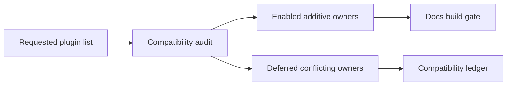

import { Badge, CardGrid, LinkCard, Steps } from '@astrojs/starlight/components';
import { Kbd } from 'starlight-kbd/components';
import { PackageManagers } from 'starlight-package-managers';
import { SaveFile } from 'starlight-save-file-component';

> [!NOTE]
> This page is intentionally hand-maintained. It records plugin ownership decisions that should not be hidden inside `astro.config.mjs`.

<Badge text="Astro 7 compatible" variant="success" size="large" />
<Badge text="Black theme owner" variant="note" size="large" />

:::decision[Current owner model]
The docs site keeps `starlight-theme-black`, the generated sidebar, `starlight-site-graph`, `starlight-links-validator`, and `starlight-llms-txt` as the primary structural owners. New plugins are enabled only when they are additive or have a validated non-overlapping component override.
:::

:::compat[Deferred plugin rule]
Plugins that need real content sources, live service configuration, a route/base-path policy, or a conflicting Starlight component override stay out of dependencies until that owner is resolved.
:::

## Enabled Surface

<CardGrid>
  <LinkCard title="Markdown helpers" href="#markdown-proof" description="GitHub alerts, directive asides, custom markdown blocks, Mermaid diagrams, and live Astro code." />
  <LinkCard title="Reading UX" href="#component-proof" description="Image zoom, keyboard shortcuts, fullscreen code blocks, scroll-to-top, and download cards." />
  <LinkCard title="Registry gates" href="#compatibility-ledger" description="Link validation, llms.txt, site graph, and the compatibility/defer ledger." />
</CardGrid>

## Markdown Proof



```astro live title="Live code proof"
---
const enabled = ['astro-mermaid', 'astro-live-code', 'starlight-tags'];
---

<ul style="display: grid; gap: 0.5rem; padding: 1rem; border: 1px solid #64748b; border-radius: 0.5rem;">
  {enabled.map((name) => <li>{name}</li>)}
</ul>
```

:::tip[Directive aside]
This aside is rendered through `remark-directive` plus `astro-starlight-remark-asides`.
:::

## Component Proof

Use <Kbd mac="Cmd+K" win="Ctrl+K" linux="Ctrl+K" /> to open command search in most local agent tools.

<PackageManagers type="add" pkg="astro-mermaid" pkgManagers={['pnpm', 'npm', 'bun']} />

<SaveFile
  href="/examples/starlight-plugin-stack.md"
  fileName="starlight-plugin-stack.md"
  title="Download the plugin-stack proof fixture"
  description="A static markdown file served from docs/public/examples/."
/>


```ts title="Fullscreen code block proof"
const starlightPluginOwners = {
  theme: 'starlight-theme-black',
  graph: 'starlight-site-graph',
  llms: 'starlight-llms-txt',
  validation: 'starlight-links-validator',
};
```

## Implementation Steps

<Steps>
1. Install only packages that can pass the current Astro 7, Starlight 0.41, Vite 8, and Node 24 gates.
2. Enable additive integrations in `astro.config.mjs`.
3. Extend the content schema for `starlight-tags` while preserving site-graph frontmatter.
4. Keep incompatible or contentless plugins in this ledger with the concrete unblock condition.
</Steps>

## Compatibility Ledger

| Requested item | Status | Owner surface | Decision |
| --- | --- | --- | --- |
| `astro-live-code` | Enabled | Markdown integration | Enables `live` code blocks for small embedded Astro examples. |
| `astro-mermaid` | Enabled | Markdown integration | Owns Mermaid rendering; `@pasqal-io/starlight-client-mermaid` stays deferred to avoid duplicate Mermaid owners. |
| `astro-plantuml` | Deferred | Diagram integration | Latest npm release peers `astro ^5.5.6`; this site is on Astro 7. |
| `astro-starlight-remark-asides` | Enabled | Markdown integration | Uses `remark-directive@3` plus package CSS for directive asides. |
| `starlight-announcement` | Enabled | Starlight Banner override | Scoped to this proof page with a static announcement. |
| `starlight-codeblock-fullscreen` | Enabled | Code block UX | Adds fullscreen controls to titled Expressive Code blocks. |
| `starlight-github-alerts` | Enabled | Markdown integration | Enables GitHub-style `[!NOTE]` alerts. |
| `starlight-heading-badges` | Deferred | ToC overrides | Theme composition already registers a `TableOfContents` override, so the plugin cannot cleanly own heading badges. |
| `starlight-image-zoom` | Enabled | MarkdownContent override | Safe because this config did not already register `MarkdownContent`. |
| `starlight-kbd` | Enabled | ThemeProvider override | Configured without the global picker to avoid crowding the existing theme controls. |
| `starlight-markdown-blocks` | Enabled | Markdown integration | Adds `decision` and `compat` directive blocks used on this page. |
| `starlight-package-managers` | Enabled | MDX component | Used directly as `<PackageManagers />`; it is not a Starlight plugin. |
| `starlight-save-file-component` | Enabled | MDX component | Used directly as `<SaveFile />`; it is not a Starlight plugin. |
| `starlight-scroll-to-top` | Enabled | Reading UX | Adds a right-side scroll affordance with progress ring. |
| `starlight-tags` | Enabled | Tags routes and schema | Uses `tags.yml` plus composed Starlight frontmatter schema. |
| `starlight-theme-black` | Enabled | Theme owner | Existing primary theme owner. |
| `starlight-links-validator` | Enabled | Validation owner | Existing build-time link validation owner. |
| `starlight-llms-txt` | Enabled | LLM text exports | Existing canonical `llms.txt` owner. |
| `starlight-site-graph` | Enabled | Graph/sidebar owner | Existing graph owner; peer allowance is scoped to its `astro-integration-kit` dependency. |
| `starlight-base-path` | Deferred | Routing/base path | Real package, but enabling it changes route/base-path policy for a root-deployed Vercel site. |
| `starlight-changelogs` | Deferred | Content collection | Needs real changelog entries and release taxonomy. |
| `starlight-llm-button` | Deferred | TableOfContents override | Conflicts with ToC ownership; `starlight-llms-txt` already owns LLM export files. |
| `starlight-page-actions` | Deferred | PageTitle override | Generates overlapping LLM/share actions and pulls a Vite peer that does not include Vite 8. |
| `starlight-page-context-action` | Deferred | Sidebar/ToC override | Collides with theme-black/site-graph sidebar composition and pulls a Vite peer that does not include Vite 8. |
| `starlight-latest-version` | Deferred | SiteTitle/version UI | Current package peers Astro 6 and needs a version policy. |
| `starlight-blog` | Deferred | Blog content | No blog content source exists in this docs repo. |
| `starlight-openapi` | Deferred | API reference | No OpenAPI specification source exists yet. |
| `starlight-obsidian` | Deferred | Obsidian import | No vault/import policy exists for this docs site. |
| `starlight-sidebar-topics` | Deferred | Navigation owner | Would compete with generated sidebar and theme-black navigation. |
| `starlight-sidebar-topics-dropdown` | Deferred | Navigation owner | Same navigation ownership conflict as sidebar topics. |
| `starlight-auto-sidebar` | Deferred | Sidebar generation | Generated sidebar is already owned by `wagents docs generate`. |
| `starlight-custom-navigation` | Deferred | Navigation owner | Would replace existing generated navigation policy. |
| `starlight-theme-obsidian` | Deferred | Theme owner | Conflicts with the selected Black theme owner. |
| `lucode-starlight-theme` | Deferred | Theme owner | Conflicts with the selected Black theme owner. |
| `starlight-theme-black` alternatives | Deferred | Theme owner | Do not run multiple global theme owners at once. |
| `starlight-versions` | Deferred | Versioned docs | Needs versioned content sources and routing policy. |
| `starlight-showcases` | Deferred | Showcase content | No showcase data source exists yet. |
| `starlight-videos` | Deferred | Media content | No video catalog source exists yet. |
| `starlight-to-pdf` | Deferred | Export pipeline | Changes generated artifact/output behavior and needs a separate export policy. |
| `starlight-view-modes` | Deferred | Search/Social/ToC/PageTitle overrides | Broad component override surface conflicts with current owners. |
| `starlight-fullview-mode` | Deferred | Fullscreen UX | Overlaps with the narrower codeblock fullscreen plugin. |
| `starlight-ui-tweaks` | Deferred | Theme/Social/ToC/Markdown/Footer overrides | Broad component override surface conflicts with image zoom, kbd, heading badges, and footer ownership. |
| `starlight-cooler-credit` | Deferred | Pagination/ToC override | Would add another ToC owner after heading badges. |
| `starlight-dot-md` | Deferred | Route/output behavior | Needs a route policy for `.md` output paths. |
| `starlight-plugin-icons` | Deferred | Icon pipeline | Real package, but it requires an UnoCSS dependency and icon policy. |
| `starlight-docsearch-typesense` | Deferred | Search owner | Needs Typesense service credentials/config and would replace current search behavior. |
| `astro-contributors` | Deferred | Contributor component | Would fetch GitHub API data during render unless an `.all-contributorsrc` source is added. |
| `starlight-head-generator` | Deferred | Head metadata | No compatible npm package was resolved during this pass. |
| `starlight-better-auth-example` | Deferred | Example content | Example-only source, not a docs plugin for this site. |
| `starlight-i18n` | Deferred | Localization | No compatible package was resolved, and there is no active i18n content policy. |
| `starlight-visual-diff` | Deferred | Visual test workflow | No compatible package was resolved; needs a visual baseline workflow first. |
| `add-last-updated` | Deferred | Last-updated metadata | Starlight `lastUpdated: true` is already enabled. |

## Validation Contract

The closeout gate for this stack is:

```sh
pnpm peers check
pnpm exec astro check
pnpm exec astro build
uv run wagents openspec validate
```
