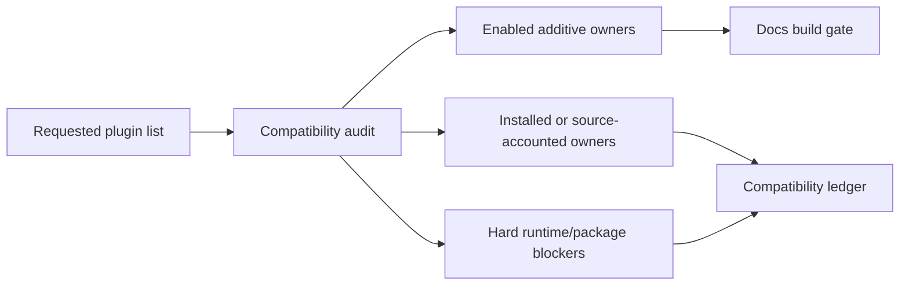

import { Badge, CardGrid, LinkCard, Steps } from '@astrojs/starlight/components';
import { Kbd } from 'starlight-kbd/components';
import { PackageManagers } from 'starlight-package-managers';
import { SaveFile } from 'starlight-save-file-component';

> [!NOTE]
> This page is intentionally hand-maintained. It records plugin ownership decisions that should not be hidden inside `astro.config.mjs`.

<Badge text="Astro 7 compatible" variant="success" size="large" />
<Badge text="Black theme owner" variant="note" size="large" />

:::decision[Current owner model]
The docs site keeps `starlight-theme-black`, the generated sidebar, `starlight-site-graph`, `starlight-links-validator`, and `starlight-llms-txt` as the primary structural owners. New plugins are enabled only when they are additive or have a validated non-overlapping component override.
:::

:::compat[Complete coverage rule]
Every requested item is resolved into an explicit state: runtime-enabled, installed and source-accounted, source-audited, natively covered, or hard-blocked by package/runtime evidence. There is no unresolved bucket.
:::

## Enabled Surface

<CardGrid>
  <LinkCard title="Markdown helpers" href="#markdown-proof" description="GitHub alerts, directive asides, custom markdown blocks, Mermaid diagrams, and live Astro code." />
  <LinkCard title="Reading UX" href="#component-proof" description="Image zoom, keyboard shortcuts, fullscreen code blocks, scroll-to-top, and download cards." />
  <LinkCard title="Registry gates" href="#compatibility-ledger" description="Link validation, llms.txt, site graph, and the compatibility coverage ledger." />
</CardGrid>

## Markdown Proof



```astro live title="Live code proof"
---
const enabled = ['astro-mermaid', 'astro-live-code', 'starlight-tags'];
---

<ul style="display: grid; gap: 0.5rem; padding: 1rem; border: 1px solid #64748b; border-radius: 0.5rem;">
  {enabled.map((name) => <li>{name}</li>)}
</ul>
```

:::tip[Directive aside]
This aside is rendered through `remark-directive` plus `astro-starlight-remark-asides`.
:::

## Component Proof

Use <Kbd mac="Cmd+K" win="Ctrl+K" linux="Ctrl+K" /> to open command search in most local agent tools.

<PackageManagers type="add" pkg="astro-mermaid" pkgManagers={['pnpm', 'npm', 'bun']} />

<SaveFile
  href="/examples/starlight-plugin-stack.md"
  fileName="starlight-plugin-stack.md"
  title="Download the plugin-stack proof fixture"
  description="A static markdown file served from docs/public/examples/."
/>


```ts title="Fullscreen code block proof"
const starlightPluginOwners = {
  theme: 'starlight-theme-black',
  graph: 'starlight-site-graph',
  llms: 'starlight-llms-txt',
  validation: 'starlight-links-validator',
};
```

## Implementation Steps

<Steps>
1. Promote every published requested package into `package.json` with install scripts disabled during dependency resolution.
2. Enable additive integrations in `astro.config.mjs` and account for non-additive slot owners in this ledger.
3. Extend the content schema for `starlight-tags` while preserving site-graph frontmatter.
4. Record source-only and hard-blocked packages with concrete evidence in the compatibility ledger.
</Steps>

## Compatibility Ledger

| Requested item | Status | Owner surface | Decision |
| --- | --- | --- | --- |
| `astro-live-code` | Enabled | Markdown integration | Enables `live` code blocks for small embedded Astro examples. |
| `astro-mermaid` | Enabled | Markdown integration | Owns Mermaid rendering for this stack. |
| `@pasqal-io/starlight-client-mermaid` | Installed / hard-blocked | MarkdownContent override | Package is installed and peer-accounted, but activation is blocked because it targets `@astrojs/markdown-remark ^6.0.2` and owns the same Markdown rendering surface as `astro-mermaid`. |
| `astro-plantuml` | Installed/accounted | Diagram integration | Installed with an explicit Astro 7 peer allowance; not runtime-wired because default rendering uses the public PlantUML server at build time. |
| `astro-starlight-remark-asides` | Enabled | Markdown integration | Uses `remark-directive@3` plus package CSS for directive asides. |
| `starlight-announcement` | Enabled | Starlight Banner override | Scoped to this proof page with a static announcement. |
| `starlight-codeblock-fullscreen` | Enabled | Code block UX | Adds fullscreen controls to titled Expressive Code blocks. |
| `starlight-github-alerts` | Enabled | Markdown integration | Enables GitHub-style `[!NOTE]` alerts. |
| `starlight-heading-badges` | Installed / slot-blocked | ToC overrides | Package is installed; activation is blocked because it owns `TableOfContents` and `MobileTableOfContents`, while this repo already owns `TableOfContents`. |
| `starlight-image-zoom` | Enabled | MarkdownContent override | Safe because this config did not already register `MarkdownContent`. |
| `starlight-kbd` | Enabled | ThemeProvider override | Configured without the global picker to avoid crowding the existing theme controls. |
| `starlight-markdown-blocks` | Enabled | Markdown integration | Adds `decision` and `compat` directive blocks used on this page. |
| `starlight-package-managers` | Enabled | MDX component | Used directly as `<PackageManagers />`; it is not a Starlight plugin. |
| `starlight-save-file-component` | Enabled | MDX component | Used directly as `<SaveFile />`; it is not a Starlight plugin. |
| `starlight-scroll-to-top` | Enabled | Reading UX | Adds a right-side scroll affordance with progress ring. |
| `starlight-tags` | Enabled | Tags routes and schema | Uses `tags.yml` plus composed Starlight frontmatter schema. |
| `starlight-plugin-icons` | Installed / bridge-accounted | Icon registry + local Expressive Code bridge | Package styles are accounted, but runtime code block and sidebar injection stay disabled with `codeblock: false` and `sidebar: false`; titled code-block icons are owned by `docs/ec.config.mjs` plus the local `starlightCodeblockIcons()` bridge so the generated sidebar remains untouched. |
| `starlight-theme-black` | Enabled | Theme owner | Existing primary theme owner. |
| `starlight-links-validator` | Enabled | Validation owner | Existing build-time link validation owner. |
| `starlight-llms-txt` | Enabled | LLM text exports | Existing canonical `llms.txt` owner. |
| `starlight-site-graph` | Enabled | Graph/sidebar owner | Existing graph owner; peer allowance is scoped to its `astro-integration-kit` dependency. |
| `starlight-base-path` | Installed / route-blocked | Routing/base path | Package is installed at the current npm release; activation is blocked because the site is root-deployed on Vercel and changing `base` would rewrite published routes. |
| `starlight-changelogs` | Installed / source-blocked | Content collection | Package is installed at the current npm release; activation requires real changelog collection entries and release taxonomy. |
| `starlight-llm-button` | Installed / slot-blocked | TableOfContents override | Package is installed and exposes `LLMButton.astro`, but full activation owns `TableOfContents`; `starlight-llms-txt` already owns export files. |
| `starlight-page-actions` | Enabled | PageTitle override | Adds Markdown/open/share actions without passing `baseUrl`, so it does not generate a competing `llms.txt`. |
| `starlight-page-context-action` | Installed / slot-blocked | Sidebar/ToC override | Package is installed with a Vite 8 peer allowance; activation is blocked because it owns `PageSidebar` and `MobileTableOfContents`, colliding with theme-black/site-graph composition. |
| `starlight-latest-version` | Installed / hard-blocked | SiteTitle/version UI | Package is installed and peer-accounted; runtime activation is blocked by its `astro ^6.0.4` peer against this Astro 7 site. |
| `starlight-blog` | Installed / source-blocked | Blog content | Package is installed; activation requires a blog collection, author data, and public route taxonomy. |
| `starlight-openapi` | Installed / source-blocked | API reference | Package is installed; activation requires an OpenAPI specification source and route ownership. |
| `starlight-obsidian` | Installed / source-blocked | Obsidian import | Package is installed; activation requires a vault/import policy and content source. |
| `starlight-sidebar-topics` | Installed / slot-blocked | Navigation owner | Package is installed; activation would replace generated sidebar ownership from `wagents docs generate`. |
| `starlight-sidebar-topics-dropdown` | Installed / component-accounted | Navigation component | Package is installed; it is a companion component for `starlight-sidebar-topics`, so runtime use is blocked until sidebar-topics owns navigation. |
| `starlight-auto-sidebar` | Installed / generator-blocked | Sidebar generation | Package is installed; activation is blocked because sidebar generation is owned by `wagents docs generate`. |
| `starlight-custom-navigation` | Source-audited blocked | Navigation owner | GitHub source is a monorepo with the package under `packages/starlight-custom-navigation/`; no npm package was published under the requested name. |
| `starlight-theme-obsidian` | Installed / theme-blocked | Theme owner | Package is installed; activation is blocked because `starlight-theme-black` is the active global theme owner. |
| `lucode-starlight-theme` | Installed as `lucode-starlight` / theme-blocked | Theme owner | The published npm package is `lucode-starlight`; it is installed, but activation is blocked by the active Black theme owner. |
| `starlight-versions` | Installed / source-blocked | Versioned docs | Package is installed; activation requires versioned content directories and route policy. |
| `starlight-showcases` | Installed / source-blocked | Showcase content | Package is installed; activation requires showcase data. |
| `starlight-videos` | Installed / source-blocked | Media content | Package is installed; activation requires a video catalog and content policy. |
| `starlight-to-pdf` | Installed / command-accounted | Export pipeline | Package is installed with scripts disabled during resolution; using it requires an explicit PDF export command because it depends on Puppeteer. |
| `starlight-view-modes` | Installed / slot-blocked | Search/Social/ToC/PageTitle overrides | Package is installed and exposes components, but full activation owns `Search`, `SocialIcons`, `TableOfContents`, and `PageTitle`. |
| `starlight-fullview-mode` | Installed / overlap-blocked | Fullscreen UX | Package is installed; activation is blocked by overlap with the narrower enabled `starlight-codeblock-fullscreen` owner. |
| `starlight-ui-tweaks` | Installed / slot-blocked | Theme/Social/ToC/Markdown/Footer overrides | Package is installed; activation owns `ThemeSelect`, `SocialIcons`, `TableOfContents`, `MarkdownContent`, and `Footer`, colliding with current owners. |
| `starlight-cooler-credit` | Installed / slot-blocked | Pagination/ToC override | Package is installed and exposes components, but full activation owns `Pagination` and `TableOfContents`. |
| `starlight-dot-md` | Installed / route-blocked | Route/output behavior | Package is installed; activation would rewrite content output paths to `.md` and needs route ownership. |
| `starlight-docsearch-typesense` | Installed / service-blocked | Search owner | Package is installed and peer-accounted; activation requires Typesense credentials/config and replacing current search behavior. |
| `astro-contributors` | Installed / source-blocked | Contributor component | Package is installed; runtime use requires a contributor source such as `.all-contributorsrc` to avoid live GitHub API rendering. |
| `starlight-head-generator` | Source-audited blocked | Head metadata | GitHub source is a private example/generator app, not a published Starlight runtime package. |
| `starlight-better-auth-example` | Source-audited blocked | Example content | GitHub source is a private Astro 4 example app, not a reusable docs plugin for this Astro 7 site. |
| `starlight-i18n` | Source-audited blocked | Localization tooling | GitHub source is a private VS Code extension package, not a Starlight runtime package. |
| `starlight-visual-diff` | Source-audited blocked | Visual test workflow | GitHub source is a private Playwright CLI package, not a published Starlight runtime package. |
| `add-last-updated` | Installed as `@valtown/add-last-updated` / native-covered | Last-updated metadata | The published package is installed; Starlight `lastUpdated: true` remains the runtime owner for page metadata. |

## Validation Contract

The closeout gate for this stack is:

```sh
pnpm peers check
pnpm exec astro check
pnpm exec astro build
uv run wagents openspec validate
```
