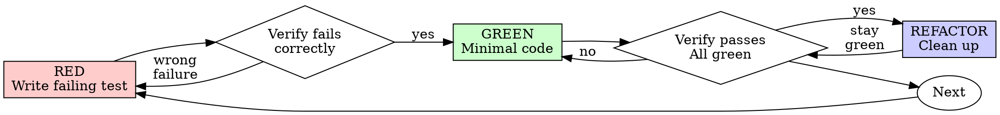

import { Badge, Card, CardGrid, LinkCard } from '@astrojs/starlight/components';

> 18 skills installed from external sources via `~/.claude/skills/`.

## agents-md-updater

<Badge text="agents-md-updater" variant="note" /> <Badge text="306 words" variant="default" />

> Validate AGENTS.md against actual codebase - checks commands, paths, test config, and links. Use after code changes or before commits.

**Install:** `npx skills add agents-md-updater -g`
**Use:** `/agents-md-updater`

<details>
<summary>View SKILL.md</summary>

````yaml title="SKILL.md"
---
name: agents-md-updater
description: Validate AGENTS.md against actual codebase - checks commands, paths, test config, and links. Use after code changes or before commits.
---

# AGENTS.md Updater

**Detect drift. Fix it. Done.**

## The Job

1. Find gaps between AGENTS.md and codebase
2. **Edit AGENTS.md to fix them**

## Execution

### Step 1: Gather state (parallel reads)
```
Read: AGENTS.md, pyproject.toml, Makefile
Glob: src/**/*.py or lib/**/*.ts (structure)
Bash: git log --oneline -5
```

### Step 2: Identify drift
Compare documented vs actual for:
- Module list vs actual files
- Workflow list vs .github/workflows/
- Exports vs __init__.py
- Tool configs vs pyproject.toml

### Step 3: EDIT THE FILE

Use Edit tool to fix each issue. Examples:

**Add missing module:**
```
Edit AGENTS.md:
old: "| storage.py | SQLite storage |"
new: "| storage.py | SQLite storage |\n| newmodule.py | New feature |"
```

**Fix stale reference:**
```
Edit AGENTS.md:
old: "- legacy.py - old system"
new: "" (delete the line)
```

**Update workflow list:**
```
Edit AGENTS.md:
old: "ci.yml, security.yml"
new: "ci.yml, security.yml, cd.yml, release.yml"
```

### Step 4: Summary
```
Updated AGENTS.md:
- Added 3 modules to Key Modules
- Added 2 workflows to CI list
- Removed 1 dead reference
```

## Rules

1. **Always edit** - don't just report
2. **Preserve manual sections** - respect `<!-- agents-md:manual -->` markers
3. **Match existing style** - if table, add table row; if list, add list item
4. **Be surgical** - small targeted edits, not rewrites

## What to update automatically

| Drift Type | Action |
|------------|--------|
| Missing module | Add row to modules table |
| Missing workflow | Add to workflow list |
| Missing export | Add to exports list |
| Dead reference | Remove the line |
| Wrong tool name | Fix inline |

## What NOT to update (ask user)

- Changing documented conventions (branch naming)
- Removing entire sections
- Adding new sections
- Anything in `<!-- agents-md:manual -->` blocks

````

</details>

---

## docx

<Badge text="docx" variant="note" /> <Badge text="2129 words" variant="default" /> <Badge text="Proprietary. LICENSE.txt has complete terms" variant="success" />

> Use this skill whenever the user wants to create, read, edit, or manipulate Word documents (.docx files). Triggers include: any mention of "Word doc", "word document", ".docx", or requests to produce professional documents with formatting like tables of contents, headings, page numbers, or letterheads. Also use when extracting or reorganizing content from .docx files, inserting or replacing images in documents, performing find-and-replace in Word files, working with tracked changes or comments, or converting content into a polished Word document. If the user asks for a "report", "memo", "letter", "template", or similar deliverable as a Word or .docx file, use this skill. Do NOT use for PDFs, spreadsheets, Google Docs, or general coding tasks unrelated to document generation.

**Install:** `npx skills add docx -g`
**Use:** `/docx`

<details>
<summary>View SKILL.md</summary>

````yaml title="SKILL.md"
---
name: docx
description: "Use this skill whenever the user wants to create, read, edit, or manipulate Word documents (.docx files). Triggers include: any mention of \"Word doc\", \"word document\", \".docx\", or requests to produce professional documents with formatting like tables of contents, headings, page numbers, or letterheads. Also use when extracting or reorganizing content from .docx files, inserting or replacing images in documents, performing find-and-replace in Word files, working with tracked changes or comments, or converting content into a polished Word document. If the user asks for a \"report\", \"memo\", \"letter\", \"template\", or similar deliverable as a Word or .docx file, use this skill. Do NOT use for PDFs, spreadsheets, Google Docs, or general coding tasks unrelated to document generation."
license: Proprietary. LICENSE.txt has complete terms
---

# DOCX creation, editing, and analysis

## Overview

A .docx file is a ZIP archive containing XML files.

## Quick Reference

| Task | Approach |
|------|----------|
| Read/analyze content | `pandoc` or unpack for raw XML |
| Create new document | Use `docx-js` - see Creating New Documents below |
| Edit existing document | Unpack → edit XML → repack - see Editing Existing Documents below |

### Converting .doc to .docx

Legacy `.doc` files must be converted before editing:

```bash
python scripts/office/soffice.py --headless --convert-to docx document.doc
```

### Reading Content

```bash
# Text extraction with tracked changes
pandoc --track-changes=all document.docx -o output.md

# Raw XML access
python scripts/office/unpack.py document.docx unpacked/
```

### Converting to Images

```bash
python scripts/office/soffice.py --headless --convert-to pdf document.docx
pdftoppm -jpeg -r 150 document.pdf page
```

### Accepting Tracked Changes

To produce a clean document with all tracked changes accepted (requires LibreOffice):

```bash
python scripts/accept_changes.py input.docx output.docx
```

---

## Creating New Documents

Generate .docx files with JavaScript, then validate. Install: `npm install -g docx`

### Setup
```javascript
const { Document, Packer, Paragraph, TextRun, Table, TableRow, TableCell, ImageRun,
        Header, Footer, AlignmentType, PageOrientation, LevelFormat, ExternalHyperlink,
        TableOfContents, HeadingLevel, BorderStyle, WidthType, ShadingType,
        VerticalAlign, PageNumber, PageBreak } = require('docx');

const doc = new Document({ sections: [{ children: [/* content */] }] });
Packer.toBuffer(doc).then(buffer => fs.writeFileSync("doc.docx", buffer));
```

### Validation
After creating the file, validate it. If validation fails, unpack, fix the XML, and repack.
```bash
python scripts/office/validate.py doc.docx
```

### Page Size

```javascript
// CRITICAL: docx-js defaults to A4, not US Letter
// Always set page size explicitly for consistent results
sections: [{
  properties: {
    page: {
      size: {
        width: 12240,   // 8.5 inches in DXA
        height: 15840   // 11 inches in DXA
      },
      margin: { top: 1440, right: 1440, bottom: 1440, left: 1440 } // 1 inch margins
    }
  },
  children: [/* content */]
}]
```

**Common page sizes (DXA units, 1440 DXA = 1 inch):**

| Paper | Width | Height | Content Width (1" margins) |
|-------|-------|--------|---------------------------|
| US Letter | 12,240 | 15,840 | 9,360 |
| A4 (default) | 11,906 | 16,838 | 9,026 |

**Landscape orientation:** docx-js swaps width/height internally, so pass portrait dimensions and let it handle the swap:
```javascript
size: {
  width: 12240,   // Pass SHORT edge as width
  height: 15840,  // Pass LONG edge as height
  orientation: PageOrientation.LANDSCAPE  // docx-js swaps them in the XML
},
// Content width = 15840 - left margin - right margin (uses the long edge)
```

### Styles (Override Built-in Headings)

Use Arial as the default font (universally supported). Keep titles black for readability.

```javascript
const doc = new Document({
  styles: {
    default: { document: { run: { font: "Arial", size: 24 } } }, // 12pt default
    paragraphStyles: [
      // IMPORTANT: Use exact IDs to override built-in styles
      { id: "Heading1", name: "Heading 1", basedOn: "Normal", next: "Normal", quickFormat: true,
        run: { size: 32, bold: true, font: "Arial" },
        paragraph: { spacing: { before: 240, after: 240 }, outlineLevel: 0 } }, // outlineLevel required for TOC
      { id: "Heading2", name: "Heading 2", basedOn: "Normal", next: "Normal", quickFormat: true,
        run: { size: 28, bold: true, font: "Arial" },
        paragraph: { spacing: { before: 180, after: 180 }, outlineLevel: 1 } },
    ]
  },
  sections: [{
    children: [
      new Paragraph({ heading: HeadingLevel.HEADING_1, children: [new TextRun("Title")] }),
    ]
  }]
});
```

### Lists (NEVER use unicode bullets)

```javascript
// ❌ WRONG - never manually insert bullet characters
new Paragraph({ children: [new TextRun("• Item")] })  // BAD
new Paragraph({ children: [new TextRun("\u2022 Item")] })  // BAD

// ✅ CORRECT - use numbering config with LevelFormat.BULLET
const doc = new Document({
  numbering: {
    config: [
      { reference: "bullets",
        levels: [{ level: 0, format: LevelFormat.BULLET, text: "•", alignment: AlignmentType.LEFT,
          style: { paragraph: { indent: { left: 720, hanging: 360 } } } }] },
      { reference: "numbers",
        levels: [{ level: 0, format: LevelFormat.DECIMAL, text: "%1.", alignment: AlignmentType.LEFT,
          style: { paragraph: { indent: { left: 720, hanging: 360 } } } }] },
    ]
  },
  sections: [{
    children: [
      new Paragraph({ numbering: { reference: "bullets", level: 0 },
        children: [new TextRun("Bullet item")] }),
      new Paragraph({ numbering: { reference: "numbers", level: 0 },
        children: [new TextRun("Numbered item")] }),
    ]
  }]
});

// ⚠️ Each reference creates INDEPENDENT numbering
// Same reference = continues (1,2,3 then 4,5,6)
// Different reference = restarts (1,2,3 then 1,2,3)
```

### Tables

**CRITICAL: Tables need dual widths** - set both `columnWidths` on the table AND `width` on each cell. Without both, tables render incorrectly on some platforms.

```javascript
// CRITICAL: Always set table width for consistent rendering
// CRITICAL: Use ShadingType.CLEAR (not SOLID) to prevent black backgrounds
const border = { style: BorderStyle.SINGLE, size: 1, color: "CCCCCC" };
const borders = { top: border, bottom: border, left: border, right: border };

new Table({
  width: { size: 9360, type: WidthType.DXA }, // Always use DXA (percentages break in Google Docs)
  columnWidths: [4680, 4680], // Must sum to table width (DXA: 1440 = 1 inch)
  rows: [
    new TableRow({
      children: [
        new TableCell({
          borders,
          width: { size: 4680, type: WidthType.DXA }, // Also set on each cell
          shading: { fill: "D5E8F0", type: ShadingType.CLEAR }, // CLEAR not SOLID
          margins: { top: 80, bottom: 80, left: 120, right: 120 }, // Cell padding (internal, not added to width)
          children: [new Paragraph({ children: [new TextRun("Cell")] })]
        })
      ]
    })
  ]
})
```

**Table width calculation:**

Always use `WidthType.DXA` — `WidthType.PERCENTAGE` breaks in Google Docs.

```javascript
// Table width = sum of columnWidths = content width
// US Letter with 1" margins: 12240 - 2880 = 9360 DXA
width: { size: 9360, type: WidthType.DXA },
columnWidths: [7000, 2360]  // Must sum to table width
```

**Width rules:**
- **Always use `WidthType.DXA`** — never `WidthType.PERCENTAGE` (incompatible with Google Docs)
- Table width must equal the sum of `columnWidths`
- Cell `width` must match corresponding `columnWidth`
- Cell `margins` are internal padding - they reduce content area, not add to cell width
- For full-width tables: use content width (page width minus left and right margins)

### Images

```javascript
// CRITICAL: type parameter is REQUIRED
new Paragraph({
  children: [new ImageRun({
    type: "png", // Required: png, jpg, jpeg, gif, bmp, svg
    data: fs.readFileSync("image.png"),
    transformation: { width: 200, height: 150 },
    altText: { title: "Title", description: "Desc", name: "Name" } // All three required
  })]
})
```

### Page Breaks

```javascript
// CRITICAL: PageBreak must be inside a Paragraph
new Paragraph({ children: [new PageBreak()] })

// Or use pageBreakBefore
new Paragraph({ pageBreakBefore: true, children: [new TextRun("New page")] })
```

### Table of Contents

```javascript
// CRITICAL: Headings must use HeadingLevel ONLY - no custom styles
new TableOfContents("Table of Contents", { hyperlink: true, headingStyleRange: "1-3" })
```

### Headers/Footers

```javascript
sections: [{
  properties: {
    page: { margin: { top: 1440, right: 1440, bottom: 1440, left: 1440 } } // 1440 = 1 inch
  },
  headers: {
    default: new Header({ children: [new Paragraph({ children: [new TextRun("Header")] })] })
  },
  footers: {
    default: new Footer({ children: [new Paragraph({
      children: [new TextRun("Page "), new TextRun({ children: [PageNumber.CURRENT] })]
    })] })
  },
  children: [/* content */]
}]
```

### Critical Rules for docx-js

- **Set page size explicitly** - docx-js defaults to A4; use US Letter (12240 x 15840 DXA) for US documents
- **Landscape: pass portrait dimensions** - docx-js swaps width/height internally; pass short edge as `width`, long edge as `height`, and set `orientation: PageOrientation.LANDSCAPE`
- **Never use `\n`** - use separate Paragraph elements
- **Never use unicode bullets** - use `LevelFormat.BULLET` with numbering config
- **PageBreak must be in Paragraph** - standalone creates invalid XML
- **ImageRun requires `type`** - always specify png/jpg/etc
- **Always set table `width` with DXA** - never use `WidthType.PERCENTAGE` (breaks in Google Docs)
- **Tables need dual widths** - `columnWidths` array AND cell `width`, both must match
- **Table width = sum of columnWidths** - for DXA, ensure they add up exactly
- **Always add cell margins** - use `margins: { top: 80, bottom: 80, left: 120, right: 120 }` for readable padding
- **Use `ShadingType.CLEAR`** - never SOLID for table shading
- **TOC requires HeadingLevel only** - no custom styles on heading paragraphs
- **Override built-in styles** - use exact IDs: "Heading1", "Heading2", etc.
- **Include `outlineLevel`** - required for TOC (0 for H1, 1 for H2, etc.)

---

## Editing Existing Documents

**Follow all 3 steps in order.**

### Step 1: Unpack
```bash
python scripts/office/unpack.py document.docx unpacked/
```
Extracts XML, pretty-prints, merges adjacent runs, and converts smart quotes to XML entities (`&#x201C;` etc.) so they survive editing. Use `--merge-runs false` to skip run merging.

### Step 2: Edit XML

Edit files in `unpacked/word/`. See XML Reference below for patterns.

**Use "Claude" as the author** for tracked changes and comments, unless the user explicitly requests use of a different name.

**Use the Edit tool directly for string replacement. Do not write Python scripts.** Scripts introduce unnecessary complexity. The Edit tool shows exactly what is being replaced.

**CRITICAL: Use smart quotes for new content.** When adding text with apostrophes or quotes, use XML entities to produce smart quotes:
```xml
<!-- Use these entities for professional typography -->
<w:t>Here&#x2019;s a quote: &#x201C;Hello&#x201D;</w:t>
```
| Entity | Character |
|--------|-----------|
| `&#x2018;` | ‘ (left single) |
| `&#x2019;` | ’ (right single / apostrophe) |
| `&#x201C;` | “ (left double) |
| `&#x201D;` | ” (right double) |

**Adding comments:** Use `comment.py` to handle boilerplate across multiple XML files (text must be pre-escaped XML):
```bash
python scripts/comment.py unpacked/ 0 "Comment text with &amp; and &#x2019;"
python scripts/comment.py unpacked/ 1 "Reply text" --parent 0  # reply to comment 0
python scripts/comment.py unpacked/ 0 "Text" --author "Custom Author"  # custom author name
```
Then add markers to document.xml (see Comments in XML Reference).

### Step 3: Pack
```bash
python scripts/office/pack.py unpacked/ output.docx --original document.docx
```
Validates with auto-repair, condenses XML, and creates DOCX. Use `--validate false` to skip.

**Auto-repair will fix:**
- `durableId` >= 0x7FFFFFFF (regenerates valid ID)
- Missing `xml:space="preserve"` on `<w:t>` with whitespace

**Auto-repair won't fix:**
- Malformed XML, invalid element nesting, missing relationships, schema violations

### Common Pitfalls

- **Replace entire `<w:r>` elements**: When adding tracked changes, replace the whole `<w:r>...</w:r>` block with `<w:del>...<w:ins>...` as siblings. Don't inject tracked change tags inside a run.
- **Preserve `<w:rPr>` formatting**: Copy the original run's `<w:rPr>` block into your tracked change runs to maintain bold, font size, etc.

---

## XML Reference

### Schema Compliance

- **Element order in `<w:pPr>`**: `<w:pStyle>`, `<w:numPr>`, `<w:spacing>`, `<w:ind>`, `<w:jc>`, `<w:rPr>` last
- **Whitespace**: Add `xml:space="preserve"` to `<w:t>` with leading/trailing spaces
- **RSIDs**: Must be 8-digit hex (e.g., `00AB1234`)

### Tracked Changes

**Insertion:**
```xml
<w:ins w:id="1" w:author="Claude" w:date="2025-01-01T00:00:00Z">
  <w:r><w:t>inserted text</w:t></w:r>
</w:ins>
```

**Deletion:**
```xml
<w:del w:id="2" w:author="Claude" w:date="2025-01-01T00:00:00Z">
  <w:r><w:delText>deleted text</w:delText></w:r>
</w:del>
```

**Inside `<w:del>`**: Use `<w:delText>` instead of `<w:t>`, and `<w:delInstrText>` instead of `<w:instrText>`.

**Minimal edits** - only mark what changes:
```xml
<!-- Change "30 days" to "60 days" -->
<w:r><w:t>The term is </w:t></w:r>
<w:del w:id="1" w:author="Claude" w:date="...">
  <w:r><w:delText>30</w:delText></w:r>
</w:del>
<w:ins w:id="2" w:author="Claude" w:date="...">
  <w:r><w:t>60</w:t></w:r>
</w:ins>
<w:r><w:t> days.</w:t></w:r>
```

**Deleting entire paragraphs/list items** - when removing ALL content from a paragraph, also mark the paragraph mark as deleted so it merges with the next paragraph. Add `<w:del/>` inside `<w:pPr><w:rPr>`:
```xml
<w:p>
  <w:pPr>
    <w:numPr>...</w:numPr>  <!-- list numbering if present -->
    <w:rPr>
      <w:del w:id="1" w:author="Claude" w:date="2025-01-01T00:00:00Z"/>
    </w:rPr>
  </w:pPr>
  <w:del w:id="2" w:author="Claude" w:date="2025-01-01T00:00:00Z">
    <w:r><w:delText>Entire paragraph content being deleted...</w:delText></w:r>
  </w:del>
</w:p>
```
Without the `<w:del/>` in `<w:pPr><w:rPr>`, accepting changes leaves an empty paragraph/list item.

**Rejecting another author's insertion** - nest deletion inside their insertion:
```xml
<w:ins w:author="Jane" w:id="5">
  <w:del w:author="Claude" w:id="10">
    <w:r><w:delText>their inserted text</w:delText></w:r>
  </w:del>
</w:ins>
```

**Restoring another author's deletion** - add insertion after (don't modify their deletion):
```xml
<w:del w:author="Jane" w:id="5">
  <w:r><w:delText>deleted text</w:delText></w:r>
</w:del>
<w:ins w:author="Claude" w:id="10">
  <w:r><w:t>deleted text</w:t></w:r>
</w:ins>
```

### Comments

After running `comment.py` (see Step 2), add markers to document.xml. For replies, use `--parent` flag and nest markers inside the parent's.

**CRITICAL: `<w:commentRangeStart>` and `<w:commentRangeEnd>` are siblings of `<w:r>`, never inside `<w:r>`.**

```xml
<!-- Comment markers are direct children of w:p, never inside w:r -->
<w:commentRangeStart w:id="0"/>
<w:del w:id="1" w:author="Claude" w:date="2025-01-01T00:00:00Z">
  <w:r><w:delText>deleted</w:delText></w:r>
</w:del>
<w:r><w:t> more text</w:t></w:r>
<w:commentRangeEnd w:id="0"/>
<w:r><w:rPr><w:rStyle w:val="CommentReference"/></w:rPr><w:commentReference w:id="0"/></w:r>

<!-- Comment 0 with reply 1 nested inside -->
<w:commentRangeStart w:id="0"/>
  <w:commentRangeStart w:id="1"/>
  <w:r><w:t>text</w:t></w:r>
  <w:commentRangeEnd w:id="1"/>
<w:commentRangeEnd w:id="0"/>
<w:r><w:rPr><w:rStyle w:val="CommentReference"/></w:rPr><w:commentReference w:id="0"/></w:r>
<w:r><w:rPr><w:rStyle w:val="CommentReference"/></w:rPr><w:commentReference w:id="1"/></w:r>
```

### Images

1. Add image file to `word/media/`
2. Add relationship to `word/_rels/document.xml.rels`:
```xml
<Relationship Id="rId5" Type=".../image" Target="media/image1.png"/>
```
3. Add content type to `[Content_Types].xml`:
```xml
<Default Extension="png" ContentType="image/png"/>
```
4. Reference in document.xml:
```xml
<w:drawing>
  <wp:inline>
    <wp:extent cx="914400" cy="914400"/>  <!-- EMUs: 914400 = 1 inch -->
    <a:graphic>
      <a:graphicData uri=".../picture">
        <pic:pic>
          <pic:blipFill><a:blip r:embed="rId5"/></pic:blipFill>
        </pic:pic>
      </a:graphicData>
    </a:graphic>
  </wp:inline>
</w:drawing>
```

---

## Dependencies

- **pandoc**: Text extraction
- **docx**: `npm install -g docx` (new documents)
- **LibreOffice**: PDF conversion (auto-configured for sandboxed environments via `scripts/office/soffice.py`)
- **Poppler**: `pdftoppm` for images

````

</details>

---

## domain-name-brainstormer

<Badge text="domain-name-brainstormer" variant="note" /> <Badge text="818 words" variant="default" />

> Generates creative domain name ideas for your project and checks availability across multiple TLDs (.com, .io, .dev, .ai, etc.). Saves hours of brainstorming and manual checking.

**Install:** `npx skills add domain-name-brainstormer -g`
**Use:** `/domain-name-brainstormer`

<details>
<summary>View SKILL.md</summary>

````yaml title="SKILL.md"
---
name: domain-name-brainstormer
description: Generates creative domain name ideas for your project and checks availability across multiple TLDs (.com, .io, .dev, .ai, etc.). Saves hours of brainstorming and manual checking.
---

# Domain Name Brainstormer

This skill helps you find the perfect domain name for your project by generating creative options and checking what's actually available to register.

## When to Use This Skill

- Starting a new project or company
- Launching a product or service
- Creating a personal brand or portfolio site
- Rebranding an existing project
- Registering a domain for a side project
- Finding available alternatives when your first choice is taken

## What This Skill Does

1. **Understands Your Project**: Analyzes what you're building and who it's for
2. **Generates Creative Names**: Creates relevant, memorable domain options
3. **Checks Availability**: Verifies which domains are actually available across multiple TLDs
4. **Multiple Extensions**: Suggests .com, .io, .dev, .ai, .app, and more
5. **Provides Alternatives**: Offers variations if top choices are taken
6. **Branding Insights**: Explains why certain names work well

## How to Use

### Basic Brainstorming

```
I'm building a project management tool for remote teams. 
Suggest domain names.
```

```
Help me brainstorm domain names for a personal finance app
```

### Specific Preferences

```
I need a domain name for my AI writing assistant. 
Prefer short names with .ai or .io extension.
```

### With Keywords

```
Suggest domain names using the words "pixel" or "studio" 
for my design agency
```

## Example

**User**: "I'm building a tool for developers to share code snippets. Suggest creative domain names."

**Output**:
```
Analyzing your project...
Target audience: Developers
Key features: Code sharing, snippets, collaboration

🎯 Domain Name Suggestions

## Available (.com)
1. ✓ snippetbox.com - Clear, memorable, available!
   Why: Directly describes the product, easy to remember

2. ✓ codeclip.com - Short and snappy
   Why: Implies quick code sharing, only 8 characters

3. ✓ devpaste.com - Developer-focused
   Why: Familiar to devs (like pastebin), clear purpose

## Available (Alternative TLDs)
4. ✓ snippet.dev - Perfect extension for developers
   Why: .dev extension signals developer tool

5. ✓ codebox.io - Tech-forward
   Why: .io popular with tech startups, clean name

6. ✓ sharecode.app - Descriptive
   Why: .app extension, clearly states the action

## Premium/Taken (.com)
- codeshare.com (Taken, est. $2,500)
- snippets.com (Taken, premium domain)

## Recommendations

🏆 Top Pick: snippet.dev
- Perfect for developer audience
- Short and memorable  
- .dev extension adds credibility
- Available now!

🥈 Runner-up: snippetbox.com
- .com is universally recognized
- Slightly longer but descriptive
- Great brandability

Next steps:
1. Register your favorite before someone else does!
2. Want me to check more variations?
3. Need help with logo ideas for these names?
```

**Inspired by:** Ben Aiad's use case from Lenny's Newsletter

## Domain Naming Tips

### What Makes a Good Domain

✓ **Short**: Under 15 characters ideal
✓ **Memorable**: Easy to recall and spell
✓ **Pronounceable**: Can be said in conversation
✓ **Descriptive**: Hints at what you do
✓ **Brandable**: Unique enough to stand out
✓ **No hyphens**: Easier to share verbally

### TLD Guide

- **.com**: Universal, trusted, great for businesses
- **.io**: Tech startups, developer tools
- **.dev**: Developer-focused products
- **.ai**: AI/ML products
- **.app**: Mobile or web applications
- **.co**: Alternative to .com
- **.xyz**: Modern, creative projects
- **.design**: Creative/design agencies
- **.tech**: Technology companies

## Advanced Features

### Check Similar Variations

```
Check availability for "codebase" and similar variations 
across .com, .io, .dev
```

### Industry-Specific

```
Suggest domain names for a sustainable fashion brand, 
checking .eco and .fashion TLDs
```

### Multilingual Options

```
Brainstorm domain names in English and Spanish for 
a language learning app
```

### Competitor Analysis

```
Show me domain patterns used by successful project 
management tools, then suggest similar available ones
```

## Example Workflows

### Startup Launch
1. Describe your startup idea
2. Get 10-15 domain suggestions across TLDs
3. Review availability and pricing
4. Pick top 3 favorites
5. Register immediately

### Personal Brand
1. Share your name and profession
2. Get variations (firstname.com, firstnamelastname.dev, etc.)
3. Check social media handle availability too
4. Register consistent brand across platforms

### Product Naming
1. Describe product and target market
2. Get creative, brandable names
3. Check trademark conflicts
4. Verify domain and social availability
5. Test names with target audience

## Tips for Success

1. **Act Fast**: Good domains get taken quickly
2. **Register Variations**: Get .com and .io to protect brand
3. **Avoid Numbers**: Hard to communicate verbally
4. **Check Social Media**: Make sure @username is available too
5. **Say It Out Loud**: Test if it's easy to pronounce
6. **Check Trademarks**: Ensure no legal conflicts
7. **Think Long-term**: Will it still make sense in 5 years?

## Pricing Context

When suggesting domains, I'll note:
- Standard domains: ~$10-15/year
- Premium TLDs (.io, .ai): ~$30-50/year
- Taken domains: Market price if listed
- Premium domains: $hundreds to $thousands

## Related Tools

After picking a domain:
- Check logo design options
- Verify social media handles
- Research trademark availability
- Plan brand identity colors/fonts


````

</details>

---

## email-whiz

<Badge text="email-whiz" variant="note" /> <Badge text="1194 words" variant="default" />

> Gmail inbox management via MCP. Triage emails to inbox zero, generate filters from patterns, audit newsletters, optimize labels, build search queries. Triggers: inbox zero, email triage, gmail filters, unsubscribe, newsletter audit, email cleanup, label organization, email search, sender analysis. NOT for: composing emails, calendar scheduling, Google Drive, non-Gmail accounts.


**Install:** `npx skills add email-whiz -g`
**Use:** `/email-whiz`

<details>
<summary>View SKILL.md</summary>

````yaml title="SKILL.md"
---
name: email-whiz
description: >
  Gmail inbox management via MCP. Triage emails to inbox zero, generate filters
  from patterns, audit newsletters, optimize labels, build search queries.
  Triggers: inbox zero, email triage, gmail filters, unsubscribe, newsletter audit,
  email cleanup, label organization, email search, sender analysis.
  NOT for: composing emails, calendar scheduling, Google Drive, non-Gmail accounts.
disable-model-invocation: true
allowed-tools: gmail_list_emails, gmail_search_emails, gmail_get_email, gmail_get_labels, gmail_create_label, gmail_modify_email, gmail_delete_email, gmail_get_filters, gmail_create_filter, gmail_send_email, Read, Grep
context: fork
---

# Email Whiz

Gmail inbox management through intelligent triage, pattern-based filter generation, and systematic email hygiene. Requires Gmail MCP server.

**Announce:** "Using email-whiz skill (forked context). Hybrid mode—analyzing freely, confirming before changes."

## Quick Reference

| Workflow | Command | Output |
|----------|---------|--------|
| **Triage** | `/email-whiz triage` | Categorized actions + batch ops |
| **Filters** | `/email-whiz filters` | Pattern-detected filter rules |
| **Newsletters** | `/email-whiz newsletters` | Subscription audit + unsubscribe |
| **Labels** | `/email-whiz labels` | Taxonomy analysis + cleanup |
| **Search** | `/email-whiz search <goal>` | Optimized Gmail query |
| **Senders** | `/email-whiz senders` | VIP + noise identification |
| **Digest** | `/email-whiz digest` | Recent important summary |
| **Cleanup** | `/email-whiz cleanup` | Archive candidates |
| **Audit** | `/email-whiz audit` | Full inbox health report |

## When to Use

✅ **Use for:**
- Inbox overwhelm (50+ unread, backlog)
- Repetitive emails needing filters
- Newsletter/subscription bloat
- Messy or redundant labels
- Finding buried emails
- Understanding email patterns

❌ **NOT for:**
- Drafting/sending emails (use directly)
- Calendar or Drive operations
- Non-Gmail accounts (Outlook, etc.)
- Real-time email monitoring
- Email content extraction for other tasks

## Hybrid Mode Protocol

**Read operations** (execute immediately):
- List/search emails
- Fetch email content
- List labels and filters
- Analyze patterns

**Write operations** (confirm first):
- Archive/delete emails
- Apply/remove labels
- Create/modify filters
- Mark read/unread

**Confirmation format:**
```
📋 PENDING ACTIONS:

1. Archive 47 emails matching "newsletter" older than 30d
2. Create filter: from:notifications@github.com → skip inbox, label:_dev/github

Reply: "execute all" | "execute 1" | "skip" | "modify 2: ..."
```

---

## Phase 0: Discovery (Run First)

Before any workflow, gather existing state:

```
1. Fetch all labels → detect naming convention
2. Fetch all filters → understand current automation
3. Sample inbox (100-200 emails) → volume patterns
4. Identify VIPs → frequent correspondents
```

Store discovered context for session. Adapt recommendations to existing taxonomy.

---

## Workflow: Inbox Triage

### Categories

| Category | Criteria | Action |
|----------|----------|--------|
| 🔴 **Action** | Needs response within 48h | Label `_action/respond` |
| 🟡 **Waiting** | Delegated, awaiting reply | Label `_waiting` |
| 🟢 **Reference** | Useful, no action | Archive + label |
| 📰 **Newsletter** | Subscription content | Batch process |
| 🗑️ **Noise** | Notifications, low-value | Archive/filter |

### Process

1. Fetch unread inbox emails
2. Classify each by category
3. Group by action type
4. Present batch operations for confirmation

**Example output:**
```
Triage Summary:
🔴 Action: 8 (3 client, 2 review requests, 3 misc)
🟡 Waiting: 4 threads pending response
🟢 Reference: 12 (receipts, confirmations)
📰 Newsletter: 23 unread from 6 sources
🗑️ Noise: 31 notifications

Inbox: 78 → estimated 8 after triage
```

See `./references/triage-framework.md` for decision trees.

---

## Workflow: Filter Suggestions

### Pattern Detection

Analyze 200-500 recent emails for:
- **Sender clusters**: Group by domain, count frequency
- **Subject patterns**: Brackets, prefixes, keywords
- **List headers**: Mailing list indicators
- **Engagement**: Reply rate per sender

### Filter Output Format

```yaml
Filter: GitHub Notifications
Match: from:notifications@github.com
Actions: [skip inbox, label:_dev/github]
Impact: ~47/month
Confidence: HIGH (0% reply rate, consistent pattern)
Conflict: None
```

### Confidence Scoring

| Level | Criteria |
|-------|----------|
| HIGH | 10+ emails, 0% reply, clear pattern |
| MEDIUM | 5-10 emails, <10% reply |
| LOW | <5 emails or mixed engagement |

See `./references/filter-patterns.md` for Gmail syntax.

---

## Workflow: Newsletter Audit

### Detection Methods
- `List-Unsubscribe` header
- "Unsubscribe" in footer
- Known newsletter sender patterns

### Output Format

```
Newsletter Inventory:
Sender              | Freq  | Read% | Recommendation
--------------------|-------|-------|---------------
Morning Brew        | Daily | 12%   | 🔴 Unsubscribe
Hacker Newsletter   | Wkly  | 89%   | ✅ Keep
Random List         | Daily | 0%    | 🔴 Unsubscribe

Potential reduction: -35 emails/week
```

Provide unsubscribe links when detectable.

---

## Workflow: Label Optimization

### Analysis

```
Label Analysis:
Label               | Count | Last Used | Status
--------------------|-------|-----------|--------
Work                | 1,247 | Today     | ✅ Active
work-stuff          | 12    | 90d ago   | 🔴 Duplicate?
to-do               | 8     | 180d ago  | 🔴 Stale
```

### Recommendations
- **Merge**: Similar names, overlapping purpose
- **Delete**: No recent use, few emails
- **Rename**: Inconsistent conventions

---

## Workflow: Search Builder

Transform natural language to Gmail query:

| Goal | Query |
|------|-------|
| "Invoices from Q4" | `filename:pdf (invoice OR receipt) after:2024/10/01 before:2025/01/01` |
| "Unresponded emails" | `is:inbox -in:sent to:me` |
| "Large attachments" | `has:attachment larger:10M` |

Always explain operators so user learns.

---

## Workflow: Cleanup

### Archive Candidates
- Inbox emails older than 30d (configurable)
- Read newsletters older than 7d
- Notifications older than 3d

### Duplicate Detection
- Same subject + sender within 1 hour
- Forwarded copies

### Expired Content
- Past calendar invites
- Old shipping notifications
- Expired promotions

---

## Workflow: Full Audit

Comprehensive report:

```
📊 INBOX HEALTH REPORT
━━━━━━━━━━━━━━━━━━━━━━
Inbox: 847 | Unread: 312 (37%)
Labels: 23 (4 stale) | Filters: 8 (~40% coverage)

Health Score: 45/100

Quick Wins:
1. 3 filters → -60% noise
2. 5 unsubscribes → -35/week
3. Archive 200+ old emails

Action Plan:
Week 1: Filters + newsletter purge
Week 2: Label cleanup
Week 3: Backlog triage
```

---

## Error Handling

### MCP Connection Failure
```
If Gmail MCP unavailable:
1. Check MCP server is running
2. Verify OAuth token not expired
3. Re-run authentication if needed

Fallback: Provide manual Gmail UI steps
```

### Rate Limiting
```
If rate limited:
1. Batch operations (max 50 per call)
2. Add delays between batches
3. Report progress incrementally
```

### Partial Failures
```
If batch operation partially fails:
1. Report successful operations
2. List failed items with reasons
3. Suggest retry strategy
```

---

## Common Anti-Patterns

### Over-filtering
**Symptom**: Important emails auto-archived
**Problem**: Too aggressive filter criteria
**Solution**: Start with skip-inbox only, add archive after validation

### Label Explosion
**Symptom**: 50+ labels, hard to find anything
**Problem**: Label per sender/project
**Solution**: Use hierarchical labels, max 3 levels

### Inbox Zero Obsession
**Symptom**: Spending more time organizing than reading
**Problem**: Process over purpose
**Solution**: Good enough > perfect; focus on actionable items

### Filter Conflicts
**Symptom**: Emails getting wrong labels or multiple labels
**Problem**: Overlapping filter criteria
**Solution**: Check conflicts before creating, use specific criteria

---

## Reference Files

Load for detailed guidance:
- `./references/triage-framework.md` - Decision trees, batch processing
- `./references/filter-patterns.md` - Gmail operators, templates
- `./references/workflows.md` - Extended workflows, edge cases
- `./references/templates.md` - Confirmation prompts, report formats

---

## Critical Rules

1. Run discovery first—detect existing labels/filters before suggesting new ones
2. Confirm all write operations—present batch with clear scope and reversibility
3. Batch similar operations—group for efficiency and clearer confirmation
4. Preserve existing patterns—adapt to user's taxonomy, suggest improvements gently
5. Explain Gmail syntax—teach operators when building searches
6. Include confidence scores—rate filter suggestions and categorizations
7. Provide rollback guidance—explain how to undo bulk operations
8. Handle MCP failures gracefully—fallback to manual steps when needed
9. Surface unsubscribe links—make newsletter cleanup actionable
10. Prioritize quick wins—high impact, low effort first in all reports

````

</details>

---

## file-organizer

<Badge text="file-organizer" variant="note" /> <Badge text="1561 words" variant="default" />

> Intelligently organizes your files and folders across your computer by understanding context, finding duplicates, suggesting better structures, and automating cleanup tasks. Reduces cognitive load and keeps your digital workspace tidy without manual effort.

**Install:** `npx skills add file-organizer -g`
**Use:** `/file-organizer`

<details>
<summary>View SKILL.md</summary>

````yaml title="SKILL.md"
---
name: file-organizer
description: Intelligently organizes your files and folders across your computer by understanding context, finding duplicates, suggesting better structures, and automating cleanup tasks. Reduces cognitive load and keeps your digital workspace tidy without manual effort.
---

# File Organizer

This skill acts as your personal organization assistant, helping you maintain a clean, logical file structure across your computer without the mental overhead of constant manual organization.

## When to Use This Skill

- Your Downloads folder is a chaotic mess
- You can't find files because they're scattered everywhere
- You have duplicate files taking up space
- Your folder structure doesn't make sense anymore
- You want to establish better organization habits
- You're starting a new project and need a good structure
- You're cleaning up before archiving old projects

## What This Skill Does

1. **Analyzes Current Structure**: Reviews your folders and files to understand what you have
2. **Finds Duplicates**: Identifies duplicate files across your system
3. **Suggests Organization**: Proposes logical folder structures based on your content
4. **Automates Cleanup**: Moves, renames, and organizes files with your approval
5. **Maintains Context**: Makes smart decisions based on file types, dates, and content
6. **Reduces Clutter**: Identifies old files you probably don't need anymore

## How to Use

### From Your Home Directory

```
cd ~
```

Then run Claude Code and ask for help:

```
Help me organize my Downloads folder
```

```
Find duplicate files in my Documents folder
```

```
Review my project directories and suggest improvements
```

### Specific Organization Tasks

```
Organize these downloads into proper folders based on what they are
```

```
Find duplicate files and help me decide which to keep
```

```
Clean up old files I haven't touched in 6+ months
```

```
Create a better folder structure for my [work/projects/photos/etc]
```

## Instructions

When a user requests file organization help:

1. **Understand the Scope**
   
   Ask clarifying questions:
   - Which directory needs organization? (Downloads, Documents, entire home folder?)
   - What's the main problem? (Can't find things, duplicates, too messy, no structure?)
   - Any files or folders to avoid? (Current projects, sensitive data?)
   - How aggressively to organize? (Conservative vs. comprehensive cleanup)

2. **Analyze Current State**
   
   Review the target directory:
   ```bash
   # Get overview of current structure
   ls -la [target_directory]
   
   # Check file types and sizes
   find [target_directory] -type f -exec file {} \; | head -20
   
   # Identify largest files
   du -sh [target_directory]/* | sort -rh | head -20
   
   # Count file types
   find [target_directory] -type f | sed 's/.*\.//' | sort | uniq -c | sort -rn
   ```
   
   Summarize findings:
   - Total files and folders
   - File type breakdown
   - Size distribution
   - Date ranges
   - Obvious organization issues

3. **Identify Organization Patterns**
   
   Based on the files, determine logical groupings:
   
   **By Type**:
   - Documents (PDFs, DOCX, TXT)
   - Images (JPG, PNG, SVG)
   - Videos (MP4, MOV)
   - Archives (ZIP, TAR, DMG)
   - Code/Projects (directories with code)
   - Spreadsheets (XLSX, CSV)
   - Presentations (PPTX, KEY)
   
   **By Purpose**:
   - Work vs. Personal
   - Active vs. Archive
   - Project-specific
   - Reference materials
   - Temporary/scratch files
   
   **By Date**:
   - Current year/month
   - Previous years
   - Very old (archive candidates)

4. **Find Duplicates**
   
   When requested, search for duplicates:
   ```bash
   # Find exact duplicates by hash
   find [directory] -type f -exec md5 {} \; | sort | uniq -d
   
   # Find files with same name
   find [directory] -type f -printf '%f\n' | sort | uniq -d
   
   # Find similar-sized files
   find [directory] -type f -printf '%s %p\n' | sort -n
   ```
   
   For each set of duplicates:
   - Show all file paths
   - Display sizes and modification dates
   - Recommend which to keep (usually newest or best-named)
   - **Important**: Always ask for confirmation before deleting

5. **Propose Organization Plan**
   
   Present a clear plan before making changes:
   
   ```markdown
   # Organization Plan for [Directory]
   
   ## Current State
   - X files across Y folders
   - [Size] total
   - File types: [breakdown]
   - Issues: [list problems]
   
   ## Proposed Structure
   
   ```
   [Directory]/
   ├── Work/
   │   ├── Projects/
   │   ├── Documents/
   │   └── Archive/
   ├── Personal/
   │   ├── Photos/
   │   ├── Documents/
   │   └── Media/
   └── Downloads/
       ├── To-Sort/
       └── Archive/
   ```
   
   ## Changes I'll Make
   
   1. **Create new folders**: [list]
   2. **Move files**:
      - X PDFs → Work/Documents/
      - Y images → Personal/Photos/
      - Z old files → Archive/
   3. **Rename files**: [any renaming patterns]
   4. **Delete**: [duplicates or trash files]
   
   ## Files Needing Your Decision
   
   - [List any files you're unsure about]
   
   Ready to proceed? (yes/no/modify)
   ```

6. **Execute Organization**
   
   After approval, organize systematically:
   
   ```bash
   # Create folder structure
   mkdir -p "path/to/new/folders"
   
   # Move files with clear logging
   mv "old/path/file.pdf" "new/path/file.pdf"
   
   # Rename files with consistent patterns
   # Example: "YYYY-MM-DD - Description.ext"
   ```
   
   **Important Rules**:
   - Always confirm before deleting anything
   - Log all moves for potential undo
   - Preserve original modification dates
   - Handle filename conflicts gracefully
   - Stop and ask if you encounter unexpected situations

7. **Provide Summary and Maintenance Tips**
   
   After organizing:
   
   ```markdown
   # Organization Complete! ✨
   
   ## What Changed
   
   - Created [X] new folders
   - Organized [Y] files
   - Freed [Z] GB by removing duplicates
   - Archived [W] old files
   
   ## New Structure
   
   [Show the new folder tree]
   
   ## Maintenance Tips
   
   To keep this organized:
   
   1. **Weekly**: Sort new downloads
   2. **Monthly**: Review and archive completed projects
   3. **Quarterly**: Check for new duplicates
   4. **Yearly**: Archive old files
   
   ## Quick Commands for You
   
   ```bash
   # Find files modified this week
   find . -type f -mtime -7
   
   # Sort downloads by type
   [custom command for their setup]
   
   # Find duplicates
   [custom command]
   ```
   
   Want to organize another folder?
   ```

## Examples

### Example 1: Organizing Downloads (From Justin Dielmann)

**User**: "My Downloads folder is a mess with 500+ files. Help me organize it."

**Process**:
1. Analyzes Downloads folder
2. Finds patterns: work docs, personal photos, installers, random PDFs
3. Proposes structure:
   - Downloads/
     - Work/
     - Personal/
     - Installers/ (DMG, PKG files)
     - Archive/
     - ToSort/ (things needing decisions)
4. Asks for confirmation
5. Moves files intelligently based on content and names
6. Results: 500 files → 5 organized folders

### Example 2: Finding and Removing Duplicates

**User**: "Find duplicate files in my Documents and help me decide which to keep."

**Output**:
```markdown
# Found 23 Sets of Duplicates (156 MB total)

## Duplicate Set 1: "proposal.pdf"
- `/Documents/proposal.pdf` (2.3 MB, modified: 2024-03-15)
- `/Documents/old/proposal.pdf` (2.3 MB, modified: 2024-03-15)
- `/Desktop/proposal.pdf` (2.3 MB, modified: 2024-03-10)

**Recommendation**: Keep `/Documents/proposal.pdf` (most recent in correct location)
Delete the other 2 copies?

[Continue for all duplicates...]
```

### Example 3: Restructuring Projects Folder

**User**: "Review my ~/Projects directory and suggest improvements."

**Output**:
```markdown
# Analysis of ~/Projects

## Current Structure Issues
- Mix of active and archived projects (3+ years old)
- No consistent naming convention
- Some projects at root, others in random subfolders
- Duplicate folders (project-name, project-name-old, project-name-v2)

## Proposed Structure

```
Projects/
├── Active/
│   ├── client-work/
│   ├── side-projects/
│   └── learning/
├── Archive/
│   ├── 2022/
│   ├── 2023/
│   └── 2024/
└── Templates/
```

## Specific Changes
1. Move 12 projects not touched since 2022 → Archive/
2. Consolidate 4 duplicate project folders
3. Rename projects to consistent format: "client-name-project-name"
4. Create Archive for old work

Want me to implement this?
```

### Example 4: Organizing Photos by Date

**User**: "Organize my photo folders by year and month."

**Output**: Creates structure like:
```
Photos/
├── 2023/
│   ├── 01-January/
│   ├── 02-February/
│   └── ...
├── 2024/
│   ├── 01-January/
│   └── ...
└── Unsorted/
```

Then moves photos based on EXIF data or file modification dates.

## Common Organization Tasks

### Downloads Cleanup
```
Organize my Downloads folder - move documents to Documents, 
images to Pictures, keep installers separate, and archive files 
older than 3 months.
```

### Project Organization
```
Review my Projects folder structure and help me separate active 
projects from old ones I should archive.
```

### Duplicate Removal
```
Find all duplicate files in my Documents folder and help me 
decide which ones to keep.
```

### Desktop Cleanup
```
My Desktop is covered in files. Help me organize everything into 
my Documents folder properly.
```

### Photo Organization
```
Organize all photos in this folder by date (year/month) based 
on when they were taken.
```

### Work/Personal Separation
```
Help me separate my work files from personal files across my 
Documents folder.
```

## Pro Tips

1. **Start Small**: Begin with one messy folder (like Downloads) to build trust
2. **Regular Maintenance**: Run weekly cleanup on Downloads
3. **Consistent Naming**: Use "YYYY-MM-DD - Description" format for important files
4. **Archive Aggressively**: Move old projects to Archive instead of deleting
5. **Keep Active Separate**: Maintain clear boundaries between active and archived work
6. **Trust the Process**: Let Claude handle the cognitive load of where things go

## Best Practices

### Folder Naming
- Use clear, descriptive names
- Avoid spaces (use hyphens or underscores)
- Be specific: "client-proposals" not "docs"
- Use prefixes for ordering: "01-current", "02-archive"

### File Naming
- Include dates: "2024-10-17-meeting-notes.md"
- Be descriptive: "q3-financial-report.xlsx"
- Avoid version numbers in names (use version control instead)
- Remove download artifacts: "document-final-v2 (1).pdf" → "document.pdf"

### When to Archive
- Projects not touched in 6+ months
- Completed work that might be referenced later
- Old versions after migration to new systems
- Files you're hesitant to delete (archive first)

## Related Use Cases

- Setting up organization for a new computer
- Preparing files for backup/archiving
- Cleaning up before storage cleanup
- Organizing shared team folders
- Structuring new project directories


````

</details>

---

## find-skills

<Badge text="find-skills" variant="note" /> <Badge text="654 words" variant="default" />

> Helps users discover and install agent skills when they ask questions like "how do I do X", "find a skill for X", "is there a skill that can...", or express interest in extending capabilities. This skill should be used when the user is looking for functionality that might exist as an installable skill.

**Install:** `npx skills add find-skills -g`
**Use:** `/find-skills`

<details>
<summary>View SKILL.md</summary>

````yaml title="SKILL.md"
---
name: find-skills
description: Helps users discover and install agent skills when they ask questions like "how do I do X", "find a skill for X", "is there a skill that can...", or express interest in extending capabilities. This skill should be used when the user is looking for functionality that might exist as an installable skill.
---

# Find Skills

This skill helps you discover and install skills from the open agent skills ecosystem.

## When to Use This Skill

Use this skill when the user:

- Asks "how do I do X" where X might be a common task with an existing skill
- Says "find a skill for X" or "is there a skill for X"
- Asks "can you do X" where X is a specialized capability
- Expresses interest in extending agent capabilities
- Wants to search for tools, templates, or workflows
- Mentions they wish they had help with a specific domain (design, testing, deployment, etc.)

## What is the Skills CLI?

The Skills CLI (`npx skills`) is the package manager for the open agent skills ecosystem. Skills are modular packages that extend agent capabilities with specialized knowledge, workflows, and tools.

**Key commands:**

- `npx skills find [query]` - Search for skills interactively or by keyword
- `npx skills add <package>` - Install a skill from GitHub or other sources
- `npx skills check` - Check for skill updates
- `npx skills update` - Update all installed skills

**Browse skills at:** https://skills.sh/

## How to Help Users Find Skills

### Step 1: Understand What They Need

When a user asks for help with something, identify:

1. The domain (e.g., React, testing, design, deployment)
2. The specific task (e.g., writing tests, creating animations, reviewing PRs)
3. Whether this is a common enough task that a skill likely exists

### Step 2: Search for Skills

Run the find command with a relevant query:

```bash
npx skills find [query]
```

For example:

- User asks "how do I make my React app faster?" → `npx skills find react performance`
- User asks "can you help me with PR reviews?" → `npx skills find pr review`
- User asks "I need to create a changelog" → `npx skills find changelog`

The command will return results like:

```
Install with npx skills add <owner/repo@skill>

vercel-labs/agent-skills@vercel-react-best-practices
└ https://skills.sh/vercel-labs/agent-skills/vercel-react-best-practices
```

### Step 3: Present Options to the User

When you find relevant skills, present them to the user with:

1. The skill name and what it does
2. The install command they can run
3. A link to learn more at skills.sh

Example response:

```
I found a skill that might help! The "vercel-react-best-practices" skill provides
React and Next.js performance optimization guidelines from Vercel Engineering.

To install it:
npx skills add vercel-labs/agent-skills@vercel-react-best-practices

Learn more: https://skills.sh/vercel-labs/agent-skills/vercel-react-best-practices
```

### Step 4: Offer to Install

If the user wants to proceed, you can install the skill for them:

```bash
npx skills add <owner/repo@skill> -g -y
```

The `-g` flag installs globally (user-level) and `-y` skips confirmation prompts.

## Common Skill Categories

When searching, consider these common categories:

| Category        | Example Queries                          |
| --------------- | ---------------------------------------- |
| Web Development | react, nextjs, typescript, css, tailwind |
| Testing         | testing, jest, playwright, e2e           |
| DevOps          | deploy, docker, kubernetes, ci-cd        |
| Documentation   | docs, readme, changelog, api-docs        |
| Code Quality    | review, lint, refactor, best-practices   |
| Design          | ui, ux, design-system, accessibility     |
| Productivity    | workflow, automation, git                |

## Tips for Effective Searches

1. **Use specific keywords**: "react testing" is better than just "testing"
2. **Try alternative terms**: If "deploy" doesn't work, try "deployment" or "ci-cd"
3. **Check popular sources**: Many skills come from `vercel-labs/agent-skills` or `ComposioHQ/awesome-claude-skills`

## When No Skills Are Found

If no relevant skills exist:

1. Acknowledge that no existing skill was found
2. Offer to help with the task directly using your general capabilities
3. Suggest the user could create their own skill with `npx skills init`

Example:

```
I searched for skills related to "xyz" but didn't find any matches.
I can still help you with this task directly! Would you like me to proceed?

If this is something you do often, you could create your own skill:
npx skills init my-xyz-skill
```

````

</details>

---

## frontend-design

<Badge text="frontend-design" variant="note" /> <Badge text="520 words" variant="default" /> <Badge text="Complete terms in LICENSE.txt" variant="success" />

> Create distinctive, production-grade frontend interfaces with high design quality. Use this skill when the user asks to build web components, pages, artifacts, posters, or applications (examples include websites, landing pages, dashboards, React components, HTML/CSS layouts, or when styling/beautifying any web UI). Generates creative, polished code and UI design that avoids generic AI aesthetics.

**Install:** `npx skills add frontend-design -g`
**Use:** `/frontend-design`

<details>
<summary>View SKILL.md</summary>

````yaml title="SKILL.md"
---
name: frontend-design
description: Create distinctive, production-grade frontend interfaces with high design quality. Use this skill when the user asks to build web components, pages, artifacts, posters, or applications (examples include websites, landing pages, dashboards, React components, HTML/CSS layouts, or when styling/beautifying any web UI). Generates creative, polished code and UI design that avoids generic AI aesthetics.
license: Complete terms in LICENSE.txt
---

This skill guides creation of distinctive, production-grade frontend interfaces that avoid generic "AI slop" aesthetics. Implement real working code with exceptional attention to aesthetic details and creative choices.

The user provides frontend requirements: a component, page, application, or interface to build. They may include context about the purpose, audience, or technical constraints.

## Design Thinking

Before coding, understand the context and commit to a BOLD aesthetic direction:
- **Purpose**: What problem does this interface solve? Who uses it?
- **Tone**: Pick an extreme: brutally minimal, maximalist chaos, retro-futuristic, organic/natural, luxury/refined, playful/toy-like, editorial/magazine, brutalist/raw, art deco/geometric, soft/pastel, industrial/utilitarian, etc. There are so many flavors to choose from. Use these for inspiration but design one that is true to the aesthetic direction.
- **Constraints**: Technical requirements (framework, performance, accessibility).
- **Differentiation**: What makes this UNFORGETTABLE? What's the one thing someone will remember?

**CRITICAL**: Choose a clear conceptual direction and execute it with precision. Bold maximalism and refined minimalism both work - the key is intentionality, not intensity.

Then implement working code (HTML/CSS/JS, React, Vue, etc.) that is:
- Production-grade and functional
- Visually striking and memorable
- Cohesive with a clear aesthetic point-of-view
- Meticulously refined in every detail

## Frontend Aesthetics Guidelines

Focus on:
- **Typography**: Choose fonts that are beautiful, unique, and interesting. Avoid generic fonts like Arial and Inter; opt instead for distinctive choices that elevate the frontend's aesthetics; unexpected, characterful font choices. Pair a distinctive display font with a refined body font.
- **Color & Theme**: Commit to a cohesive aesthetic. Use CSS variables for consistency. Dominant colors with sharp accents outperform timid, evenly-distributed palettes.
- **Motion**: Use animations for effects and micro-interactions. Prioritize CSS-only solutions for HTML. Use Motion library for React when available. Focus on high-impact moments: one well-orchestrated page load with staggered reveals (animation-delay) creates more delight than scattered micro-interactions. Use scroll-triggering and hover states that surprise.
- **Spatial Composition**: Unexpected layouts. Asymmetry. Overlap. Diagonal flow. Grid-breaking elements. Generous negative space OR controlled density.
- **Backgrounds & Visual Details**: Create atmosphere and depth rather than defaulting to solid colors. Add contextual effects and textures that match the overall aesthetic. Apply creative forms like gradient meshes, noise textures, geometric patterns, layered transparencies, dramatic shadows, decorative borders, custom cursors, and grain overlays.

NEVER use generic AI-generated aesthetics like overused font families (Inter, Roboto, Arial, system fonts), cliched color schemes (particularly purple gradients on white backgrounds), predictable layouts and component patterns, and cookie-cutter design that lacks context-specific character.

Interpret creatively and make unexpected choices that feel genuinely designed for the context. No design should be the same. Vary between light and dark themes, different fonts, different aesthetics. NEVER converge on common choices (Space Grotesk, for example) across generations.

**IMPORTANT**: Match implementation complexity to the aesthetic vision. Maximalist designs need elaborate code with extensive animations and effects. Minimalist or refined designs need restraint, precision, and careful attention to spacing, typography, and subtle details. Elegance comes from executing the vision well.

Remember: Claude is capable of extraordinary creative work. Don't hold back, show what can truly be created when thinking outside the box and committing fully to a distinctive vision.

````

</details>

---

## image-enhancer

<Badge text="image-enhancer" variant="note" /> <Badge text="332 words" variant="default" />

> Improves the quality of images, especially screenshots, by enhancing resolution, sharpness, and clarity. Perfect for preparing images for presentations, documentation, or social media posts.

**Install:** `npx skills add image-enhancer -g`
**Use:** `/image-enhancer`

<details>
<summary>View SKILL.md</summary>

````yaml title="SKILL.md"
---
name: image-enhancer
description: Improves the quality of images, especially screenshots, by enhancing resolution, sharpness, and clarity. Perfect for preparing images for presentations, documentation, or social media posts.
---

# Image Enhancer

This skill takes your images and screenshots and makes them look better—sharper, clearer, and more professional.

## When to Use This Skill

- Improving screenshot quality for blog posts or documentation
- Enhancing images before sharing on social media
- Preparing images for presentations or reports
- Upscaling low-resolution images
- Sharpening blurry photos
- Cleaning up compressed images

## What This Skill Does

1. **Analyzes Image Quality**: Checks resolution, sharpness, and compression artifacts
2. **Enhances Resolution**: Upscales images intelligently
3. **Improves Sharpness**: Enhances edges and details
4. **Reduces Artifacts**: Cleans up compression artifacts and noise
5. **Optimizes for Use Case**: Adjusts based on intended use (web, print, social media)

## How to Use

### Basic Enhancement

```
Improve the image quality of screenshot.png
```

```
Enhance all images in this folder
```

### Specific Improvements

```
Upscale this image to 4K resolution
```

```
Sharpen this blurry screenshot
```

```
Reduce compression artifacts in this image
```

### Batch Processing

```
Improve the quality of all PNG files in this directory
```

## Example

**User**: "Improve the image quality of screenshot-2024.png"

**Output**:
```
Analyzing screenshot-2024.png...

Current specs:
- Resolution: 1920x1080
- Format: PNG
- Quality: Good, but slight blur

Enhancements applied:
✓ Upscaled to 2560x1440 (retina)
✓ Sharpened edges
✓ Enhanced text clarity
✓ Optimized file size

Saved as: screenshot-2024-enhanced.png
Original preserved as: screenshot-2024-original.png
```

**Inspired by:** Lenny Rachitsky's workflow from his newsletter - used for screenshots in his articles

## Tips

- Always keeps original files as backup
- Works best with screenshots and digital images
- Can batch process entire folders
- Specify output format if needed (PNG for quality, JPG for smaller size)
- For social media, mention the platform for optimal sizing

## Common Use Cases

- **Blog Posts**: Enhance screenshots before publishing
- **Documentation**: Make UI screenshots crystal clear
- **Social Media**: Optimize images for Twitter, LinkedIn, Instagram
- **Presentations**: Upscale images for large screens
- **Print Materials**: Increase resolution for physical media


````

</details>

---

## kaizen

<Badge text="kaizen" variant="note" /> <Badge text="2521 words" variant="default" />

> Use when Code implementation and refactoring, architecturing or designing systems, process and workflow improvements, error handling and validation. Provide tehniquest to avoid over-engineering and apply iterative improvements.

**Install:** `npx skills add kaizen -g`
**Use:** `/kaizen`

<details>
<summary>View SKILL.md</summary>

````yaml title="SKILL.md"
---
description: Use when Code implementation and refactoring, architecturing or designing systems, process and workflow improvements, error handling and validation. Provide tehniquest to avoid over-engineering and apply iterative improvements.
---

# Kaizen: Continuous Improvement

Apply continuous improvement mindset - suggest small iterative improvements, error-proof designs, follow established patterns, avoid over-engineering; automatically applied to guide quality and simplicity

## Overview

Small improvements, continuously. Error-proof by design. Follow what works. Build only what's needed.

**Core principle:** Many small improvements beat one big change. Prevent errors at design time, not with fixes.

## When to Use

**Always applied for:**

- Code implementation and refactoring
- Architecture and design decisions
- Process and workflow improvements
- Error handling and validation

**Philosophy:** Quality through incremental progress and prevention, not perfection through massive effort.

## The Four Pillars

### 1. Continuous Improvement (Kaizen)

Small, frequent improvements compound into major gains.

#### Principles

**Incremental over revolutionary:**

- Make smallest viable change that improves quality
- One improvement at a time
- Verify each change before next
- Build momentum through small wins

**Always leave code better:**

- Fix small issues as you encounter them
- Refactor while you work (within scope)
- Update outdated comments
- Remove dead code when you see it

**Iterative refinement:**

- First version: make it work
- Second pass: make it clear
- Third pass: make it efficient
- Don't try all three at once

<Good>
```typescript
// Iteration 1: Make it work
const calculateTotal = (items: Item[]) => {
  let total = 0;
  for (let i = 0; i < items.length; i++) {
    total += items[i].price * items[i].quantity;
  }
  return total;
};

// Iteration 2: Make it clear (refactor)
const calculateTotal = (items: Item[]): number => {
  return items.reduce((total, item) => {
    return total + (item.price * item.quantity);
  }, 0);
};

// Iteration 3: Make it robust (add validation)
const calculateTotal = (items: Item[]): number => {
  if (!items?.length) return 0;
  
  return items.reduce((total, item) => {
    if (item.price < 0 || item.quantity < 0) {
      throw new Error('Price and quantity must be non-negative');
    }
    return total + (item.price * item.quantity);
  }, 0);
};

```
Each step is complete, tested, and working
</Good>

<Bad>
```typescript
// Trying to do everything at once
const calculateTotal = (items: Item[]): number => {
  // Validate, optimize, add features, handle edge cases all together
  if (!items?.length) return 0;
  const validItems = items.filter(item => {
    if (item.price < 0) throw new Error('Negative price');
    if (item.quantity < 0) throw new Error('Negative quantity');
    return item.quantity > 0; // Also filtering zero quantities
  });
  // Plus caching, plus logging, plus currency conversion...
  return validItems.reduce(...); // Too many concerns at once
};
```

Overwhelming, error-prone, hard to verify
</Bad>

#### In Practice

**When implementing features:**

1. Start with simplest version that works
2. Add one improvement (error handling, validation, etc.)
3. Test and verify
4. Repeat if time permits
5. Don't try to make it perfect immediately

**When refactoring:**

- Fix one smell at a time
- Commit after each improvement
- Keep tests passing throughout
- Stop when "good enough" (diminishing returns)

**When reviewing code:**

- Suggest incremental improvements (not rewrites)
- Prioritize: critical → important → nice-to-have
- Focus on highest-impact changes first
- Accept "better than before" even if not perfect

### 2. Poka-Yoke (Error Proofing)

Design systems that prevent errors at compile/design time, not runtime.

#### Principles

**Make errors impossible:**

- Type system catches mistakes
- Compiler enforces contracts
- Invalid states unrepresentable
- Errors caught early (left of production)

**Design for safety:**

- Fail fast and loudly
- Provide helpful error messages
- Make correct path obvious
- Make incorrect path difficult

**Defense in layers:**

1. Type system (compile time)
2. Validation (runtime, early)
3. Guards (preconditions)
4. Error boundaries (graceful degradation)

#### Type System Error Proofing

<Good>
```typescript
// Error: string status can be any value
type OrderBad = {
  status: string; // Can be "pending", "PENDING", "pnding", anything!
  total: number;
};

// Good: Only valid states possible
type OrderStatus = 'pending' | 'processing' | 'shipped' | 'delivered';
type Order = {
  status: OrderStatus;
  total: number;
};

// Better: States with associated data
type Order =
  | { status: 'pending'; createdAt: Date }
  | { status: 'processing'; startedAt: Date; estimatedCompletion: Date }
  | { status: 'shipped'; trackingNumber: string; shippedAt: Date }
  | { status: 'delivered'; deliveredAt: Date; signature: string };

// Now impossible to have shipped without trackingNumber

```
Type system prevents entire classes of errors
</Good>

<Good>
```typescript
// Make invalid states unrepresentable
type NonEmptyArray<T> = [T, ...T[]];

const firstItem = <T>(items: NonEmptyArray<T>): T => {
  return items[0]; // Always safe, never undefined!
};

// Caller must prove array is non-empty
const items: number[] = [1, 2, 3];
if (items.length > 0) {
  firstItem(items as NonEmptyArray<number>); // Safe
}
```

Function signature guarantees safety
</Good>

#### Validation Error Proofing

<Good>
```typescript
// Error: Validation after use
const processPayment = (amount: number) => {
  const fee = amount * 0.03; // Used before validation!
  if (amount <= 0) throw new Error('Invalid amount');
  // ...
};

// Good: Validate immediately
const processPayment = (amount: number) => {
  if (amount <= 0) {
    throw new Error('Payment amount must be positive');
  }
  if (amount > 10000) {
    throw new Error('Payment exceeds maximum allowed');
  }
  
  const fee = amount * 0.03;
  // ... now safe to use
};

// Better: Validation at boundary with branded type
type PositiveNumber = number & { readonly __brand: 'PositiveNumber' };

const validatePositive = (n: number): PositiveNumber => {
  if (n <= 0) throw new Error('Must be positive');
  return n as PositiveNumber;
};

const processPayment = (amount: PositiveNumber) => {
  // amount is guaranteed positive, no need to check
  const fee = amount * 0.03;
};

// Validate at system boundary
const handlePaymentRequest = (req: Request) => {
  const amount = validatePositive(req.body.amount); // Validate once
  processPayment(amount); // Use everywhere safely
};

```
Validate once at boundary, safe everywhere else
</Good>

#### Guards and Preconditions

<Good>
```typescript
// Early returns prevent deeply nested code
const processUser = (user: User | null) => {
  if (!user) {
    logger.error('User not found');
    return;
  }
  
  if (!user.email) {
    logger.error('User email missing');
    return;
  }
  
  if (!user.isActive) {
    logger.info('User inactive, skipping');
    return;
  }
  
  // Main logic here, guaranteed user is valid and active
  sendEmail(user.email, 'Welcome!');
};
```

Guards make assumptions explicit and enforced
</Good>

#### Configuration Error Proofing

<Good>
```typescript
// Error: Optional config with unsafe defaults
type ConfigBad = {
  apiKey?: string;
  timeout?: number;
};

const client = new APIClient({ timeout: 5000 }); // apiKey missing!

// Good: Required config, fails early
type Config = {
  apiKey: string;
  timeout: number;
};

const loadConfig = (): Config => {
  const apiKey = process.env.API_KEY;
  if (!apiKey) {
    throw new Error('API_KEY environment variable required');
  }
  
  return {
    apiKey,
    timeout: 5000,
  };
};

// App fails at startup if config invalid, not during request
const config = loadConfig();
const client = new APIClient(config);

```
Fail at startup, not in production
</Good>

#### In Practice

**When designing APIs:**
- Use types to constrain inputs
- Make invalid states unrepresentable
- Return Result<T, E> instead of throwing
- Document preconditions in types

**When handling errors:**
- Validate at system boundaries
- Use guards for preconditions
- Fail fast with clear messages
- Log context for debugging

**When configuring:**
- Required over optional with defaults
- Validate all config at startup
- Fail deployment if config invalid
- Don't allow partial configurations

### 3. Standardized Work

Follow established patterns. Document what works. Make good practices easy to follow.

#### Principles

**Consistency over cleverness:**
- Follow existing codebase patterns
- Don't reinvent solved problems
- New pattern only if significantly better
- Team agreement on new patterns

**Documentation lives with code:**
- README for setup and architecture
- CLAUDE.md for AI coding conventions
- Comments for "why", not "what"
- Examples for complex patterns

**Automate standards:**
- Linters enforce style
- Type checks enforce contracts
- Tests verify behavior
- CI/CD enforces quality gates

#### Following Patterns

<Good>
```typescript
// Existing codebase pattern for API clients
class UserAPIClient {
  async getUser(id: string): Promise<User> {
    return this.fetch(`/users/${id}`);
  }
}

// New code follows the same pattern
class OrderAPIClient {
  async getOrder(id: string): Promise<Order> {
    return this.fetch(`/orders/${id}`);
  }
}
```

Consistency makes codebase predictable
</Good>

<Bad>
```typescript
// Existing pattern uses classes
class UserAPIClient { /* ... */ }

// New code introduces different pattern without discussion
const getOrder = async (id: string): Promise<Order> => {
  // Breaking consistency "because I prefer functions"
};

```
Inconsistency creates confusion
</Bad>

#### Error Handling Patterns

<Good>
```typescript
// Project standard: Result type for recoverable errors
type Result<T, E> = { ok: true; value: T } | { ok: false; error: E };

// All services follow this pattern
const fetchUser = async (id: string): Promise<Result<User, Error>> => {
  try {
    const user = await db.users.findById(id);
    if (!user) {
      return { ok: false, error: new Error('User not found') };
    }
    return { ok: true, value: user };
  } catch (err) {
    return { ok: false, error: err as Error };
  }
};

// Callers use consistent pattern
const result = await fetchUser('123');
if (!result.ok) {
  logger.error('Failed to fetch user', result.error);
  return;
}
const user = result.value; // Type-safe!
```

Standard pattern across codebase
</Good>

#### Documentation Standards

<Good>
```typescript
/**
 * Retries an async operation with exponential backoff.
 *
 * Why: Network requests fail temporarily; retrying improves reliability
 * When to use: External API calls, database operations
 * When not to use: User input validation, internal function calls
 *
 * @example
 * const result = await retry(
 *   () => fetch('https://api.example.com/data'),
 *   { maxAttempts: 3, baseDelay: 1000 }
 * );
 */
const retry = async <T>(
  operation: () => Promise<T>,
  options: RetryOptions
): Promise<T> => {
  // Implementation...
};
```
Documents why, when, and how
</Good>

#### In Practice

**Before adding new patterns:**

- Search codebase for similar problems solved
- Check CLAUDE.md for project conventions
- Discuss with team if breaking from pattern
- Update docs when introducing new pattern

**When writing code:**

- Match existing file structure
- Use same naming conventions
- Follow same error handling approach
- Import from same locations

**When reviewing:**

- Check consistency with existing code
- Point to examples in codebase
- Suggest aligning with standards
- Update CLAUDE.md if new standard emerges

### 4. Just-In-Time (JIT)

Build what's needed now. No more, no less. Avoid premature optimization and over-engineering.

#### Principles

**YAGNI (You Aren't Gonna Need It):**

- Implement only current requirements
- No "just in case" features
- No "we might need this later" code
- Delete speculation

**Simplest thing that works:**

- Start with straightforward solution
- Add complexity only when needed
- Refactor when requirements change
- Don't anticipate future needs

**Optimize when measured:**

- No premature optimization
- Profile before optimizing
- Measure impact of changes
- Accept "good enough" performance

#### YAGNI in Action

<Good>
```typescript
// Current requirement: Log errors to console
const logError = (error: Error) => {
  console.error(error.message);
};
```
Simple, meets current need
</Good>

<Bad>
```typescript
// Over-engineered for "future needs"
interface LogTransport {
  write(level: LogLevel, message: string, meta?: LogMetadata): Promise<void>;
}

class ConsoleTransport implements LogTransport { /*... */ }
class FileTransport implements LogTransport { /* ... */ }
class RemoteTransport implements LogTransport { /* ...*/ }

class Logger {
  private transports: LogTransport[] = [];
  private queue: LogEntry[] = [];
  private rateLimiter: RateLimiter;
  private formatter: LogFormatter;
  
  // 200 lines of code for "maybe we'll need it"
}

const logError = (error: Error) => {
  Logger.getInstance().log('error', error.message);
};

```
Building for imaginary future requirements
</Bad>

**When to add complexity:**
- Current requirement demands it
- Pain points identified through use
- Measured performance issues
- Multiple use cases emerged

<Good>
```typescript
// Start simple
const formatCurrency = (amount: number): string => {
  return `$${amount.toFixed(2)}`;
};

// Requirement evolves: support multiple currencies
const formatCurrency = (amount: number, currency: string): string => {
  const symbols = { USD: '$', EUR: '€', GBP: '£' };
  return `${symbols[currency]}${amount.toFixed(2)}`;
};

// Requirement evolves: support localization
const formatCurrency = (amount: number, locale: string): string => {
  return new Intl.NumberFormat(locale, {
    style: 'currency',
    currency: locale === 'en-US' ? 'USD' : 'EUR',
  }).format(amount);
};
```

Complexity added only when needed
</Good>

#### Premature Abstraction

<Bad>
```typescript
// One use case, but building generic framework
abstract class BaseCRUDService<T> {
  abstract getAll(): Promise<T[]>;
  abstract getById(id: string): Promise<T>;
  abstract create(data: Partial<T>): Promise<T>;
  abstract update(id: string, data: Partial<T>): Promise<T>;
  abstract delete(id: string): Promise<void>;
}

class GenericRepository<T> { /*300 lines */ }
class QueryBuilder<T> { /* 200 lines*/ }
// ... building entire ORM for single table

```
Massive abstraction for uncertain future
</Bad>

<Good>
```typescript
// Simple functions for current needs
const getUsers = async (): Promise<User[]> => {
  return db.query('SELECT * FROM users');
};

const getUserById = async (id: string): Promise<User | null> => {
  return db.query('SELECT * FROM users WHERE id = $1', [id]);
};

// When pattern emerges across multiple entities, then abstract
```

Abstract only when pattern proven across 3+ cases
</Good>

#### Performance Optimization

<Good>
```typescript
// Current: Simple approach
const filterActiveUsers = (users: User[]): User[] => {
  return users.filter(user => user.isActive);
};

// Benchmark shows: 50ms for 1000 users (acceptable)
// ✓ Ship it, no optimization needed

// Later: After profiling shows this is bottleneck
// Then optimize with indexed lookup or caching

```
Optimize based on measurement, not assumptions
</Good>

<Bad>
```typescript
// Premature optimization
const filterActiveUsers = (users: User[]): User[] => {
  // "This might be slow, so let's cache and index"
  const cache = new WeakMap();
  const indexed = buildBTreeIndex(users, 'isActive');
  // 100 lines of optimization code
  // Adds complexity, harder to maintain
  // No evidence it was needed
};
```

Complex solution for unmeasured problem
</Bad>

#### In Practice

**When implementing:**

- Solve the immediate problem
- Use straightforward approach
- Resist "what if" thinking
- Delete speculative code

**When optimizing:**

- Profile first, optimize second
- Measure before and after
- Document why optimization needed
- Keep simple version in tests

**When abstracting:**

- Wait for 3+ similar cases (Rule of Three)
- Make abstraction as simple as possible
- Prefer duplication over wrong abstraction
- Refactor when pattern clear

## Integration with Commands

The Kaizen skill guides how you work. The commands provide structured analysis:

- **`/why`**: Root cause analysis (5 Whys)
- **`/cause-and-effect`**: Multi-factor analysis (Fishbone)
- **`/plan-do-check-act`**: Iterative improvement cycles
- **`/analyse-problem`**: Comprehensive documentation (A3)
- **`/analyse`**: Smart method selection (Gemba/VSM/Muda)

Use commands for structured problem-solving. Apply skill for day-to-day development.

## Red Flags

**Violating Continuous Improvement:**

- "I'll refactor it later" (never happens)
- Leaving code worse than you found it
- Big bang rewrites instead of incremental

**Violating Poka-Yoke:**

- "Users should just be careful"
- Validation after use instead of before
- Optional config with no validation

**Violating Standardized Work:**

- "I prefer to do it my way"
- Not checking existing patterns
- Ignoring project conventions

**Violating Just-In-Time:**

- "We might need this someday"
- Building frameworks before using them
- Optimizing without measuring

## Remember

**Kaizen is about:**

- Small improvements continuously
- Preventing errors by design
- Following proven patterns
- Building only what's needed

**Not about:**

- Perfection on first try
- Massive refactoring projects
- Clever abstractions
- Premature optimization

**Mindset:** Good enough today, better tomorrow. Repeat.

````

</details>

---

## pdf

<Badge text="pdf" variant="note" /> <Badge text="927 words" variant="default" /> <Badge text="Proprietary. LICENSE.txt has complete terms" variant="success" />

> Use this skill whenever the user wants to do anything with PDF files. This includes reading or extracting text/tables from PDFs, combining or merging multiple PDFs into one, splitting PDFs apart, rotating pages, adding watermarks, creating new PDFs, filling PDF forms, encrypting/decrypting PDFs, extracting images, and OCR on scanned PDFs to make them searchable. If the user mentions a .pdf file or asks to produce one, use this skill.

**Install:** `npx skills add pdf -g`
**Use:** `/pdf`

<details>
<summary>View SKILL.md</summary>

````yaml title="SKILL.md"
---
name: pdf
description: Use this skill whenever the user wants to do anything with PDF files. This includes reading or extracting text/tables from PDFs, combining or merging multiple PDFs into one, splitting PDFs apart, rotating pages, adding watermarks, creating new PDFs, filling PDF forms, encrypting/decrypting PDFs, extracting images, and OCR on scanned PDFs to make them searchable. If the user mentions a .pdf file or asks to produce one, use this skill.
license: Proprietary. LICENSE.txt has complete terms
---

# PDF Processing Guide

## Overview

This guide covers essential PDF processing operations using Python libraries and command-line tools. For advanced features, JavaScript libraries, and detailed examples, see REFERENCE.md. If you need to fill out a PDF form, read FORMS.md and follow its instructions.

## Quick Start

```python
from pypdf import PdfReader, PdfWriter

# Read a PDF
reader = PdfReader("document.pdf")
print(f"Pages: {len(reader.pages)}")

# Extract text
text = ""
for page in reader.pages:
    text += page.extract_text()
```

## Python Libraries

### pypdf - Basic Operations

#### Merge PDFs
```python
from pypdf import PdfWriter, PdfReader

writer = PdfWriter()
for pdf_file in ["doc1.pdf", "doc2.pdf", "doc3.pdf"]:
    reader = PdfReader(pdf_file)
    for page in reader.pages:
        writer.add_page(page)

with open("merged.pdf", "wb") as output:
    writer.write(output)
```

#### Split PDF
```python
reader = PdfReader("input.pdf")
for i, page in enumerate(reader.pages):
    writer = PdfWriter()
    writer.add_page(page)
    with open(f"page_{i+1}.pdf", "wb") as output:
        writer.write(output)
```

#### Extract Metadata
```python
reader = PdfReader("document.pdf")
meta = reader.metadata
print(f"Title: {meta.title}")
print(f"Author: {meta.author}")
print(f"Subject: {meta.subject}")
print(f"Creator: {meta.creator}")
```

#### Rotate Pages
```python
reader = PdfReader("input.pdf")
writer = PdfWriter()

page = reader.pages[0]
page.rotate(90)  # Rotate 90 degrees clockwise
writer.add_page(page)

with open("rotated.pdf", "wb") as output:
    writer.write(output)
```

### pdfplumber - Text and Table Extraction

#### Extract Text with Layout
```python
import pdfplumber

with pdfplumber.open("document.pdf") as pdf:
    for page in pdf.pages:
        text = page.extract_text()
        print(text)
```

#### Extract Tables
```python
with pdfplumber.open("document.pdf") as pdf:
    for i, page in enumerate(pdf.pages):
        tables = page.extract_tables()
        for j, table in enumerate(tables):
            print(f"Table {j+1} on page {i+1}:")
            for row in table:
                print(row)
```

#### Advanced Table Extraction
```python
import pandas as pd

with pdfplumber.open("document.pdf") as pdf:
    all_tables = []
    for page in pdf.pages:
        tables = page.extract_tables()
        for table in tables:
            if table:  # Check if table is not empty
                df = pd.DataFrame(table[1:], columns=table[0])
                all_tables.append(df)

# Combine all tables
if all_tables:
    combined_df = pd.concat(all_tables, ignore_index=True)
    combined_df.to_excel("extracted_tables.xlsx", index=False)
```

### reportlab - Create PDFs

#### Basic PDF Creation
```python
from reportlab.lib.pagesizes import letter
from reportlab.pdfgen import canvas

c = canvas.Canvas("hello.pdf", pagesize=letter)
width, height = letter

# Add text
c.drawString(100, height - 100, "Hello World!")
c.drawString(100, height - 120, "This is a PDF created with reportlab")

# Add a line
c.line(100, height - 140, 400, height - 140)

# Save
c.save()
```

#### Create PDF with Multiple Pages
```python
from reportlab.lib.pagesizes import letter
from reportlab.platypus import SimpleDocTemplate, Paragraph, Spacer, PageBreak
from reportlab.lib.styles import getSampleStyleSheet

doc = SimpleDocTemplate("report.pdf", pagesize=letter)
styles = getSampleStyleSheet()
story = []

# Add content
title = Paragraph("Report Title", styles['Title'])
story.append(title)
story.append(Spacer(1, 12))

body = Paragraph("This is the body of the report. " * 20, styles['Normal'])
story.append(body)
story.append(PageBreak())

# Page 2
story.append(Paragraph("Page 2", styles['Heading1']))
story.append(Paragraph("Content for page 2", styles['Normal']))

# Build PDF
doc.build(story)
```

#### Subscripts and Superscripts

**IMPORTANT**: Never use Unicode subscript/superscript characters (₀₁₂₃₄₅₆₇₈₉, ⁰¹²³⁴⁵⁶⁷⁸⁹) in ReportLab PDFs. The built-in fonts do not include these glyphs, causing them to render as solid black boxes.

Instead, use ReportLab's XML markup tags in Paragraph objects:
```python
from reportlab.platypus import Paragraph
from reportlab.lib.styles import getSampleStyleSheet

styles = getSampleStyleSheet()

# Subscripts: use <sub> tag
chemical = Paragraph("H<sub>2</sub>O", styles['Normal'])

# Superscripts: use <super> tag
squared = Paragraph("x<super>2</super> + y<super>2</super>", styles['Normal'])
```

For canvas-drawn text (not Paragraph objects), manually adjust font the size and position rather than using Unicode subscripts/superscripts.

## Command-Line Tools

### pdftotext (poppler-utils)
```bash
# Extract text
pdftotext input.pdf output.txt

# Extract text preserving layout
pdftotext -layout input.pdf output.txt

# Extract specific pages
pdftotext -f 1 -l 5 input.pdf output.txt  # Pages 1-5
```

### qpdf
```bash
# Merge PDFs
qpdf --empty --pages file1.pdf file2.pdf -- merged.pdf

# Split pages
qpdf input.pdf --pages . 1-5 -- pages1-5.pdf
qpdf input.pdf --pages . 6-10 -- pages6-10.pdf

# Rotate pages
qpdf input.pdf output.pdf --rotate=+90:1  # Rotate page 1 by 90 degrees

# Remove password
qpdf --password=mypassword --decrypt encrypted.pdf decrypted.pdf
```

### pdftk (if available)
```bash
# Merge
pdftk file1.pdf file2.pdf cat output merged.pdf

# Split
pdftk input.pdf burst

# Rotate
pdftk input.pdf rotate 1east output rotated.pdf
```

## Common Tasks

### Extract Text from Scanned PDFs
```python
# Requires: pip install pytesseract pdf2image
import pytesseract
from pdf2image import convert_from_path

# Convert PDF to images
images = convert_from_path('scanned.pdf')

# OCR each page
text = ""
for i, image in enumerate(images):
    text += f"Page {i+1}:\n"
    text += pytesseract.image_to_string(image)
    text += "\n\n"

print(text)
```

### Add Watermark
```python
from pypdf import PdfReader, PdfWriter

# Create watermark (or load existing)
watermark = PdfReader("watermark.pdf").pages[0]

# Apply to all pages
reader = PdfReader("document.pdf")
writer = PdfWriter()

for page in reader.pages:
    page.merge_page(watermark)
    writer.add_page(page)

with open("watermarked.pdf", "wb") as output:
    writer.write(output)
```

### Extract Images
```bash
# Using pdfimages (poppler-utils)
pdfimages -j input.pdf output_prefix

# This extracts all images as output_prefix-000.jpg, output_prefix-001.jpg, etc.
```

### Password Protection
```python
from pypdf import PdfReader, PdfWriter

reader = PdfReader("input.pdf")
writer = PdfWriter()

for page in reader.pages:
    writer.add_page(page)

# Add password
writer.encrypt("userpassword", "ownerpassword")

with open("encrypted.pdf", "wb") as output:
    writer.write(output)
```

## Quick Reference

| Task | Best Tool | Command/Code |
|------|-----------|--------------|
| Merge PDFs | pypdf | `writer.add_page(page)` |
| Split PDFs | pypdf | One page per file |
| Extract text | pdfplumber | `page.extract_text()` |
| Extract tables | pdfplumber | `page.extract_tables()` |
| Create PDFs | reportlab | Canvas or Platypus |
| Command line merge | qpdf | `qpdf --empty --pages ...` |
| OCR scanned PDFs | pytesseract | Convert to image first |
| Fill PDF forms | pdf-lib or pypdf (see FORMS.md) | See FORMS.md |

## Next Steps

- For advanced pypdfium2 usage, see REFERENCE.md
- For JavaScript libraries (pdf-lib), see REFERENCE.md
- If you need to fill out a PDF form, follow the instructions in FORMS.md
- For troubleshooting guides, see REFERENCE.md

````

</details>

---

## pptx

<Badge text="pptx" variant="note" /> <Badge text="1295 words" variant="default" /> <Badge text="Proprietary. LICENSE.txt has complete terms" variant="success" />

> Use this skill any time a .pptx file is involved in any way — as input, output, or both. This includes: creating slide decks, pitch decks, or presentations; reading, parsing, or extracting text from any .pptx file (even if the extracted content will be used elsewhere, like in an email or summary); editing, modifying, or updating existing presentations; combining or splitting slide files; working with templates, layouts, speaker notes, or comments. Trigger whenever the user mentions "deck," "slides," "presentation," or references a .pptx filename, regardless of what they plan to do with the content afterward. If a .pptx file needs to be opened, created, or touched, use this skill.

**Install:** `npx skills add pptx -g`
**Use:** `/pptx`

<details>
<summary>View SKILL.md</summary>

````yaml title="SKILL.md"
---
name: pptx
description: "Use this skill any time a .pptx file is involved in any way — as input, output, or both. This includes: creating slide decks, pitch decks, or presentations; reading, parsing, or extracting text from any .pptx file (even if the extracted content will be used elsewhere, like in an email or summary); editing, modifying, or updating existing presentations; combining or splitting slide files; working with templates, layouts, speaker notes, or comments. Trigger whenever the user mentions \"deck,\" \"slides,\" \"presentation,\" or references a .pptx filename, regardless of what they plan to do with the content afterward. If a .pptx file needs to be opened, created, or touched, use this skill."
license: Proprietary. LICENSE.txt has complete terms
---

# PPTX Skill

## Quick Reference

| Task | Guide |
|------|-------|
| Read/analyze content | `python -m markitdown presentation.pptx` |
| Edit or create from template | Read [editing.md](editing.md) |
| Create from scratch | Read [pptxgenjs.md](pptxgenjs.md) |

---

## Reading Content

```bash
# Text extraction
python -m markitdown presentation.pptx

# Visual overview
python scripts/thumbnail.py presentation.pptx

# Raw XML
python scripts/office/unpack.py presentation.pptx unpacked/
```

---

## Editing Workflow

**Read [editing.md](editing.md) for full details.**

1. Analyze template with `thumbnail.py`
2. Unpack → manipulate slides → edit content → clean → pack

---

## Creating from Scratch

**Read [pptxgenjs.md](pptxgenjs.md) for full details.**

Use when no template or reference presentation is available.

---

## Design Ideas

**Don't create boring slides.** Plain bullets on a white background won't impress anyone. Consider ideas from this list for each slide.

### Before Starting

- **Pick a bold, content-informed color palette**: The palette should feel designed for THIS topic. If swapping your colors into a completely different presentation would still "work," you haven't made specific enough choices.
- **Dominance over equality**: One color should dominate (60-70% visual weight), with 1-2 supporting tones and one sharp accent. Never give all colors equal weight.
- **Dark/light contrast**: Dark backgrounds for title + conclusion slides, light for content ("sandwich" structure). Or commit to dark throughout for a premium feel.
- **Commit to a visual motif**: Pick ONE distinctive element and repeat it — rounded image frames, icons in colored circles, thick single-side borders. Carry it across every slide.

### Color Palettes

Choose colors that match your topic — don't default to generic blue. Use these palettes as inspiration:

| Theme | Primary | Secondary | Accent |
|-------|---------|-----------|--------|
| **Midnight Executive** | `1E2761` (navy) | `CADCFC` (ice blue) | `FFFFFF` (white) |
| **Forest & Moss** | `2C5F2D` (forest) | `97BC62` (moss) | `F5F5F5` (cream) |
| **Coral Energy** | `F96167` (coral) | `F9E795` (gold) | `2F3C7E` (navy) |
| **Warm Terracotta** | `B85042` (terracotta) | `E7E8D1` (sand) | `A7BEAE` (sage) |
| **Ocean Gradient** | `065A82` (deep blue) | `1C7293` (teal) | `21295C` (midnight) |
| **Charcoal Minimal** | `36454F` (charcoal) | `F2F2F2` (off-white) | `212121` (black) |
| **Teal Trust** | `028090` (teal) | `00A896` (seafoam) | `02C39A` (mint) |
| **Berry & Cream** | `6D2E46` (berry) | `A26769` (dusty rose) | `ECE2D0` (cream) |
| **Sage Calm** | `84B59F` (sage) | `69A297` (eucalyptus) | `50808E` (slate) |
| **Cherry Bold** | `990011` (cherry) | `FCF6F5` (off-white) | `2F3C7E` (navy) |

### For Each Slide

**Every slide needs a visual element** — image, chart, icon, or shape. Text-only slides are forgettable.

**Layout options:**
- Two-column (text left, illustration on right)
- Icon + text rows (icon in colored circle, bold header, description below)
- 2x2 or 2x3 grid (image on one side, grid of content blocks on other)
- Half-bleed image (full left or right side) with content overlay

**Data display:**
- Large stat callouts (big numbers 60-72pt with small labels below)
- Comparison columns (before/after, pros/cons, side-by-side options)
- Timeline or process flow (numbered steps, arrows)

**Visual polish:**
- Icons in small colored circles next to section headers
- Italic accent text for key stats or taglines

### Typography

**Choose an interesting font pairing** — don't default to Arial. Pick a header font with personality and pair it with a clean body font.

| Header Font | Body Font |
|-------------|-----------|
| Georgia | Calibri |
| Arial Black | Arial |
| Calibri | Calibri Light |
| Cambria | Calibri |
| Trebuchet MS | Calibri |
| Impact | Arial |
| Palatino | Garamond |
| Consolas | Calibri |

| Element | Size |
|---------|------|
| Slide title | 36-44pt bold |
| Section header | 20-24pt bold |
| Body text | 14-16pt |
| Captions | 10-12pt muted |

### Spacing

- 0.5" minimum margins
- 0.3-0.5" between content blocks
- Leave breathing room—don't fill every inch

### Avoid (Common Mistakes)

- **Don't repeat the same layout** — vary columns, cards, and callouts across slides
- **Don't center body text** — left-align paragraphs and lists; center only titles
- **Don't skimp on size contrast** — titles need 36pt+ to stand out from 14-16pt body
- **Don't default to blue** — pick colors that reflect the specific topic
- **Don't mix spacing randomly** — choose 0.3" or 0.5" gaps and use consistently
- **Don't style one slide and leave the rest plain** — commit fully or keep it simple throughout
- **Don't create text-only slides** — add images, icons, charts, or visual elements; avoid plain title + bullets
- **Don't forget text box padding** — when aligning lines or shapes with text edges, set `margin: 0` on the text box or offset the shape to account for padding
- **Don't use low-contrast elements** — icons AND text need strong contrast against the background; avoid light text on light backgrounds or dark text on dark backgrounds
- **NEVER use accent lines under titles** — these are a hallmark of AI-generated slides; use whitespace or background color instead

---

## QA (Required)

**Assume there are problems. Your job is to find them.**

Your first render is almost never correct. Approach QA as a bug hunt, not a confirmation step. If you found zero issues on first inspection, you weren't looking hard enough.

### Content QA

```bash
python -m markitdown output.pptx
```

Check for missing content, typos, wrong order.

**When using templates, check for leftover placeholder text:**

```bash
python -m markitdown output.pptx | grep -iE "xxxx|lorem|ipsum|this.*(page|slide).*layout"
```

If grep returns results, fix them before declaring success.

### Visual QA

**⚠️ USE SUBAGENTS** — even for 2-3 slides. You've been staring at the code and will see what you expect, not what's there. Subagents have fresh eyes.

Convert slides to images (see [Converting to Images](#converting-to-images)), then use this prompt:

```
Visually inspect these slides. Assume there are issues — find them.

Look for:
- Overlapping elements (text through shapes, lines through words, stacked elements)
- Text overflow or cut off at edges/box boundaries
- Decorative lines positioned for single-line text but title wrapped to two lines
- Source citations or footers colliding with content above
- Elements too close (< 0.3" gaps) or cards/sections nearly touching
- Uneven gaps (large empty area in one place, cramped in another)
- Insufficient margin from slide edges (< 0.5")
- Columns or similar elements not aligned consistently
- Low-contrast text (e.g., light gray text on cream-colored background)
- Low-contrast icons (e.g., dark icons on dark backgrounds without a contrasting circle)
- Text boxes too narrow causing excessive wrapping
- Leftover placeholder content

For each slide, list issues or areas of concern, even if minor.

Read and analyze these images:
1. /path/to/slide-01.jpg (Expected: [brief description])
2. /path/to/slide-02.jpg (Expected: [brief description])

Report ALL issues found, including minor ones.
```

### Verification Loop

1. Generate slides → Convert to images → Inspect
2. **List issues found** (if none found, look again more critically)
3. Fix issues
4. **Re-verify affected slides** — one fix often creates another problem
5. Repeat until a full pass reveals no new issues

**Do not declare success until you've completed at least one fix-and-verify cycle.**

---

## Converting to Images

Convert presentations to individual slide images for visual inspection:

```bash
python scripts/office/soffice.py --headless --convert-to pdf output.pptx
pdftoppm -jpeg -r 150 output.pdf slide
```

This creates `slide-01.jpg`, `slide-02.jpg`, etc.

To re-render specific slides after fixes:

```bash
pdftoppm -jpeg -r 150 -f N -l N output.pdf slide-fixed
```

---

## Dependencies

- `pip install "markitdown[pptx]"` - text extraction
- `pip install Pillow` - thumbnail grids
- `npm install -g pptxgenjs` - creating from scratch
- LibreOffice (`soffice`) - PDF conversion (auto-configured for sandboxed environments via `scripts/office/soffice.py`)
- Poppler (`pdftoppm`) - PDF to images

````

</details>

---

## project-context

<Badge text="project-context" variant="note" /> <Badge text="30 words" variant="default" />

> Summarize the project context and key constraints

**Install:** `npx skills add project-context -g`
**Use:** `/project-context`

<details>
<summary>View SKILL.md</summary>

````yaml title="SKILL.md"
---
name: project-context
description: Summarize the project context and key constraints
---
Summarize the project goals, core constraints, and relevant dependencies.
Call out any architecture decisions, shared conventions, and validation steps.
Keep the summary concise and ready to reuse in future tasks.

````

</details>

---

## subagent-driven-development

<Badge text="subagent-driven-development" variant="note" /> <Badge text="1555 words" variant="default" />

> Use when executing implementation plans with independent tasks in the current session or facing 3+ independent issues that can be investigated without shared state or dependencies - dispatches fresh subagent for each task with code review between tasks, enabling fast iteration with quality gates

**Install:** `npx skills add subagent-driven-development -g`
**Use:** `/subagent-driven-development`

<details>
<summary>View SKILL.md</summary>

````yaml title="SKILL.md"
---
description: Use when executing implementation plans with independent tasks in the current session or facing 3+ independent issues that can be investigated without shared state or dependencies - dispatches fresh subagent for each task with code review between tasks, enabling fast iteration with quality gates
---

# Subagent-Driven Development

Create and execute plan by dispatching fresh subagent per task or issue, with code and output review after each or batch of tasks.

**Core principle:** Fresh subagent per task + review between or after tasks = high quality, fast iteration.

Executing Plans through agents:

- Same session (no context switch)
- Fresh subagent per task (no context pollution)
- Code review after each or batch of task (catch issues early)
- Faster iteration (no human-in-loop between tasks)

## Supported types of execution

### Sequential Execution

When you have a tasks or issues that are related to each other, and they need to be executed in order, investigating or modifying them sequentially is the best way to go.

Dispatch one agent per task or issue. Let it work sequentially. Review the output and code after each task or issue.

**When to use:**

- Tasks are tightly coupled
- Tasks should be executed in order

### Parallel Execution

When you have multiple unrelated tasks or issues (different files, different subsystems, different bugs), investigatin or modifying them sequentially wastes time. Each task or investigation is independent and can happen in parallel.

Dispatch one agent per independent problem domain. Let them work concurrently.

**When to use:**

- Tasks are mostly independent
- Overral review can be done after all tasks are completed

## Sequential Execution Process

### 1. Load Plan

Read plan file, create TodoWrite with all tasks.

### 2. Execute Task with Subagent

For each task:

**Dispatch fresh subagent:**

```
Task tool (general-purpose):
  description: "Implement Task N: [task name]"
  prompt: |
    You are implementing Task N from [plan-file].

    Read that task carefully. Your job is to:
    1. Implement exactly what the task specifies
    2. Write tests (following TDD if task says to)
    3. Verify implementation works
    4. Commit your work
    5. Report back

    Work from: [directory]

    Report: What you implemented, what you tested, test results, files changed, any issues
```

**Subagent reports back** with summary of work.

### 3. Review Subagent's Work

**Dispatch code-reviewer subagent:**

```
Task tool (superpowers:code-reviewer):
  Use template at requesting-code-review/code-reviewer.md

  WHAT_WAS_IMPLEMENTED: [from subagent's report]
  PLAN_OR_REQUIREMENTS: Task N from [plan-file]
  BASE_SHA: [commit before task]
  HEAD_SHA: [current commit]
  DESCRIPTION: [task summary]
```

**Code reviewer returns:** Strengths, Issues (Critical/Important/Minor), Assessment

### 4. Apply Review Feedback

**If issues found:**

- Fix Critical issues immediately
- Fix Important issues before next task
- Note Minor issues

**Dispatch follow-up subagent if needed:**

```
"Fix issues from code review: [list issues]"
```

### 5. Mark Complete, Next Task

- Mark task as completed in TodoWrite
- Move to next task
- Repeat steps 2-5

### 6. Final Review

After all tasks complete, dispatch final code-reviewer:

- Reviews entire implementation
- Checks all plan requirements met
- Validates overall architecture

### 7. Complete Development

After final review passes:

- Announce: "I'm using the finishing-a-development-branch skill to complete this work."
- **REQUIRED SUB-SKILL:** Use superpowers:finishing-a-development-branch
- Follow that skill to verify tests, present options, execute choice

### Example Workflow

```
You: I'm using Subagent-Driven Development to execute this plan.

[Load plan, create TodoWrite]

Task 1: Hook installation script

[Dispatch implementation subagent]
Subagent: Implemented install-hook with tests, 5/5 passing

[Get git SHAs, dispatch code-reviewer]
Reviewer: Strengths: Good test coverage. Issues: None. Ready.

[Mark Task 1 complete]

Task 2: Recovery modes

[Dispatch implementation subagent]
Subagent: Added verify/repair, 8/8 tests passing

[Dispatch code-reviewer]
Reviewer: Strengths: Solid. Issues (Important): Missing progress reporting

[Dispatch fix subagent]
Fix subagent: Added progress every 100 conversations

[Verify fix, mark Task 2 complete]

...

[After all tasks]
[Dispatch final code-reviewer]
Final reviewer: All requirements met, ready to merge

Done!
```

### Red Flags

**Never:**

- Skip code review between tasks
- Proceed with unfixed Critical issues
- Dispatch multiple implementation subagents in parallel (conflicts)
- Implement without reading plan task

**If subagent fails task:**

- Dispatch fix subagent with specific instructions
- Don't try to fix manually (context pollution)

## Parallel Execution Process

Load plan, review critically, execute tasks in batches, report for review between batches.

**Core principle:** Batch execution with checkpoints for architect review.

**Announce at start:** "I'm using the executing-plans skill to implement this plan."

### Step 1: Load and Review Plan

1. Read plan file
2. Review critically - identify any questions or concerns about the plan
3. If concerns: Raise them with your human partner before starting
4. If no concerns: Create TodoWrite and proceed

### Step 2: Execute Batch

**Default: First 3 tasks**

For each task:

1. Mark as in_progress
2. Follow each step exactly (plan has bite-sized steps)
3. Run verifications as specified
4. Mark as completed

### Step 3: Report

When batch complete:

- Show what was implemented
- Show verification output
- Say: "Ready for feedback."

### Step 4: Continue

Based on feedback:

- Apply changes if needed
- Execute next batch
- Repeat until complete

### Step 5: Complete Development

After all tasks complete and verified:

- Announce: "I'm using the finishing-a-development-branch skill to complete this work."
- **REQUIRED SUB-SKILL:** Use superpowers:finishing-a-development-branch
- Follow that skill to verify tests, present options, execute choice

### When to Stop and Ask for Help

**STOP executing immediately when:**

- Hit a blocker mid-batch (missing dependency, test fails, instruction unclear)
- Plan has critical gaps preventing starting
- You don't understand an instruction
- Verification fails repeatedly

**Ask for clarification rather than guessing.**

### When to Revisit Earlier Steps

**Return to Review (Step 1) when:**

- Partner updates the plan based on your feedback
- Fundamental approach needs rethinking

**Don't force through blockers** - stop and ask.

### Remember

- Review plan critically first
- Follow plan steps exactly
- Don't skip verifications
- Reference skills when plan says to
- Between batches: just report and wait
- Stop when blocked, don't guess

## Parallel Investigation Process

Special case of parallel execution, when you have multiple unrelated failures that can be investigated without shared state or dependencies.

### 1. Identify Independent Domains

Group failures by what's broken:

- File A tests: Tool approval flow
- File B tests: Batch completion behavior
- File C tests: Abort functionality

Each domain is independent - fixing tool approval doesn't affect abort tests.

### 2. Create Focused Agent Tasks

Each agent gets:

- **Specific scope:** One test file or subsystem
- **Clear goal:** Make these tests pass
- **Constraints:** Don't change other code
- **Expected output:** Summary of what you found and fixed

### 3. Dispatch in Parallel

```typescript
// In Claude Code / AI environment
Task("Fix agent-tool-abort.test.ts failures")
Task("Fix batch-completion-behavior.test.ts failures")
Task("Fix tool-approval-race-conditions.test.ts failures")
// All three run concurrently
```

### 4. Review and Integrate

When agents return:

- Read each summary
- Verify fixes don't conflict
- Run full test suite
- Integrate all changes

### Agent Prompt Structure

Good agent prompts are:

1. **Focused** - One clear problem domain
2. **Self-contained** - All context needed to understand the problem
3. **Specific about output** - What should the agent return?

```markdown
Fix the 3 failing tests in src/agents/agent-tool-abort.test.ts:

1. "should abort tool with partial output capture" - expects 'interrupted at' in message
2. "should handle mixed completed and aborted tools" - fast tool aborted instead of completed
3. "should properly track pendingToolCount" - expects 3 results but gets 0

These are timing/race condition issues. Your task:

1. Read the test file and understand what each test verifies
2. Identify root cause - timing issues or actual bugs?
3. Fix by:
   - Replacing arbitrary timeouts with event-based waiting
   - Fixing bugs in abort implementation if found
   - Adjusting test expectations if testing changed behavior

Do NOT just increase timeouts - find the real issue.

Return: Summary of what you found and what you fixed.
```

### Common Mistakes

**❌ Too broad:** "Fix all the tests" - agent gets lost
**✅ Specific:** "Fix agent-tool-abort.test.ts" - focused scope

**❌ No context:** "Fix the race condition" - agent doesn't know where
**✅ Context:** Paste the error messages and test names

**❌ No constraints:** Agent might refactor everything
**✅ Constraints:** "Do NOT change production code" or "Fix tests only"

**❌ Vague output:** "Fix it" - you don't know what changed
**✅ Specific:** "Return summary of root cause and changes"

### When NOT to Use

**Related failures:** Fixing one might fix others - investigate together first
**Need full context:** Understanding requires seeing entire system
**Exploratory debugging:** You don't know what's broken yet
**Shared state:** Agents would interfere (editing same files, using same resources)

### Real Example from Session

**Scenario:** 6 test failures across 3 files after major refactoring

**Failures:**

- agent-tool-abort.test.ts: 3 failures (timing issues)
- batch-completion-behavior.test.ts: 2 failures (tools not executing)
- tool-approval-race-conditions.test.ts: 1 failure (execution count = 0)

**Decision:** Independent domains - abort logic separate from batch completion separate from race conditions

**Dispatch:**

```
Agent 1 → Fix agent-tool-abort.test.ts
Agent 2 → Fix batch-completion-behavior.test.ts
Agent 3 → Fix tool-approval-race-conditions.test.ts
```

**Results:**

- Agent 1: Replaced timeouts with event-based waiting
- Agent 2: Fixed event structure bug (threadId in wrong place)
- Agent 3: Added wait for async tool execution to complete

**Integration:** All fixes independent, no conflicts, full suite green

**Time saved:** 3 problems solved in parallel vs sequentially

### #Verification

After agents return:

1. **Review each summary** - Understand what changed
2. **Check for conflicts** - Did agents edit same code?
3. **Run full suite** - Verify all fixes work together
4. **Spot check** - Agents can make systematic errors

````

</details>

---

## test-driven-development

<Badge text="test-driven-development" variant="note" /> <Badge text="1480 words" variant="default" />

> Use when implementing any feature or bugfix, before writing implementation code

**Install:** `npx skills add test-driven-development -g`
**Use:** `/test-driven-development`

<details>
<summary>View SKILL.md</summary>

````yaml title="SKILL.md"
---
name: test-driven-development
description: Use when implementing any feature or bugfix, before writing implementation code
---

# Test-Driven Development (TDD)

## Overview

Write the test first. Watch it fail. Write minimal code to pass.

**Core principle:** If you didn't watch the test fail, you don't know if it tests the right thing.

**Violating the letter of the rules is violating the spirit of the rules.**

## When to Use

**Always:**
- New features
- Bug fixes
- Refactoring
- Behavior changes

**Exceptions (ask your human partner):**
- Throwaway prototypes
- Generated code
- Configuration files

Thinking "skip TDD just this once"? Stop. That's rationalization.

## The Iron Law

```
NO PRODUCTION CODE WITHOUT A FAILING TEST FIRST
```

Write code before the test? Delete it. Start over.

**No exceptions:**
- Don't keep it as "reference"
- Don't "adapt" it while writing tests
- Don't look at it
- Delete means delete

Implement fresh from tests. Period.

## Red-Green-Refactor



### RED - Write Failing Test

Write one minimal test showing what should happen.

<Good>
```typescript
test('retries failed operations 3 times', async () => {
  let attempts = 0;
  const operation = () => {
    attempts++;
    if (attempts < 3) throw new Error('fail');
    return 'success';
  };

  const result = await retryOperation(operation);

  expect(result).toBe('success');
  expect(attempts).toBe(3);
});
```
Clear name, tests real behavior, one thing
</Good>

<Bad>
```typescript
test('retry works', async () => {
  const mock = jest.fn()
    .mockRejectedValueOnce(new Error())
    .mockRejectedValueOnce(new Error())
    .mockResolvedValueOnce('success');
  await retryOperation(mock);
  expect(mock).toHaveBeenCalledTimes(3);
});
```
Vague name, tests mock not code
</Bad>

**Requirements:**
- One behavior
- Clear name
- Real code (no mocks unless unavoidable)

### Verify RED - Watch It Fail

**MANDATORY. Never skip.**

```bash
npm test path/to/test.test.ts
```

Confirm:
- Test fails (not errors)
- Failure message is expected
- Fails because feature missing (not typos)

**Test passes?** You're testing existing behavior. Fix test.

**Test errors?** Fix error, re-run until it fails correctly.

### GREEN - Minimal Code

Write simplest code to pass the test.

<Good>
```typescript
async function retryOperation<T>(fn: () => Promise<T>): Promise<T> {
  for (let i = 0; i < 3; i++) {
    try {
      return await fn();
    } catch (e) {
      if (i === 2) throw e;
    }
  }
  throw new Error('unreachable');
}
```
Just enough to pass
</Good>

<Bad>
```typescript
async function retryOperation<T>(
  fn: () => Promise<T>,
  options?: {
    maxRetries?: number;
    backoff?: 'linear' | 'exponential';
    onRetry?: (attempt: number) => void;
  }
): Promise<T> {
  // YAGNI
}
```
Over-engineered
</Bad>

Don't add features, refactor other code, or "improve" beyond the test.

### Verify GREEN - Watch It Pass

**MANDATORY.**

```bash
npm test path/to/test.test.ts
```

Confirm:
- Test passes
- Other tests still pass
- Output pristine (no errors, warnings)

**Test fails?** Fix code, not test.

**Other tests fail?** Fix now.

### REFACTOR - Clean Up

After green only:
- Remove duplication
- Improve names
- Extract helpers

Keep tests green. Don't add behavior.

### Repeat

Next failing test for next feature.

## Good Tests

| Quality | Good | Bad |
|---------|------|-----|
| **Minimal** | One thing. "and" in name? Split it. | `test('validates email and domain and whitespace')` |
| **Clear** | Name describes behavior | `test('test1')` |
| **Shows intent** | Demonstrates desired API | Obscures what code should do |

## Why Order Matters

**"I'll write tests after to verify it works"**

Tests written after code pass immediately. Passing immediately proves nothing:
- Might test wrong thing
- Might test implementation, not behavior
- Might miss edge cases you forgot
- You never saw it catch the bug

Test-first forces you to see the test fail, proving it actually tests something.

**"I already manually tested all the edge cases"**

Manual testing is ad-hoc. You think you tested everything but:
- No record of what you tested
- Can't re-run when code changes
- Easy to forget cases under pressure
- "It worked when I tried it" ≠ comprehensive

Automated tests are systematic. They run the same way every time.

**"Deleting X hours of work is wasteful"**

Sunk cost fallacy. The time is already gone. Your choice now:
- Delete and rewrite with TDD (X more hours, high confidence)
- Keep it and add tests after (30 min, low confidence, likely bugs)

The "waste" is keeping code you can't trust. Working code without real tests is technical debt.

**"TDD is dogmatic, being pragmatic means adapting"**

TDD IS pragmatic:
- Finds bugs before commit (faster than debugging after)
- Prevents regressions (tests catch breaks immediately)
- Documents behavior (tests show how to use code)
- Enables refactoring (change freely, tests catch breaks)

"Pragmatic" shortcuts = debugging in production = slower.

**"Tests after achieve the same goals - it's spirit not ritual"**

No. Tests-after answer "What does this do?" Tests-first answer "What should this do?"

Tests-after are biased by your implementation. You test what you built, not what's required. You verify remembered edge cases, not discovered ones.

Tests-first force edge case discovery before implementing. Tests-after verify you remembered everything (you didn't).

30 minutes of tests after ≠ TDD. You get coverage, lose proof tests work.

## Common Rationalizations

| Excuse | Reality |
|--------|---------|
| "Too simple to test" | Simple code breaks. Test takes 30 seconds. |
| "I'll test after" | Tests passing immediately prove nothing. |
| "Tests after achieve same goals" | Tests-after = "what does this do?" Tests-first = "what should this do?" |
| "Already manually tested" | Ad-hoc ≠ systematic. No record, can't re-run. |
| "Deleting X hours is wasteful" | Sunk cost fallacy. Keeping unverified code is technical debt. |
| "Keep as reference, write tests first" | You'll adapt it. That's testing after. Delete means delete. |
| "Need to explore first" | Fine. Throw away exploration, start with TDD. |
| "Test hard = design unclear" | Listen to test. Hard to test = hard to use. |
| "TDD will slow me down" | TDD faster than debugging. Pragmatic = test-first. |
| "Manual test faster" | Manual doesn't prove edge cases. You'll re-test every change. |
| "Existing code has no tests" | You're improving it. Add tests for existing code. |

## Red Flags - STOP and Start Over

- Code before test
- Test after implementation
- Test passes immediately
- Can't explain why test failed
- Tests added "later"
- Rationalizing "just this once"
- "I already manually tested it"
- "Tests after achieve the same purpose"
- "It's about spirit not ritual"
- "Keep as reference" or "adapt existing code"
- "Already spent X hours, deleting is wasteful"
- "TDD is dogmatic, I'm being pragmatic"
- "This is different because..."

**All of these mean: Delete code. Start over with TDD.**

## Example: Bug Fix

**Bug:** Empty email accepted

**RED**
```typescript
test('rejects empty email', async () => {
  const result = await submitForm({ email: '' });
  expect(result.error).toBe('Email required');
});
```

**Verify RED**
```bash
$ npm test
FAIL: expected 'Email required', got undefined
```

**GREEN**
```typescript
function submitForm(data: FormData) {
  if (!data.email?.trim()) {
    return { error: 'Email required' };
  }
  // ...
}
```

**Verify GREEN**
```bash
$ npm test
PASS
```

**REFACTOR**
Extract validation for multiple fields if needed.

## Verification Checklist

Before marking work complete:

- [ ] Every new function/method has a test
- [ ] Watched each test fail before implementing
- [ ] Each test failed for expected reason (feature missing, not typo)
- [ ] Wrote minimal code to pass each test
- [ ] All tests pass
- [ ] Output pristine (no errors, warnings)
- [ ] Tests use real code (mocks only if unavoidable)
- [ ] Edge cases and errors covered

Can't check all boxes? You skipped TDD. Start over.

## When Stuck

| Problem | Solution |
|---------|----------|
| Don't know how to test | Write wished-for API. Write assertion first. Ask your human partner. |
| Test too complicated | Design too complicated. Simplify interface. |
| Must mock everything | Code too coupled. Use dependency injection. |
| Test setup huge | Extract helpers. Still complex? Simplify design. |

## Debugging Integration

Bug found? Write failing test reproducing it. Follow TDD cycle. Test proves fix and prevents regression.

Never fix bugs without a test.

## Testing Anti-Patterns

When adding mocks or test utilities, read @testing-anti-patterns.md to avoid common pitfalls:
- Testing mock behavior instead of real behavior
- Adding test-only methods to production classes
- Mocking without understanding dependencies

## Final Rule

```
Production code → test exists and failed first
Otherwise → not TDD
```

No exceptions without your human partner's permission.

````

</details>

---

## using-git-worktrees

<Badge text="using-git-worktrees" variant="note" /> <Badge text="751 words" variant="default" />

> Use when starting feature work that needs isolation from current workspace or before executing implementation plans - creates isolated git worktrees with smart directory selection and safety verification

**Install:** `npx skills add using-git-worktrees -g`
**Use:** `/using-git-worktrees`

<details>
<summary>View SKILL.md</summary>

````yaml title="SKILL.md"
---
name: using-git-worktrees
description: Use when starting feature work that needs isolation from current workspace or before executing implementation plans - creates isolated git worktrees with smart directory selection and safety verification
---

# Using Git Worktrees

## Overview

Git worktrees create isolated workspaces sharing the same repository, allowing work on multiple branches simultaneously without switching.

**Core principle:** Systematic directory selection + safety verification = reliable isolation.

**Announce at start:** "I'm using the using-git-worktrees skill to set up an isolated workspace."

## Directory Selection Process

Follow this priority order:

### 1. Check Existing Directories

```bash
# Check in priority order
ls -d .worktrees 2>/dev/null     # Preferred (hidden)
ls -d worktrees 2>/dev/null      # Alternative
```

**If found:** Use that directory. If both exist, `.worktrees` wins.

### 2. Check CLAUDE.md

```bash
grep -i "worktree.*director" CLAUDE.md 2>/dev/null
```

**If preference specified:** Use it without asking.

### 3. Ask User

If no directory exists and no CLAUDE.md preference:

```
No worktree directory found. Where should I create worktrees?

1. .worktrees/ (project-local, hidden)
2. ~/.config/superpowers/worktrees/<project-name>/ (global location)

Which would you prefer?
```

## Safety Verification

### For Project-Local Directories (.worktrees or worktrees)

**MUST verify directory is ignored before creating worktree:**

```bash
# Check if directory is ignored (respects local, global, and system gitignore)
git check-ignore -q .worktrees 2>/dev/null || git check-ignore -q worktrees 2>/dev/null
```

**If NOT ignored:**

Per Jesse's rule "Fix broken things immediately":
1. Add appropriate line to .gitignore
2. Commit the change
3. Proceed with worktree creation

**Why critical:** Prevents accidentally committing worktree contents to repository.

### For Global Directory (~/.config/superpowers/worktrees)

No .gitignore verification needed - outside project entirely.

## Creation Steps

### 1. Detect Project Name

```bash
project=$(basename "$(git rev-parse --show-toplevel)")
```

### 2. Create Worktree

```bash
# Determine full path
case $LOCATION in
  .worktrees|worktrees)
    path="$LOCATION/$BRANCH_NAME"
    ;;
  ~/.config/superpowers/worktrees/*)
    path="~/.config/superpowers/worktrees/$project/$BRANCH_NAME"
    ;;
esac

# Create worktree with new branch
git worktree add "$path" -b "$BRANCH_NAME"
cd "$path"
```

### 3. Run Project Setup

Auto-detect and run appropriate setup:

```bash
# Node.js
if [ -f package.json ]; then npm install; fi

# Rust
if [ -f Cargo.toml ]; then cargo build; fi

# Python
if [ -f requirements.txt ]; then pip install -r requirements.txt; fi
if [ -f pyproject.toml ]; then poetry install; fi

# Go
if [ -f go.mod ]; then go mod download; fi
```

### 4. Verify Clean Baseline

Run tests to ensure worktree starts clean:

```bash
# Examples - use project-appropriate command
npm test
cargo test
pytest
go test ./...
```

**If tests fail:** Report failures, ask whether to proceed or investigate.

**If tests pass:** Report ready.

### 5. Report Location

```
Worktree ready at <full-path>
Tests passing (<N> tests, 0 failures)
Ready to implement <feature-name>
```

## Quick Reference

| Situation | Action |
|-----------|--------|
| `.worktrees/` exists | Use it (verify ignored) |
| `worktrees/` exists | Use it (verify ignored) |
| Both exist | Use `.worktrees/` |
| Neither exists | Check CLAUDE.md → Ask user |
| Directory not ignored | Add to .gitignore + commit |
| Tests fail during baseline | Report failures + ask |
| No package.json/Cargo.toml | Skip dependency install |

## Common Mistakes

### Skipping ignore verification

- **Problem:** Worktree contents get tracked, pollute git status
- **Fix:** Always use `git check-ignore` before creating project-local worktree

### Assuming directory location

- **Problem:** Creates inconsistency, violates project conventions
- **Fix:** Follow priority: existing > CLAUDE.md > ask

### Proceeding with failing tests

- **Problem:** Can't distinguish new bugs from pre-existing issues
- **Fix:** Report failures, get explicit permission to proceed

### Hardcoding setup commands

- **Problem:** Breaks on projects using different tools
- **Fix:** Auto-detect from project files (package.json, etc.)

## Example Workflow

```
You: I'm using the using-git-worktrees skill to set up an isolated workspace.

[Check .worktrees/ - exists]
[Verify ignored - git check-ignore confirms .worktrees/ is ignored]
[Create worktree: git worktree add .worktrees/auth -b feature/auth]
[Run npm install]
[Run npm test - 47 passing]

Worktree ready at /Users/jesse/myproject/.worktrees/auth
Tests passing (47 tests, 0 failures)
Ready to implement auth feature
```

## Red Flags

**Never:**
- Create worktree without verifying it's ignored (project-local)
- Skip baseline test verification
- Proceed with failing tests without asking
- Assume directory location when ambiguous
- Skip CLAUDE.md check

**Always:**
- Follow directory priority: existing > CLAUDE.md > ask
- Verify directory is ignored for project-local
- Auto-detect and run project setup
- Verify clean test baseline

## Integration

**Called by:**
- **brainstorming** (Phase 4) - REQUIRED when design is approved and implementation follows
- **subagent-driven-development** - REQUIRED before executing any tasks
- **executing-plans** - REQUIRED before executing any tasks
- Any skill needing isolated workspace

**Pairs with:**
- **finishing-a-development-branch** - REQUIRED for cleanup after work complete

````

</details>

---

## web-artifacts-builder

<Badge text="web-artifacts-builder" variant="note" /> <Badge text="399 words" variant="default" /> <Badge text="Complete terms in LICENSE.txt" variant="success" />

> Suite of tools for creating elaborate, multi-component claude.ai HTML artifacts using modern frontend web technologies (React, Tailwind CSS, shadcn/ui). Use for complex artifacts requiring state management, routing, or shadcn/ui components - not for simple single-file HTML/JSX artifacts.

**Install:** `npx skills add web-artifacts-builder -g`
**Use:** `/web-artifacts-builder`

<details>
<summary>View SKILL.md</summary>

````yaml title="SKILL.md"
---
name: web-artifacts-builder
description: Suite of tools for creating elaborate, multi-component claude.ai HTML artifacts using modern frontend web technologies (React, Tailwind CSS, shadcn/ui). Use for complex artifacts requiring state management, routing, or shadcn/ui components - not for simple single-file HTML/JSX artifacts.
license: Complete terms in LICENSE.txt
---

# Web Artifacts Builder

To build powerful frontend claude.ai artifacts, follow these steps:
1. Initialize the frontend repo using `scripts/init-artifact.sh`
2. Develop your artifact by editing the generated code
3. Bundle all code into a single HTML file using `scripts/bundle-artifact.sh`
4. Display artifact to user
5. (Optional) Test the artifact

**Stack**: React 18 + TypeScript + Vite + Parcel (bundling) + Tailwind CSS + shadcn/ui

## Design & Style Guidelines

VERY IMPORTANT: To avoid what is often referred to as "AI slop", avoid using excessive centered layouts, purple gradients, uniform rounded corners, and Inter font.

## Quick Start

### Step 1: Initialize Project

Run the initialization script to create a new React project:
```bash
bash scripts/init-artifact.sh <project-name>
cd <project-name>
```

This creates a fully configured project with:
- ✅ React + TypeScript (via Vite)
- ✅ Tailwind CSS 3.4.1 with shadcn/ui theming system
- ✅ Path aliases (`@/`) configured
- ✅ 40+ shadcn/ui components pre-installed
- ✅ All Radix UI dependencies included
- ✅ Parcel configured for bundling (via .parcelrc)
- ✅ Node 18+ compatibility (auto-detects and pins Vite version)

### Step 2: Develop Your Artifact

To build the artifact, edit the generated files. See **Common Development Tasks** below for guidance.

### Step 3: Bundle to Single HTML File

To bundle the React app into a single HTML artifact:
```bash
bash scripts/bundle-artifact.sh
```

This creates `bundle.html` - a self-contained artifact with all JavaScript, CSS, and dependencies inlined. This file can be directly shared in Claude conversations as an artifact.

**Requirements**: Your project must have an `index.html` in the root directory.

**What the script does**:
- Installs bundling dependencies (parcel, @parcel/config-default, parcel-resolver-tspaths, html-inline)
- Creates `.parcelrc` config with path alias support
- Builds with Parcel (no source maps)
- Inlines all assets into single HTML using html-inline

### Step 4: Share Artifact with User

Finally, share the bundled HTML file in conversation with the user so they can view it as an artifact.

### Step 5: Testing/Visualizing the Artifact (Optional)

Note: This is a completely optional step. Only perform if necessary or requested.

To test/visualize the artifact, use available tools (including other Skills or built-in tools like Playwright or Puppeteer). In general, avoid testing the artifact upfront as it adds latency between the request and when the finished artifact can be seen. Test later, after presenting the artifact, if requested or if issues arise.

## Reference

- **shadcn/ui components**: https://ui.shadcn.com/docs/components
````

</details>

---

## webapp-testing

<Badge text="webapp-testing" variant="note" /> <Badge text="466 words" variant="default" /> <Badge text="Complete terms in LICENSE.txt" variant="success" />

> Toolkit for interacting with and testing local web applications using Playwright. Supports verifying frontend functionality, debugging UI behavior, capturing browser screenshots, and viewing browser logs.

**Install:** `npx skills add webapp-testing -g`
**Use:** `/webapp-testing`

<details>
<summary>View SKILL.md</summary>

````yaml title="SKILL.md"
---
name: webapp-testing
description: Toolkit for interacting with and testing local web applications using Playwright. Supports verifying frontend functionality, debugging UI behavior, capturing browser screenshots, and viewing browser logs.
license: Complete terms in LICENSE.txt
---

# Web Application Testing

To test local web applications, write native Python Playwright scripts.

**Helper Scripts Available**:
- `scripts/with_server.py` - Manages server lifecycle (supports multiple servers)

**Always run scripts with `--help` first** to see usage. DO NOT read the source until you try running the script first and find that a customized solution is abslutely necessary. These scripts can be very large and thus pollute your context window. They exist to be called directly as black-box scripts rather than ingested into your context window.

## Decision Tree: Choosing Your Approach

```
User task → Is it static HTML?
    ├─ Yes → Read HTML file directly to identify selectors
    │         ├─ Success → Write Playwright script using selectors
    │         └─ Fails/Incomplete → Treat as dynamic (below)
    │
    └─ No (dynamic webapp) → Is the server already running?
        ├─ No → Run: python scripts/with_server.py --help
        │        Then use the helper + write simplified Playwright script
        │
        └─ Yes → Reconnaissance-then-action:
            1. Navigate and wait for networkidle
            2. Take screenshot or inspect DOM
            3. Identify selectors from rendered state
            4. Execute actions with discovered selectors
```

## Example: Using with_server.py

To start a server, run `--help` first, then use the helper:

**Single server:**
```bash
python scripts/with_server.py --server "npm run dev" --port 5173 -- python your_automation.py
```

**Multiple servers (e.g., backend + frontend):**
```bash
python scripts/with_server.py \
  --server "cd backend && python server.py" --port 3000 \
  --server "cd frontend && npm run dev" --port 5173 \
  -- python your_automation.py
```

To create an automation script, include only Playwright logic (servers are managed automatically):
```python
from playwright.sync_api import sync_playwright

with sync_playwright() as p:
    browser = p.chromium.launch(headless=True) # Always launch chromium in headless mode
    page = browser.new_page()
    page.goto('http://localhost:5173') # Server already running and ready
    page.wait_for_load_state('networkidle') # CRITICAL: Wait for JS to execute
    # ... your automation logic
    browser.close()
```

## Reconnaissance-Then-Action Pattern

1. **Inspect rendered DOM**:
   ```python
   page.screenshot(path='/tmp/inspect.png', full_page=True)
   content = page.content()
   page.locator('button').all()
   ```

2. **Identify selectors** from inspection results

3. **Execute actions** using discovered selectors

## Common Pitfall

❌ **Don't** inspect the DOM before waiting for `networkidle` on dynamic apps
✅ **Do** wait for `page.wait_for_load_state('networkidle')` before inspection

## Best Practices

- **Use bundled scripts as black boxes** - To accomplish a task, consider whether one of the scripts available in `scripts/` can help. These scripts handle common, complex workflows reliably without cluttering the context window. Use `--help` to see usage, then invoke directly. 
- Use `sync_playwright()` for synchronous scripts
- Always close the browser when done
- Use descriptive selectors: `text=`, `role=`, CSS selectors, or IDs
- Add appropriate waits: `page.wait_for_selector()` or `page.wait_for_timeout()`

## Reference Files

- **examples/** - Examples showing common patterns:
  - `element_discovery.py` - Discovering buttons, links, and inputs on a page
  - `static_html_automation.py` - Using file:// URLs for local HTML
  - `console_logging.py` - Capturing console logs during automation
````

</details>

---

## xlsx

<Badge text="xlsx" variant="note" /> <Badge text="1446 words" variant="default" /> <Badge text="Proprietary. LICENSE.txt has complete terms" variant="success" />

> Use this skill any time a spreadsheet file is the primary input or output. This means any task where the user wants to: open, read, edit, or fix an existing .xlsx, .xlsm, .csv, or .tsv file (e.g., adding columns, computing formulas, formatting, charting, cleaning messy data); create a new spreadsheet from scratch or from other data sources; or convert between tabular file formats. Trigger especially when the user references a spreadsheet file by name or path — even casually (like "the xlsx in my downloads") — and wants something done to it or produced from it. Also trigger for cleaning or restructuring messy tabular data files (malformed rows, misplaced headers, junk data) into proper spreadsheets. The deliverable must be a spreadsheet file. Do NOT trigger when the primary deliverable is a Word document, HTML report, standalone Python script, database pipeline, or Google Sheets API integration, even if tabular data is involved.

**Install:** `npx skills add xlsx -g`
**Use:** `/xlsx`

<details>
<summary>View SKILL.md</summary>

````yaml title="SKILL.md"
---
name: xlsx
description: "Use this skill any time a spreadsheet file is the primary input or output. This means any task where the user wants to: open, read, edit, or fix an existing .xlsx, .xlsm, .csv, or .tsv file (e.g., adding columns, computing formulas, formatting, charting, cleaning messy data); create a new spreadsheet from scratch or from other data sources; or convert between tabular file formats. Trigger especially when the user references a spreadsheet file by name or path — even casually (like \"the xlsx in my downloads\") — and wants something done to it or produced from it. Also trigger for cleaning or restructuring messy tabular data files (malformed rows, misplaced headers, junk data) into proper spreadsheets. The deliverable must be a spreadsheet file. Do NOT trigger when the primary deliverable is a Word document, HTML report, standalone Python script, database pipeline, or Google Sheets API integration, even if tabular data is involved."
license: Proprietary. LICENSE.txt has complete terms
---

# Requirements for Outputs

## All Excel files

### Professional Font
- Use a consistent, professional font (e.g., Arial, Times New Roman) for all deliverables unless otherwise instructed by the user

### Zero Formula Errors
- Every Excel model MUST be delivered with ZERO formula errors (#REF!, #DIV/0!, #VALUE!, #N/A, #NAME?)

### Preserve Existing Templates (when updating templates)
- Study and EXACTLY match existing format, style, and conventions when modifying files
- Never impose standardized formatting on files with established patterns
- Existing template conventions ALWAYS override these guidelines

## Financial models

### Color Coding Standards
Unless otherwise stated by the user or existing template

#### Industry-Standard Color Conventions
- **Blue text (RGB: 0,0,255)**: Hardcoded inputs, and numbers users will change for scenarios
- **Black text (RGB: 0,0,0)**: ALL formulas and calculations
- **Green text (RGB: 0,128,0)**: Links pulling from other worksheets within same workbook
- **Red text (RGB: 255,0,0)**: External links to other files
- **Yellow background (RGB: 255,255,0)**: Key assumptions needing attention or cells that need to be updated

### Number Formatting Standards

#### Required Format Rules
- **Years**: Format as text strings (e.g., "2024" not "2,024")
- **Currency**: Use $#,##0 format; ALWAYS specify units in headers ("Revenue ($mm)")
- **Zeros**: Use number formatting to make all zeros "-", including percentages (e.g., "$#,##0;($#,##0);-")
- **Percentages**: Default to 0.0% format (one decimal)
- **Multiples**: Format as 0.0x for valuation multiples (EV/EBITDA, P/E)
- **Negative numbers**: Use parentheses (123) not minus -123

### Formula Construction Rules

#### Assumptions Placement
- Place ALL assumptions (growth rates, margins, multiples, etc.) in separate assumption cells
- Use cell references instead of hardcoded values in formulas
- Example: Use =B5*(1+$B$6) instead of =B5*1.05

#### Formula Error Prevention
- Verify all cell references are correct
- Check for off-by-one errors in ranges
- Ensure consistent formulas across all projection periods
- Test with edge cases (zero values, negative numbers)
- Verify no unintended circular references

#### Documentation Requirements for Hardcodes
- Comment or in cells beside (if end of table). Format: "Source: [System/Document], [Date], [Specific Reference], [URL if applicable]"
- Examples:
  - "Source: Company 10-K, FY2024, Page 45, Revenue Note, [SEC EDGAR URL]"
  - "Source: Company 10-Q, Q2 2025, Exhibit 99.1, [SEC EDGAR URL]"
  - "Source: Bloomberg Terminal, 8/15/2025, AAPL US Equity"
  - "Source: FactSet, 8/20/2025, Consensus Estimates Screen"

# XLSX creation, editing, and analysis

## Overview

A user may ask you to create, edit, or analyze the contents of an .xlsx file. You have different tools and workflows available for different tasks.

## Important Requirements

**LibreOffice Required for Formula Recalculation**: You can assume LibreOffice is installed for recalculating formula values using the `scripts/recalc.py` script. The script automatically configures LibreOffice on first run, including in sandboxed environments where Unix sockets are restricted (handled by `scripts/office/soffice.py`)

## Reading and analyzing data

### Data analysis with pandas
For data analysis, visualization, and basic operations, use **pandas** which provides powerful data manipulation capabilities:

```python
import pandas as pd

# Read Excel
df = pd.read_excel('file.xlsx')  # Default: first sheet
all_sheets = pd.read_excel('file.xlsx', sheet_name=None)  # All sheets as dict

# Analyze
df.head()      # Preview data
df.info()      # Column info
df.describe()  # Statistics

# Write Excel
df.to_excel('output.xlsx', index=False)
```

## Excel File Workflows

## CRITICAL: Use Formulas, Not Hardcoded Values

**Always use Excel formulas instead of calculating values in Python and hardcoding them.** This ensures the spreadsheet remains dynamic and updateable.

### ❌ WRONG - Hardcoding Calculated Values
```python
# Bad: Calculating in Python and hardcoding result
total = df['Sales'].sum()
sheet['B10'] = total  # Hardcodes 5000

# Bad: Computing growth rate in Python
growth = (df.iloc[-1]['Revenue'] - df.iloc[0]['Revenue']) / df.iloc[0]['Revenue']
sheet['C5'] = growth  # Hardcodes 0.15

# Bad: Python calculation for average
avg = sum(values) / len(values)
sheet['D20'] = avg  # Hardcodes 42.5
```

### ✅ CORRECT - Using Excel Formulas
```python
# Good: Let Excel calculate the sum
sheet['B10'] = '=SUM(B2:B9)'

# Good: Growth rate as Excel formula
sheet['C5'] = '=(C4-C2)/C2'

# Good: Average using Excel function
sheet['D20'] = '=AVERAGE(D2:D19)'
```

This applies to ALL calculations - totals, percentages, ratios, differences, etc. The spreadsheet should be able to recalculate when source data changes.

## Common Workflow
1. **Choose tool**: pandas for data, openpyxl for formulas/formatting
2. **Create/Load**: Create new workbook or load existing file
3. **Modify**: Add/edit data, formulas, and formatting
4. **Save**: Write to file
5. **Recalculate formulas (MANDATORY IF USING FORMULAS)**: Use the scripts/recalc.py script
   ```bash
   python scripts/recalc.py output.xlsx
   ```
6. **Verify and fix any errors**: 
   - The script returns JSON with error details
   - If `status` is `errors_found`, check `error_summary` for specific error types and locations
   - Fix the identified errors and recalculate again
   - Common errors to fix:
     - `#REF!`: Invalid cell references
     - `#DIV/0!`: Division by zero
     - `#VALUE!`: Wrong data type in formula
     - `#NAME?`: Unrecognized formula name

### Creating new Excel files

```python
# Using openpyxl for formulas and formatting
from openpyxl import Workbook
from openpyxl.styles import Font, PatternFill, Alignment

wb = Workbook()
sheet = wb.active

# Add data
sheet['A1'] = 'Hello'
sheet['B1'] = 'World'
sheet.append(['Row', 'of', 'data'])

# Add formula
sheet['B2'] = '=SUM(A1:A10)'

# Formatting
sheet['A1'].font = Font(bold=True, color='FF0000')
sheet['A1'].fill = PatternFill('solid', start_color='FFFF00')
sheet['A1'].alignment = Alignment(horizontal='center')

# Column width
sheet.column_dimensions['A'].width = 20

wb.save('output.xlsx')
```

### Editing existing Excel files

```python
# Using openpyxl to preserve formulas and formatting
from openpyxl import load_workbook

# Load existing file
wb = load_workbook('existing.xlsx')
sheet = wb.active  # or wb['SheetName'] for specific sheet

# Working with multiple sheets
for sheet_name in wb.sheetnames:
    sheet = wb[sheet_name]
    print(f"Sheet: {sheet_name}")

# Modify cells
sheet['A1'] = 'New Value'
sheet.insert_rows(2)  # Insert row at position 2
sheet.delete_cols(3)  # Delete column 3

# Add new sheet
new_sheet = wb.create_sheet('NewSheet')
new_sheet['A1'] = 'Data'

wb.save('modified.xlsx')
```

## Recalculating formulas

Excel files created or modified by openpyxl contain formulas as strings but not calculated values. Use the provided `scripts/recalc.py` script to recalculate formulas:

```bash
python scripts/recalc.py <excel_file> [timeout_seconds]
```

Example:
```bash
python scripts/recalc.py output.xlsx 30
```

The script:
- Automatically sets up LibreOffice macro on first run
- Recalculates all formulas in all sheets
- Scans ALL cells for Excel errors (#REF!, #DIV/0!, etc.)
- Returns JSON with detailed error locations and counts
- Works on both Linux and macOS

## Formula Verification Checklist

Quick checks to ensure formulas work correctly:

### Essential Verification
- [ ] **Test 2-3 sample references**: Verify they pull correct values before building full model
- [ ] **Column mapping**: Confirm Excel columns match (e.g., column 64 = BL, not BK)
- [ ] **Row offset**: Remember Excel rows are 1-indexed (DataFrame row 5 = Excel row 6)

### Common Pitfalls
- [ ] **NaN handling**: Check for null values with `pd.notna()`
- [ ] **Far-right columns**: FY data often in columns 50+ 
- [ ] **Multiple matches**: Search all occurrences, not just first
- [ ] **Division by zero**: Check denominators before using `/` in formulas (#DIV/0!)
- [ ] **Wrong references**: Verify all cell references point to intended cells (#REF!)
- [ ] **Cross-sheet references**: Use correct format (Sheet1!A1) for linking sheets

### Formula Testing Strategy
- [ ] **Start small**: Test formulas on 2-3 cells before applying broadly
- [ ] **Verify dependencies**: Check all cells referenced in formulas exist
- [ ] **Test edge cases**: Include zero, negative, and very large values

### Interpreting scripts/recalc.py Output
The script returns JSON with error details:
```json
{
  "status": "success",           // or "errors_found"
  "total_errors": 0,              // Total error count
  "total_formulas": 42,           // Number of formulas in file
  "error_summary": {              // Only present if errors found
    "#REF!": {
      "count": 2,
      "locations": ["Sheet1!B5", "Sheet1!C10"]
    }
  }
}
```

## Best Practices

### Library Selection
- **pandas**: Best for data analysis, bulk operations, and simple data export
- **openpyxl**: Best for complex formatting, formulas, and Excel-specific features

### Working with openpyxl
- Cell indices are 1-based (row=1, column=1 refers to cell A1)
- Use `data_only=True` to read calculated values: `load_workbook('file.xlsx', data_only=True)`
- **Warning**: If opened with `data_only=True` and saved, formulas are replaced with values and permanently lost
- For large files: Use `read_only=True` for reading or `write_only=True` for writing
- Formulas are preserved but not evaluated - use scripts/recalc.py to update values

### Working with pandas
- Specify data types to avoid inference issues: `pd.read_excel('file.xlsx', dtype={'id': str})`
- For large files, read specific columns: `pd.read_excel('file.xlsx', usecols=['A', 'C', 'E'])`
- Handle dates properly: `pd.read_excel('file.xlsx', parse_dates=['date_column'])`

## Code Style Guidelines
**IMPORTANT**: When generating Python code for Excel operations:
- Write minimal, concise Python code without unnecessary comments
- Avoid verbose variable names and redundant operations
- Avoid unnecessary print statements

**For Excel files themselves**:
- Add comments to cells with complex formulas or important assumptions
- Document data sources for hardcoded values
- Include notes for key calculations and model sections
````

</details>

---
