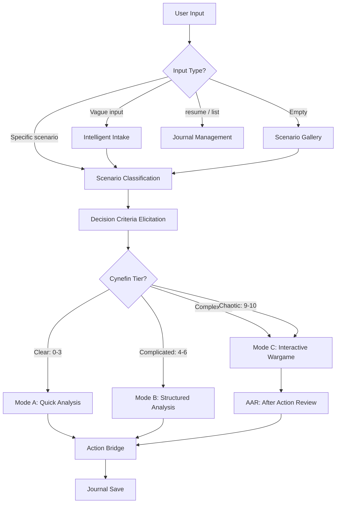

{/* HAND-MAINTAINED */}

import { Badge, Tabs, TabItem, Card, CardGrid, LinkCard, Aside, Steps } from '@astrojs/starlight/components';

<Badge text="wargame" variant="note" /> <Badge text="4227 words" variant="default" /> <Badge text="MIT" variant="success" /> <Badge text="v2.1" variant="success" /> <Badge text="wyattowalsh" variant="caution" /> <Badge text="opus" variant="tip" />

> Domain-agnostic strategic decision analysis and wargaming. Auto-classifies scenario complexity: simple decisions get structured analysis (pre-mortem, ACH, decision trees); complex or adversarial scenarios get full multi-turn interactive wargames with AI-controlled actors, Monte Carlo outcome exploration, and structured adjudication. Generates visual dashboards and saves markdown decision journals. Use for business strategy, crisis management, competitive analysis, geopolitical scenarios, personal decisions, or any consequential choice under uncertainty. NOT for simple pros/cons lists, non-strategic decisions, or academic debate.

<div class="quick-start">

### Quick Start

**Install:**
```bash
npx skills add wyattowalsh/agents/skills/wargame -g
```

**Use:** `/wargame` `<scenario description>`

</div>

Works with [Claude Code](https://docs.anthropic.com/en/docs/claude-code), [Gemini CLI](https://github.com/google-gemini/gemini-cli), and other [agentskills.io](https://agentskills.io)-compatible agents.

<Aside type="note" title="Hand-maintained page">
This page is intentionally hand-maintained (not overwritten by `wagents docs generate`) to preserve richer curated documentation while staying aligned with the underlying `skills/wargame/SKILL.md`.
</Aside>

## What It Does

Domain-agnostic strategic decision analysis. Every output labeled exploratory.

## Modes

| $ARGUMENTS | Action |
|------------|--------|
| Scenario text (specific) | → Classification → Criteria → Analysis |
| Vague/general input | → Research → Interview → Confirmation → Classification |
| `resume [# | keyword]` | Resume journal (numbered, keyword match, or auto-detect) |
| `list [filter]` | Show journal metadata table (optional filter: `active`, domain, tier) |
| `archive` | Archive journals older than 90 days (when count > 20) |
| `delete N` | Delete journal N with confirmation |
| `meta` | Cross-journal decision fitness analysis |
| `compare [j1] [j2]` | Side-by-side comparison of two journal runs |
| `summary [N]` | Condensed summary of completed journal N (10-20 lines) |
| `tutorial` | Run guided 2-turn pedagogical scenario |
| `facilitated` | Start facilitated multiplayer mode (LLM as game master only) |
| Empty | Show scenario gallery + "guide me" |

<Tabs>
  <TabItem label="General">
| Field | Value |
| ----- | ----- |
| Name | `wargame` |
| License | MIT |
| Version | 2.1 |
| Author | wyattowalsh |
  </TabItem>
  <TabItem label="Claude Code">
| Field | Value |
| ----- | ----- |
| Model | `opus` |
| Argument Hint | `<scenario description>` |
  </TabItem>
</Tabs>

## Related Skills

<CardGrid>
  <LinkCard title="host-panel" href="/skills/host-panel/" description="Host simulated panel discussions and debates among AI-simulated domain experts." />
  <LinkCard title="prompt-engineer" href="/skills/prompt-engineer/" description="Comprehensive prompt and context engineering for any AI system." />
  <LinkCard title="orchestrator" href="/skills/orchestrator/" description="Build and deploy parallel execution via subagent waves, agent teams, and multi-wave pipelines." />
</CardGrid>

<details>
<summary>View Full SKILL.md</summary>

````yaml title="SKILL.md"
---
name: wargame
description: >-
  Domain-agnostic strategic decision analysis and wargaming. Auto-classifies
  scenario complexity: simple decisions get structured analysis (pre-mortem,
  ACH, decision trees); complex or adversarial scenarios get full multi-turn
  interactive wargames with AI-controlled actors, Monte Carlo outcome
  exploration, and structured adjudication. Generates visual dashboards and
  saves markdown decision journals. Use for business strategy, crisis
  management, competitive analysis, geopolitical scenarios, personal decisions,
  or any consequential choice under uncertainty. NOT for simple pros/cons
  lists, non-strategic decisions, or academic debate.
license: MIT
argument-hint: "<scenario description>"
model: opus
metadata:
  author: wyattowalsh
  version: "2.1"
---

# Wargame

Domain-agnostic strategic decision analysis. Every output labeled exploratory.

## Canonical Vocabulary

Use these terms exactly throughout all modes:

| Term | Definition |
|------|-----------|
| **scenario** | The situation under analysis — includes trigger event, stakeholders, constraints, and decision space |
| **actor** | An entity in the wargame with goals, resources, and constraints; may be user-controlled or AI-controlled |
| **turn** | One cycle of the interactive wargame loop: situation brief, decision, adjudication, consequences |
| **adjudication** | The process of resolving a turn's decisions into outcomes using probability and game state |
| **monte carlo** | Randomized exploration of N outcome variations from a single decision point (N <= 25) |
| **inject** | A pre-seeded unexpected event deployed mid-game to force trade-offs between competing objectives |
| **tier** | Complexity classification: Clear (0-3), Complicated (4-6), Complex (7-10), Chaotic (9-10) |
| **AAR** | After Action Review — mandatory end-of-game analysis extracting biases, insights, and transferable principles |
| **journal** | The saved markdown record of an analysis or wargame session, stored in `~/.claude/wargames/` |
| **action bridge** | Three-level commitment framework: Probe (low-cost test), Position (reversible move), Commit (irreversible) |
| **criteria** | User-ranked decision dimensions (e.g., Speed, Cost, Risk) that weight option evaluation |
| **bias sweep** | Systematic check for human and LLM biases per `references/cognitive-biases.md` protocol |
| **rewind** | Load a previous turn's state snapshot and fork the journal to explore an alternate path |
| **difficulty** | Adjudication harshness: optimistic, realistic, adversarial, worst-case |

## Dispatch

| $ARGUMENTS | Action |
|------------|--------|
| Scenario text (specific) | → Classification → Criteria → Analysis |
| Vague/general input | → Research → Interview → Confirmation → Classification |
| `resume [# | keyword]` | Resume journal (numbered, keyword match, or auto-detect) |
| `list [filter]` | Show journal metadata table (optional filter: `active`, domain, tier) |
| `archive` | Archive journals older than 90 days (when count > 20) |
| `delete N` | Delete journal N with confirmation |
| `meta` | Cross-journal decision fitness analysis |
| `compare [j1] [j2]` | Side-by-side comparison of two journal runs |
| `summary [N]` | Condensed summary of completed journal N (10-20 lines) |
| `tutorial` | Run guided 2-turn pedagogical scenario |
| `facilitated` | Start facilitated multiplayer mode (LLM as game master only) |
| Empty | Show scenario gallery + "guide me" |

**Dispatch guard:** If args match an in-session command name (e.g., `red team`, `sensitivity`) but no session is active, treat as scenario text or ask for clarification: "Did you mean to start a new scenario about '{input}', or resume an existing session?"

### Scenario Gallery (empty args)

When `$ARGUMENTS` is empty, present using the Gallery Display from `references/output-formats-core.md`:

| # | Domain | Scenario | Likely Tier |
|---|--------|----------|-------------|
| 1 | Business | "Main competitor just acquired our key supplier" | Complex |
| 2 | Career | "Two job offers with very different trade-offs" | Complicated |
| 3 | Crisis | "Product recall with regulatory scrutiny and media attention" | Chaotic |
| 4 | Geopolitical | "Allied nation shifting alignment toward rival bloc" | Complex |
| 5 | Personal | "Relocate for a dream job or stay near aging parents" | Complicated |
| 6 | Startup | "Lead investor wants to pivot; co-founder disagrees" | Complex |
| 7 | Negotiation | "Union contract expires in 30 days, no deal in sight" | Complicated |
| 8 | Technology | "Open-source alternative threatens our core product" | Complex |

**Domain tags** are extensible. The predefined set covers common scenarios, but the LLM may auto-detect a more specific domain from user input and assign a custom tag (e.g., `healthcare`, `education`, `supply-chain`). Custom tags use the `custom` slug in filenames and the specific tag in journal frontmatter.

> Pick a number, paste your own scenario, or type "guide me".

### Guided Intake

If the user types "guide me", ask three questions sequentially:

1. **Situation + trigger:** "What is happening, and what forced this to your attention now?"
2. **Stakes + players:** "Who is involved, what do they want, and what is at stake?"
3. **Constraints + unknowns:** "What limits your options, and what do you wish you knew?"

After all three answers, synthesize into a scenario description and proceed to Scenario Classification.

### Intelligent Intake (vague inputs)

Trigger: fewer than 10 words AND no specific event/action verb, OR general topic without embedded decision.

**Phase 1: Contextual Research** — `WebSearch`/`WebFetch` (max 2-3 searches). Present via Context Research Display. Skip if web search unavailable.

**Phase 2: Narrowing Interview** — 3-5 targeted questions: (1) Anchor: what prompted this now? (2) Decision: what choice? (3) Stakes: what if wrong? (4) Constraints (if needed). (5) Timeline (if needed). Skip already-answered questions.

**Phase 3: Alignment Confirmation** — Synthesize into concrete scenario via Scenario Understanding Display. User confirms, adjusts, or starts over.

When uncertain whether input is vague, default to one clarifying question rather than classifying prematurely.

### Journal Resume

**`resume` (no args):** Read `~/.claude/wargames/`, find journals with `status: In Progress` in YAML frontmatter (or `**Status:** In Progress` for v1 journals). If exactly one, auto-resume. If multiple, show numbered list.

**`resume N` (number):** Resume the Nth journal from `list` output. Sort is reverse chronological (newest first) — this ordering is canonical for both `list` and `resume N`.

**`resume keyword` (text):** Search journal YAML frontmatter (`scenario`, `tags` fields) for case-insensitive substring match. If exactly one match, auto-resume. If multiple, show filtered list.

**Resume flow:** Read YAML frontmatter (metadata) + last `<!-- STATE ... -->` block (game state) for fast resume. Fall back to full-journal reconstruction if no state snapshot found.

### Journal List

If `$ARGUMENTS` starts with `list`: read `~/.claude/wargames/`, extract metadata from YAML frontmatter. For v1 journals without frontmatter, fall back to parsing `**Scenario:**`, `**Tier:**`, `**Status:**`, `**Turns:**` lines.

**Filters** (optional, AND-combined):
- `list active` — filter to `status: In Progress` only
- `list biz` — filter by domain tag
- `list complex` — filter by tier

Present using the list display from `references/output-formats-core.md`. Sort reverse chronological (newest first).

> resume [# | keyword], list [active | domain | tier]

### Journal Lifecycle

**`archive`:** Move journals older than 90 days from `~/.claude/wargames/` to `~/.claude/wargames/archive/`. Only runs when journal count > 20.

**`delete N`:** Delete journal N from `list`. Confirm before deleting: "Delete '{scenario}'? [yes/no]"

**Abandon protocol:** If the user types `end` or `abandon` during an active wargame before the AAR, update journal status to `Abandoned` and save. Abandoned journals appear in `list` but are excluded from `resume` (no arg) auto-detection.

Otherwise, proceed to Scenario Classification with the provided text.

## Wargame Principles

Core principles governing all modes. Violations are bugs.

- **Exploratory, not predictive** — RAND guardrail: all outputs are thought experiments, never forecasts. Label accordingly.
- **Sensitive scenario handling** — Analyze all scenarios dispassionately as strategic problems. Analytical distance is a feature.
- **Depth calibration** — Match analysis depth to complexity tier. Do not over-analyze trivial decisions or under-analyze consequential ones.
- **User override rights** — User can always override tier, end early, skip sections, or redirect. Proceed without resistance.
- **Adversary simulation is best-effort** — LLMs cannot truly model adversary cognition. Acknowledge this at the start of every Interactive Wargame.
- **Force trade-offs** — Never present costless options. If an option dominates, search harder for weaknesses.
- **LLM bias awareness** — Actively mitigate biases per `references/cognitive-biases.md`.

## Context Management

Multi-turn wargames consume significant context. These rules prevent overflow.

**Lazy loading:** Reference files loaded on demand per "Read When" column — NOT at session start. Read only relevant sections.

**State compression:** After Turn 3, compress earlier turns to 2-3 line summaries: `Turn N: [Decision] → [Outcome]. Key state change: [what shifted].` Full details remain in saved journal.

**Context budget:** >50%: full execution. 30-50%: drop Tier 3, compress turns older than 2. <30%: drop Tiers 2-3, minimal output, warn user to `export` and `resume`.

**Monte Carlo budget:** N <= 25 iterations. See `references/wargame-engine.md` Monte Carlo Iteration Protocol.

## Output Verbosity

Controls output density per turn. Set during setup or changed mid-game with `verbose [level]`.

| Level | Constraint Tiers | Target Lines/Turn | When |
|-------|-----------------|-------------------|------|
| `brief` | Tier 1 only | ~40 lines | Fast-paced play, experienced users |
| `standard` | Tier 1 + Tier 2 | ~60 lines | Default for all tiers |
| `detailed` | All tiers | ~80 lines | Deep analysis, learning mode |

Default: `standard`. Maps to the existing Constraint Priority Tiers in `references/wargame-engine.md`.

During setup, present: "Output verbosity? [brief / standard / detailed]" — user can skip (defaults to `standard`).

## Scenario Classification

Score the scenario on five dimensions. Show all scores to the user.

### Scoring Rubric

| Dimension | 0 | 1 | 2 |
|-----------|---|---|---|
| Adversary / competing interests | None | Passive / indirect | Active adversary optimizing against you |
| Reversibility | Easily reversible | Partially reversible / costly to undo | Irreversible or extremely costly |
| Time pressure | Months+ to decide | Weeks | Days or hours |
| Stakeholder count | 1-2 | 3-5 | 6+ with conflicting interests |
| Information completeness | Full information available | Partial / uncertain | Asymmetric or actively obscured |

### Tier Assignment

| Total Score | Tier | Mode | Depth |
|-------------|------|------|-------|
| 0-3 | Clear | Quick Analysis | Single output |
| 4-6 | Complicated | Structured Analysis | Single output |
| 7-8 | Complex | Interactive Wargame | 3-5 turns |
| 9-10 | Chaotic | Interactive Wargame (TTX) | 3-8 turns |

Score each dimension independently. Present a filled-in rubric table with the
user's scenario mapped to each row. **Include a Reasoning column** explaining
each score in one line (see `references/output-formats-core.md` Classification Display).

After scoring, present:
- **Why This Tier:** 2-3 sentences explaining which dimensions drove the score
- **What Would Change:** 1-2 sentences describing what shift would change the tier

Present difficulty level (auto-mapped from tier):

| Tier | Default Difficulty |
|------|-------------------|
| Clear | `optimistic` |
| Complicated | `realistic` |
| Complex | `adversarial` |
| Chaotic | `worst-case` |

> Your scenario scores **N/10** — tier **X**, mode **Y**, difficulty **Z**.
> Override tier or difficulty? [yes/no]

If the user overrides, acknowledge and switch without argument. If the user
provides additional context that changes scores, rescore and re-announce
before proceeding. Proceed to Decision Criteria Elicitation.

## Decision Criteria Elicitation

After classification, before entering any analysis mode. All modes.

Present 4-8 criteria relevant to THIS scenario's domain, scaled to complexity: Clear/Complicated: 4-5 criteria, Complex/Chaotic: 6-8 criteria. May include standard criteria (Speed, Cost, Risk, Relationships, Reversibility, Learning) or domain-specific ones the LLM proposes based on the scenario context.

```
Quick-rank for THIS decision (e.g., "3 1 5 2 4 6") or "skip":
  1. {criterion_1}  2. {criterion_2}  3. {criterion_3}  4. {criterion_4}  5. {criterion_5}  6. {criterion_6}
```

If the user provides a ranking, record it as ranked criteria. If the user skips,
proceed without criteria weighting. The user can re-rank anytime with the
`criteria` command.

**Swing weighting (Complex/Chaotic only):** For Complex or Chaotic tier scenarios, offer swing weighting after the quick-rank: "Your scenario has high complexity — would you like detailed swing weighting for more precise criteria weights? [quick-rank / swing]". Swing weighting procedure: (1) Set all criteria to their worst plausible level. (2) Ask: "Which criterion, improved from worst to best, would make the biggest difference?" — that criterion gets the highest weight. (3) Repeat for remaining criteria. (4) Normalize weights to sum to 1.0. Quick-rank remains the default for Clear/Complicated tiers.

**Criteria propagation by mode:**
- **Quick Analysis:** Annotate decision tree branches with alignment to top 2 criteria
- **Structured Analysis:** Use criteria as ranking dimensions in option analysis; criteria become quadrant chart axes
- **Interactive Wargame:** Annotate decision menu options with criteria alignment (High/Medium/Low per top criteria)

Criteria appear in the Decision Criteria Lens display (see `references/output-formats-core.md`).

## Mode A: Quick Analysis

Clear tier (score 0-3). Single output, minimal ceremony.

### Steps

1. **Restate decision** in the user's own terms. Confirm framing.
2. **Key Assumptions Check** — Surface 2-3 unstated assumptions baked into
   the scenario framing. Challenge each briefly.
3. **Framework application** — Select 2-3 frameworks from
   `references/frameworks.md` using the heuristic table. Apply each to the
   scenario. Show reasoning, not just labels.
4. **Analysis** — Present findings using a Unicode decision tree (see
   `references/output-formats-core.md`). Map options to outcomes with
   probabilities where estimable.
5. **Recommendation** — State clearly with:
   - Confidence level: high, medium, or low
   - Key assumption that could change this recommendation
   - Watch signal: what to monitor that would trigger reconsideration
6. **Bias sweep** — Run the Single-Output Mode Sweep per `references/cognitive-biases.md` Bias Sweep Protocol.
6b. **Proactive bias detection** — Suggest relevant commands for overconfidence signals (max one per turn). See `references/cognitive-biases.md` Enhanced Debiasing.
7. **Action Bridge** — See `references/output-formats-core.md` Action Bridge template. Each move must reference a specific analysis output.
8. **Monte Carlo option** — If uncertainty warrants it, offer: "Want to explore N variations? Type `explore [N]`." See `references/wargame-engine.md` Monte Carlo Iteration Protocol.
9. **Save journal** to `~/.claude/wargames/{date}-{slug}.md`

Keep the total output concise. This mode exists for decisions that do not
warrant deep analysis. Resist scope creep. If the analysis reveals the
scenario is more complex than initially scored, note this and offer to
re-classify upward.

## Mode B: Structured Analysis

Complicated tier (score 4-6). Single output, thorough examination.

### Steps

1. **Key Assumptions Check** — Surface and challenge all major assumptions.
   For each assumption, state what changes if it is wrong.
2. **Stakeholder mapping** — Table format:

   | Stakeholder | Interest | Power | Position |
   |-------------|----------|-------|----------|

   Power: high, medium, low. Position: supportive, neutral, opposed.
3. **Framework application** — Select 3-5 frameworks from
   `references/frameworks.md`. Include ACH (Analysis of Competing
   Hypotheses) if the scenario involves competing explanations or theories.
4. **Option analysis** — For each viable option, present explicit trade-offs.
   Every option must have at least one significant downside. No free lunches.
5. **Ranking with rationale** — Rank options. If criteria were set, use them as
   the primary ranking dimensions. State how each option scored against each
   criterion. Use granular probability estimates (percentages, not "low/medium/high")
   per superforecasting methodology (see `references/frameworks.md`).
6. **Decision triggers** — Define conditions that would change the
   recommendation. Be specific: thresholds, events, new information.
7. **Pre-mortem** — For each top-ranked option, imagine it has failed
   catastrophically. Identify the most likely cause of failure. State what
   early warning signs would precede that failure.
8. **Quadrant chart** — Generate a Mermaid quadrant chart plotting options
   on risk (x-axis) vs. reward (y-axis). Label each quadrant and place
   options with brief annotations.
8b. **Proactive bias detection** — Suggest relevant commands for overconfidence signals (max one per turn). See `references/cognitive-biases.md` Enhanced Debiasing.
9. **Action Bridge** — See `references/output-formats-core.md` Action Bridge template.
10. **Monte Carlo option** — Offer: "Want to explore N variations? Type `explore [N]`." See `references/wargame-engine.md` Monte Carlo Iteration Protocol.
11. **Save journal** to `~/.claude/wargames/{date}-{slug}.md`

## Mode C: Interactive Wargame

Complex/Chaotic tier (score 7-10). Multi-turn interactive protocol.

### Setup Phase

1. **Define actors** — Create 2-8 actors using structured persona templates
   from `references/wargame-engine.md`. Each actor has: name, role, goals,
   resources, constraints, personality archetype (hawk, dove, pragmatist,
   ideologue, bureaucrat, opportunist, disruptor, or custom).
2. **User role selection** — User selects which actor they control. If none
   fit, create a custom actor for them.
3. **Initial conditions** — Define the starting state: resources, positions,
   alliances, constraints, information each actor has access to.
4. **Pre-seed injects** — Create 3-5 injects (unexpected events). At least
   one must be a positive opportunity, not just a crisis. Injects remain
   hidden from the user until deployed.
5. **Set turn count** — Default: Complex 3-5 turns, Chaotic 3-8 turns. User may request 2-12 turns. Above 8 turns, warn: "Extended games may hit context limits — consider `export` + `resume` at turn 8." Confirm actor list and turn count with user before proceeding.
6. **Present setup summary** — Show all actors, initial conditions, and turn
   count. Confirm with user before proceeding.

State the adversary simulation limitation explicitly during setup: "AI-
controlled actors optimize for their stated goals, but this is best-effort
simulation, not genuine adversarial cognition."

Ensure actor goals genuinely conflict. If all actors want the same thing,
the wargame degenerates into a coordination exercise. Introduce at least
one structural tension between actor objectives.

### Turn Loop

Execute turns per `references/wargame-engine.md` Turn Structure (13 steps). The engine handles choice architecture, belief updating, signal classification, consider-the-opposite, and in-session command dispatch.

Use display templates from `references/output-formats-core.md`: Turn Header Display for status bar, Intelligence Brief Display for situation, Actor Card Display for each actor, Decision Card Display for options, Inject Alert Display for injects. Target 40-80 lines per turn.

**Proactive bias detection:** Suggest relevant commands for overconfidence signals (max one per turn). See `references/cognitive-biases.md` Enhanced Debiasing.

### Inject Deployment

Fire pre-seeded injects per `references/wargame-engine.md` Inject Design. Injects must create dilemmas forcing trade-offs between competing objectives.

### End Conditions

The wargame ends when: max turns reached, user explicitly ends early, or a
decisive outcome renders continued play moot. If the user says "end",
"stop", "done", or "AAR", proceed to AAR immediately. Proceed to AAR
regardless of end condition — never end without it.

### Mandatory AAR (After Action Review)

Never skip the AAR. This is where learning happens.

1. **Timeline** — Key decisions and their outcomes in chronological order.
2. **What worked and what failed** — With evidence from turn records.
3. **Biases detected** — Both human decision biases and LLM simulation
   biases observed during play. Name each bias explicitly.
4. **Transferable insights** — Decision principles extracted from this
   scenario that apply to the user's real context.
5. **Paths not taken** — Briefly explore 2-3 alternative decision paths
   and their likely consequences. For each, identify the turn where the
   divergence would have occurred and the likely cascade.
6. **Actor performance** — Evaluate each AI-controlled actor: did they
   behave consistently with their archetype and goals? Flag any actors
   that drifted from their persona (LLM consistency check).
7. **Visualizations** — Generate Mermaid timeline (campaign phases) and decision tree (key branch points) in
   the journal showing the full arc of the wargame.
8. **Final journal save** — Write the complete AAR to the journal file.
9. **Action Bridge** — See `references/output-formats-core.md` Action Bridge template. The Probe should target the most uncertain insight from the AAR.

## State Management

### Journal Directory
- Path: `~/.claude/wargames/`
- Create on first use with `mkdir -p`
- Archive path: `~/.claude/wargames/archive/`

### Journal Format
Journals use YAML frontmatter for machine-parseable metadata:

```yaml
---
scenario: "{title}"
tier: {Clear | Complicated | Complex | Chaotic}
mode: {Quick Analysis | Structured Analysis | Interactive Wargame}
difficulty: {optimistic | realistic | adversarial | worst-case}
status: {In Progress | Complete | Abandoned}
created: {YYYY-MM-DDTHH:MM:SS}
updated: {YYYY-MM-DDTHH:MM:SS}
turns: {completed}/{total}
criteria: [{ranked criteria list}]
actors: [{actor names}]
tags: [{domain tags}]
---
```

**Migration:** If `list`/`resume` encounters a journal without `---` frontmatter, fall back to v1 markdown header parsing. New journals always use frontmatter.

### Filename Convention
Pattern: `{YYYY-MM-DD}-{domain}-{slug}.md`
- `{domain}`: predefined: `biz`, `career`, `crisis`, `geo`, `personal`, `startup`, `negotiation`, `tech`. Auto-detected domains use `custom` as the slug.
- `{slug}`: 3-5 word semantic summary (e.g., `supplier-acquisition-crisis`)
- Collision handling: append `-v2`, `-v3`, etc.

### Save Protocol
- **Quick Analysis / Structured Analysis:** Save once at end with `status: Complete`
- **Interactive Wargame:** Save after EVERY turn with `status: In Progress`. After AAR, update to `status: Complete`

### State Snapshot
Append a `<!-- STATE ... -->` YAML block as an HTML comment after each turn save. Fields: `turn_number`, `difficulty`, `verbosity`, `criteria`, `branches`, `actors` (each with name, resources, stance, beliefs, information_state, relationships, risk_posture, attention_style), `active_injects`, `inject_history`. Resume reads frontmatter + last state block. Full schema and rewind/branch protocols in `references/session-commands.md` § State Snapshot and § Rewind Protocol.

### Sort Order
Journals sorted by filename (reverse chronological — newest first). This ordering is canonical for both `list` and `resume N`.

### Corruption Resilience
1. Before writing: validate target file exists and frontmatter is parseable
2. After writing: verify write completed
3. On resume: if frontmatter missing or malformed, attempt v1 header parsing. If that fails, inform user: "Journal appears corrupted. Start a new analysis of the same scenario?"

## In-Session Commands

Available during any active analysis or wargame. Type `?` at any decision
point to see the full menu.

| Command | Modes | Effect |
|---------|-------|--------|
| `red team` / `challenge` | All | Strongest case against preferred option |
| `what if <condition>` | All | Focused counterfactual, max 3 per decision |
| `criteria` | All | Set or re-rank decision criteria |
| `explore [N]` | All | Monte Carlo exploration, default N=15. See `references/wargame-engine.md` Monte Carlo Iteration Protocol |
| `sensitivity` | All | Parameter sensitivity tornado diagram |
| `delphi` / `experts` | All | Synthetic expert panel with structured disagreement |
| `forecast` / `base rate` | All | Reference class forecasting with Fermi decomposition |
| `negotiate` / `batna` | All | BATNA/ZOPA negotiation mapping |
| `calibrate` | All | Probability calibration audit |
| `options` / `optionality` | All | Real options framing |
| `cause` / `causal` | All | Causal diagram with feedback loops |
| `morph` / `scenarios` | All | Morphological scenario generator |
| `research` | All | WebSearch intelligence briefing for current decision point |
| `rewind [N]` | Wargame | Load turn N's state snapshot (default: 1 turn back), fork journal |
| `branches` | Wargame | List, switch, or prune timeline branches |
| `status` | All | Condensed mid-game snapshot without advancing the turn |
| `export` / `dashboard` | All | Render HTML dashboard |
| `meta` | All | Cross-journal decision fitness report |
| `compare [j1] [j2]` | All | Side-by-side comparison of two journal runs |
| `summary [N]` | All | Condensed 10-20 line summary of completed journal N |
| `verbose [level]` | All | Change output verbosity: `brief`, `standard`, `detailed` |
| `?` | All | Show command menu (Command Menu Display) |

All commands handled per protocols in `references/wargame-engine.md` (except `criteria`, `export`, `verbose`, `research`, `rewind`, `branches`, `status`, `meta`, `compare`, `summary`, and `?` which are defined in this file). Display templates in `references/output-formats-core.md` and `references/output-formats-commands.md`.

Command protocols for `export`, `meta`, `compare`, and `summary`: read `references/session-commands.md`.

## Difficulty Levels

Auto-mapped from tier (Clear→optimistic, Complicated→realistic, Complex→adversarial, Chaotic→worst-case). User can override during classification. Difficulty affects actor behavior, inject frequency, adjudication thresholds, and analysis tone in all modes.

See `references/wargame-engine.md` Difficulty Levels for full specification.

## Tutorial Mode

Tutorial (`$ARGUMENTS` = `tutorial`): pre-scripted 2-turn Complicated tier scenario with pedagogical annotations. Full protocol in `references/session-commands.md` § Tutorial Mode.

## Research Command

Research (`research` during active session): 1-2 targeted WebSearch queries for current decision point, presented via Intelligence Research Display. Does not advance the turn. Full protocol in `references/session-commands.md` § Research Command.

## Facilitated Mode

Facilitated mode (`$ARGUMENTS` = `facilitated`): LLM as game master only, all actors human-controlled. Full protocol in `references/session-commands.md` § Facilitated Mode.

## Reference File Index

| File | Content | Read When |
|------|---------|-----------|
| `references/frameworks.md` | Framework catalog (13 entries), selection heuristics, enforcement rules | Selecting frameworks for any mode |
| `references/frameworks-procedures.md` | Step-by-step procedures for each framework | Applying a specific selected framework |
| `references/wargame-engine.md` | Actor definitions (9-field), turn structure (13 steps), adjudication, Monte Carlo, counterfactual/red-team protocols, 8 analytical command protocols, inject design, difficulty levels | Setting up or running any analysis mode |
| `references/cognitive-biases.md` | 10 human + 4 LLM biases, bias sweep protocol, analytical constitution | Bias checks in any mode |
| `references/output-formats-core.md` | Core display templates (20+), UX box-drawing system, journal format, accessibility rules | Rendering any output |
| `references/output-formats-commands.md` | Analytical command display templates (red team, sensitivity, delphi, forecast, etc.) | Rendering output for a specific analytical command |
| `references/session-commands.md` | Export, meta, compare, summary command protocols + facilitated mode | `export`, `meta`, `compare`, `summary`, or `facilitated` commands |
| `references/dashboard-schema.md` | JSON data contract for HTML dashboard (12 view schemas, cross-view fields) | `export` or `dashboard` command |
| `references/visualizations.md` | Design principles, Unicode charts, Mermaid diagrams, HTML dashboard patterns | Generating visual outputs |
| `templates/dashboard.html` | Composable HTML dashboard with JSON-in-script rendering (12+ views) | `export` or `dashboard` command |

Read reference files as indicated by the "Read When" column above. Do not
rely on memory or prior knowledge of their contents. Reference files are
the source of truth. If a reference file does not exist, proceed without
it but note the gap in the journal.

## Critical Rules

1. Label ALL outputs as exploratory, not predictive (RAND guardrail)
2. Always allow the user to override the classification tier
3. Never skip AAR in Interactive Wargame mode
4. Force trade-offs — every option must have explicit downsides
5. Name biases explicitly when detected — both human and LLM
6. Default maximum 8 turns per wargame; user may override up to 12 with context warning
7. Save journal after every turn in Interactive Wargame mode
8. Criteria and Action Bridge are mandatory — when criteria are set they must visibly influence rankings; every recommendation, ranking, or AAR must end with Probe/Position/Commit

**Canonical term enumerations:** See `references/session-commands.md` § Canonical Terms for exact string values of tiers, modes, archetypes, difficulty levels, commands, verbosity levels, action bridge levels, journal statuses, and domain tags.

````

[Download from GitHub](https://raw.githubusercontent.com/wyattowalsh/agents/main/skills/wargame/SKILL.md)

</details>

---

## Deep Dive

Architecture, research sources, framework catalog, design decisions, and roadmap for the wargame skill.

## Architecture

The wargame skill is organized as a self-contained skill directory with reference documents that the LLM reads on demand during execution.

### File Tree

```
skills/wargame/
  SKILL.md                          # Main skill specification (dispatch, modes, rules)
  references/
    frameworks.md                   # 13 decision analysis frameworks + selection heuristics
    wargame-engine.md               # Actor model, turn structure, adjudication, protocols
    cognitive-biases.md             # 10 human + 4 LLM biases, sweep protocol, constitution
    output-formats.md               # 20+ display templates, box-drawing system, UX rules
    visualizations.md               # 3-tier viz system (Unicode, Mermaid, HTML dashboard)
  templates/
    dashboard.html                  # Composable HTML dashboard (~600 lines, 12+ views)
```

Reference files are loaded lazily -- the LLM reads each file only when its content is needed (e.g., `frameworks.md` during framework selection, `cognitive-biases.md` during bias sweeps). This keeps the active context budget lean while the full specification spans thousands of tokens.

### Mode Flow

Every invocation follows the same pipeline, branching at classification:



<Aside type="tip">
The user can override the classification tier at any point. If a Quick Analysis reveals unexpected complexity, the skill offers to re-classify upward.
</Aside>

---

## Features

### UX Features

<Tabs>
  <TabItem label="Intake">
    **Scenario Gallery** -- When invoked with no arguments, presents 8 pre-built scenarios spanning business, career, crisis, geopolitical, personal, startup, negotiation, and technology domains. Each scenario is tagged with its likely Cynefin tier.

    **Guided Intake** -- The `"guide me"` option walks the user through three sequential questions: situation and trigger, stakes and players, constraints and unknowns. Synthesizes answers into a concrete scenario description.

    **Intelligent Intake** -- For vague or general inputs, runs a three-phase protocol: (1) web research to gather domain context, (2) targeted interview informed by research findings, (3) alignment confirmation before classification. Degrades gracefully when web search is unavailable.
  </TabItem>
  <TabItem label="Journals">
    **YAML Frontmatter** -- Every journal uses machine-parseable YAML frontmatter with scenario title, tier, mode, difficulty, status, timestamps, criteria, actors, and domain tags. v1 fallback parsing for legacy journals.

    **Semantic Slugs** -- Filenames follow `{YYYY-MM-DD}-{domain}-{slug}.md` with 3-5 word semantic summaries (e.g., `2026-02-17-biz-supplier-acquisition-crisis.md`).

    **Filtered List** -- The `list` command supports AND-combined filters: `list active`, `list biz`, `list complex`. Reverse chronological sort.

    **Keyword Resume** -- Resume by number (`resume 3`), keyword (`resume supplier`), or auto-detect the single in-progress journal (`resume`).

    **Lifecycle** -- Archive journals older than 90 days, delete by number with confirmation, abandon in-progress wargames gracefully.

    **State Snapshots** -- HTML comment YAML blocks appended after each turn enable fast resume without full-journal reconstruction.
  </TabItem>
  <TabItem label="Session UX">
    **Progressive Disclosure** -- The `?` command reveals the full command menu only when requested, keeping the default interface clean.

    **Difficulty Levels** -- Four levels (optimistic, realistic, adversarial, worst-case) auto-mapped from tier but user-overridable. Affects actor behavior, inject frequency, adjudication friction, and analysis tone.

    **Transparent Classification** -- Every score includes a reasoning column explaining each dimension. "Why This Tier" and "What Would Change" sections make the classification auditable.

    **User Override Rights** -- The user can override tier, difficulty, end early, skip sections, or redirect analysis at any point. The skill acknowledges overrides without resistance.
  </TabItem>
</Tabs>

### Analysis Tools

14 in-session commands available at any decision point during active analysis or wargame sessions:

<Tabs>
  <TabItem label="Analysis">
    | Command | Purpose |
    |---------|---------|
    | `red team` / `challenge` | Build the strongest case against the preferred option -- weakest assumptions, concrete attack vectors, historical analog, counter-recommendation |
    | `what if <condition>` | Focused counterfactual tracing first, second, and third-order effects (max 3 per decision) |
    | `explore [N]` | Monte Carlo exploration with multi-axis diversity -- varies actor decisions, information states, random events, adjudication outcomes, and external context (default N=10) |
    | `sensitivity` | Parameter sensitivity tornado diagram ranking variables by outcome swing magnitude |
    | `calibrate` | Probability calibration audit -- checks base rate anchoring, overconfidence, Fermi decomposition |
  </TabItem>
  <TabItem label="Strategy">
    | Command | Purpose |
    |---------|---------|
    | `delphi` / `experts` | Synthetic expert panel with 3-5 domain experts, structured disagreement, convergence/divergence analysis, and crux identification |
    | `forecast` / `base rate` | Reference class forecasting with Fermi decomposition, base rate anchoring, and granular probability adjustment |
    | `negotiate` / `batna` | BATNA/ZOPA negotiation mapping -- reservation values, aspiration points, value creation opportunities, power dynamics |
    | `options` / `optionality` | Real options framing -- options created vs destroyed, exercise triggers, optionality ranking under uncertainty |
    | `cause` / `causal` | Lightweight causal diagram with feedback loops (reinforcing and balancing) and intervention point identification |
    | `morph` / `scenarios` | Morphological scenario generator -- cross-product of key dimensions, consistency filtering, cluster analysis, wild cards, robust moves |
  </TabItem>
  <TabItem label="Session">
    | Command | Purpose |
    |---------|---------|
    | `criteria` | Set or re-rank decision criteria at any time -- criteria propagate into option annotations, rankings, and quadrant charts |
    | `export` / `dashboard` | Render composable HTML dashboard with JSON-in-script pattern -- classification, turn, analysis, or AAR views |
    | `?` | Show categorized command menu |
  </TabItem>
</Tabs>

### Behavioral Realism

The Interactive Wargame mode models actors with behavioral parameters grounded in decision science:

<CardGrid>
  <Card title="Risk Posture">
    Qualitative risk profile (risk-seeking / risk-neutral / risk-averse) measured against each actor's reference point. Hawks default to risk-seeking; doves to risk-averse. Risk-averse actors reject favorable gambles to avoid losses; risk-seeking actors escalate after setbacks.
  </Card>
  <Card title="Attention Style">
    Cognitive bandwidth model (reactive / adaptive / agile). Reactive actors process one development at a time and satisfice under pressure. Agile actors process many signals in parallel. Bureaucrats default to reactive; disruptors to agile.
  </Card>
  <Card title="Bayesian Belief Updating">
    Each actor maintains probabilistic beliefs about other actors' intentions. Beliefs update incrementally via likelihood ratios after observing actions. Costly signals trigger larger updates than cheap talk. Reactive actors update more slowly.
  </Card>
  <Card title="Signal Classification">
    Every action is classified as a costly signal (consumes resources, high credibility), cheap talk (verbal declaration, low credibility), or mixed. Signal credibility feeds directly into belief updating magnitude.
  </Card>
</CardGrid>

**Constraint Priority Tiers** -- The engine manages approximately 24 active constraints organized into three tiers:

| Tier | Label | Count | Scope |
|------|-------|-------|-------|
| 1 | **Structural** (never skip) | ~10 | Turn sequence, adjudication, journal save, decision menu, unexpected consequence, dissenting actor |
| 2 | **Quality** (best-effort) | ~8 | Anti-escalation, anti-blue-bias, signal classification, choice architecture, consider-the-opposite, bias callouts, belief updating |
| 3 | **Enrichment** (when context allows) | ~6 | Sparkline trends, attention style effects, per-action signal taxonomy, EVPI, Mermaid in journal |

### Decision Science

<Tabs>
  <TabItem label="Superforecasting">
    Integrates Tetlock's superforecasting methodology throughout:
    - **Fermi decomposition** -- Break complex probabilities into estimable sub-questions
    - **Base rate anchoring** -- Every estimate starts from an outside-view base rate before scenario-specific adjustment
    - **Granular probabilities** -- Percentages (`35%`), not vague labels (`medium likelihood`)
    - **Calibration audits** -- The `calibrate` command checks all estimates for overconfidence (widen by 50%) and base rate anchoring
  </TabItem>
  <TabItem label="Choice Architecture">
    Option presentation is itself a bias vector. Four mitigations are integrated into every decision menu:
    1. **Randomized order** between turns to prevent primacy/recency bias
    2. **Dual framing** -- risk presented in both positive and negative frames (`70% success` AND `30% failure`)
    3. **Active "do nothing"** -- status quo presented as an active choice requiring justification, not the default
    4. **Uncertainty ranges** -- `moderate (range: low-high)` instead of point estimates
  </TabItem>
  <TabItem label="EVPI">
    After Monte Carlo exploration, the skill identifies the variable whose resolution would most change the outcome distribution:

    > *If you could know ONE thing with certainty, the most valuable would be: [variable]. Knowing this could shift your expected outcome from [current range] to [resolved range]. Investment suggestion: [specific action].*

    This tells the user where to invest in information gathering before committing.
  </TabItem>
  <TabItem label="Constitution">
    A 3-principle self-revision checklist applied at exactly two points (after final recommendation in Quick/Structured, after AAR in Wargame):
    1. **Adversary parity** -- Adversary actors receive the same quality of strategic reasoning as user-aligned actors
    2. **Grounded outcomes** -- Outcomes grounded in scenario conditions, not dramatic preference
    3. **Calibrated confidence** -- Confidence matched to available information, not inflated for rhetoric

    Plus **consider-the-opposite** debiasing: after user decisions that conflict with a specific actor's stated objective, briefly show that actor's opposing perspective.
  </TabItem>
</Tabs>

---

## Frameworks Catalog

The skill draws from 13 decision analysis frameworks, selected via a heuristic matching table:

| # | Framework | Best For |
|---|-----------|----------|
| 1 | Pre-Mortem | Identifying failure modes before they happen |
| 2 | Red Team / Devil's Advocacy | Stress-testing a preferred option |
| 3 | SWOT (via Scenario Planning 2x2) | Quick strengths/weaknesses snapshot |
| 4 | Analysis of Competing Hypotheses (ACH) | Evaluating rival explanations with evidence matrix |
| 5 | Stakeholder Power/Interest Mapping | Mapping influence, engagement, and coalition dynamics |
| 6 | Decision Trees with Expected Value | Quantifying branching outcomes with option value extension |
| 7 | Payoff Matrix / Game Theory | Comparing options across scenarios, finding Nash equilibria |
| 8 | Scenario Planning (2x2) | Exploring multiple futures along two critical uncertainties |
| 9 | OODA Loop | Fast-cycle competitive response under incomplete information |
| 10 | Second-Order Effects Chain | Tracing cascading consequences and feedback loops |
| 11 | Regret Minimization | Minimizing worst-case regret for irreversible decisions |
| 12 | Key Assumptions Check | Surfacing unstated assumptions before analysis |
| 13 | Multi-Criteria Decision Analysis (MCDA) | Weighted scoring across dimensions with sensitivity testing |

<Aside type="note">
**Framework selection heuristic by mode:** Quick Analysis uses 2-3 frameworks. Structured Analysis chains 3-5 (including ACH when competing explanations exist). Interactive Wargame integrates frameworks throughout turns with adversarial red-teaming. Superforecasting methodology (Fermi decomposition + base rates) applies whenever any framework requires probability estimates.
</Aside>

---

## Cognitive Bias Engine

The skill maintains a dual bias catalog -- human decision biases detected in user strategies, and LLM-specific biases mitigated structurally in the simulation engine.

### Human Biases (10)

| # | Bias | Detection Signal | Challenge Prompt |
|---|------|-----------------|------------------|
| 1 | **Anchoring** | First option dominates; alternatives dismissed without comparison | "Remove the first option entirely. What would you choose if it never existed?" |
| 2 | **Confirmation** | Evidence cited only supports preferred outcome | "List three pieces of evidence that contradict your current position." |
| 3 | **Sunk Cost** | Justification references past investment, not future value | "If starting fresh today with zero prior investment, would you still choose this?" |
| 4 | **Availability** | Recent/vivid examples drive risk assessment over base rates | "Set aside that example. What does the statistical base rate actually say?" |
| 5 | **Planning Fallacy** | Best-case timelines; risks acknowledged but not quantified | "What happened the last three times a similar plan was attempted?" |
| 6 | **Groupthink** | Quick convergence; dissent framed as disloyal | "Appoint a designated dissenter. What is the strongest case against consensus?" |
| 7 | **Status Quo** | "No change needed" as default; burden of proof on change | "Assume the current state degrades 20% next cycle. Re-evaluate doing nothing." |
| 8 | **Overconfidence** | Estimates cluster near 0% or 100%; narrow uncertainty ranges | "Widen your confidence interval by 50%. What changes at the new bounds?" |
| 9 | **Loss Aversion** | Small downside risk blocks proportionally larger upside | "Reframe: instead of what you might lose, what is the cost of not capturing the gain?" |
| 10 | **Framing Effect** | Conclusions shift between "90% success" vs "10% failure" | "Restate this outcome using the opposite frame. Does your assessment change?" |

### LLM-Specific Biases (4)

These are always-on mitigations applied during adjudication -- structural failure modes of the simulation engine itself:

<CardGrid>
  <Card title="Escalation Bias">
    LLMs prefer dramatic outcomes. **Mitigation:** Flag unjustified escalation; require de-escalation alternatives for every aggressive action; suppress dramatic language without quantified impact.
  </Card>
  <Card title="Sycophancy">
    LLMs reinforce user framing. **Mitigation:** Adversarial prompting on user positions; at least one dissenting actor per turn; score adversary arguments independently.
  </Card>
  <Card title="Farcical Harmony">
    Multi-actor dialogues converge too quickly. **Mitigation:** Structured pro/con before consensus; mandatory dissent through first deliberation round; document concessions.
  </Card>
  <Card title="Blue Bias">
    LLMs underestimate adversaries. **Mitigation:** Calibrate adversary capabilities to real-world benchmarks; dedicated adversary advocate reviews adjudications; inject friction into friendly-force execution.
  </Card>
</CardGrid>

### Sweep Protocol

<Steps>
1. **Checkpoint 1 (Pre-adjudication):** Scan actor reasoning against human biases table. If detected, inject challenge prompt. Rate limit: max 1 human bias flag per 2 turns per actor.
2. **Checkpoint 2 (Post-adjudication):** Run all 4 LLM-specific mitigations (always-on, not rate-limited). Verify each criterion before finalizing turn output.
</Steps>

<Aside type="caution">
**Gamified debiasing delivery:** Instead of confrontational warnings, bias detection is framed as skill checks: "Bias detected: Anchoring. Your analysis weighted the first option 3x more heavily. Adjustment: evaluating options in reverse order." Interactive feedback in this style reduces biases 30%+ with lasting effects (Fasolo et al. 2025).
</Aside>

---

## Visualization System

Three tiers, with automatic fallback to the highest available:

<Tabs>
  <TabItem label="Tier 1: Unicode">
    <Badge text="Zero dependencies" variant="success" /> Always available in any terminal.

    - **Decision trees:** `--- CHOICE --- OPT A --- OPT B` with risk/gain per branch
    - **2x2 matrices:** SWOT, priority grids with box-drawing characters
    - **Force maps:** `SUPPORT <---> OPPOSE` with bar weights per stakeholder
    - **Resource bars:** `Military: 80%` with visual fill indicators
    - **Actor tables:** Multi-dimension status with bar indicators and trend arrows
    - **Timelines:** `T1 -- T2 -- T3` with event labels

    All Unicode visualizations include text equivalents (bars show both visual fill AND percentage).
  </TabItem>
  <TabItem label="Tier 2: Diagrams">
    <Badge text="Mermaid / Graphviz" variant="note" /> Auto-detected via `command -v mmdc` and `command -v dot`.

    Supported diagram types:
    - **Quadrant charts** -- Option assessment (risk vs reward axes)
    - **Timelines** -- Campaign progression and decision arcs
    - **Flowcharts** -- Decision trees with probability branches
    - **Causal diagrams** -- Variables with reinforcing (+) and dampening (-) links
    - **State diagrams** -- Actor state transitions
    - **Sequence diagrams** -- Actor interaction sequences
  </TabItem>
  <TabItem label="Tier 3: Rich HTML">
    <Badge text="Dashboard template" variant="tip" /> Composable HTML dashboard (~600 lines) with JSON-in-script rendering.

    **Pattern:** The LLM writes only the JSON data block. Template JS handles all rendering deterministically. Self-validating: malformed JSON falls back to a `<pre>` error display.

    **12+ view types:**

    | View | Sections | Trigger |
    |------|----------|---------|
    | `classification` | Score bars, tier badge, reasoning | After classification |
    | `turn` | Actors, options, inject, situation brief | Each wargame turn |
    | `analysis` | Grid (ACH/matrix/stakeholder subview) | Structured Analysis |
    | `aar` | Timeline, insights, paths not taken, action bridge | After AAR |
    | Compound views | Multiple views combined | `export` / `dashboard` command |

    **Design:** OKLCH color space, glass morphism effects, SVG data visualization, semantic HTML with `role` and `aria-label` attributes. Dark theme (`#0f172a` background).

    **Rendering flow:** Playwright screenshot (preferred) -- browser open (fallback) -- Tier 1 Unicode (always works).
  </TabItem>
</Tabs>

---

## Research Sources

The skill's design draws from peer-reviewed research, institutional wargaming practice, and decision science literature:

| Domain | Source | Key Contribution |
|--------|--------|-----------------|
| Prospect Theory | "LLM economicus?" (arXiv 2408.02784) | LLMs exhibit prospect-theory-like biases; explicit parameterization needed |
| Bayesian Games | "Game-theoretic LLM" (arXiv 2411.05990) | Structured workflows enable LLMs to compute Nash Equilibria under incomplete info |
| Signaling | Sobel; MIT OCW Game Theory | Costly vs cheap signals; credibility assessment |
| Superforecasting | Tetlock; Good Judgment Project | 60% improvement via Fermi decomposition + base rates + calibration |
| Choice Architecture | Thaler &amp; Sunstein; "Autonomous Choice Architect" (Springer) | Option presentation affects decision quality |
| Debiasing | Fasolo et al. 2025 (Journal of Management) | Interactive debiasing reduces biases 30%+ with lasting effects |
| Constitutional AI | Anthropic; C3AI (ACM 2025) | Self-revision principles improve analytical objectivity |
| Monte Carlo Diversity | "Monte Carlo Temperature" (Amazon 2025); NeurIPS 2025 | Multi-axis variation prevents narrative clustering |
| EVPI/EVSI | DeLLMa (ICLR 2025 Spotlight) | Information value analysis for decision prioritization |
| Bounded Rationality | Simon; Stanford Encyclopedia | Satisficing + processing capacity limits for realistic actors |
| Snow Globe | IQT Labs (arXiv 2404.11446) | Closest existing LLM wargame system; validates architecture |
| JHU APL GenWar | JHU APL (Oct 2025) | State-of-art institutional AI wargaming |
| Multi-Agent Debate | ICLR 2025 Blogpost | Persona diversity > structural parameters for debate quality |
| Wargaming | "Shall We Play a Game?" (arXiv 2509.17192) | Language models for open-ended wargames |

<Aside type="note">
Citations live in the docs, not in the skill specification. This saves approximately 200 tokens from the LLM's active context during execution while keeping the research trail fully auditable here.
</Aside>

---

## Design Decisions

Key resolved decisions with rationale. These document the "why" behind architectural choices that may appear non-obvious.

<Tabs>
  <TabItem label="Architecture">
    <Aside type="caution" title="1. No MCP server">
      Three showstoppers verified: `ctx.set_state` is request-scoped (no persistent state across tool calls), `ctx.elicit` is broken in Claude Code, and `ui://` protocol is unsupported. A pure-prompt skill with file-based state (journals) works reliably today. MCP integration deferred to v3 pending upstream fixes.
    </Aside>

    <Aside type="tip" title="2. Canonical turn specification in wargame-engine.md">
      SKILL.md contains only a summary reference to the turn structure. The full 13-step specification lives exclusively in `references/wargame-engine.md`. This eliminates dual specification (two sources of truth that can drift) at the cost of one extra file read per wargame session.
    </Aside>

    <Aside type="tip" title="3. Constraint priority tiers">
      With approximately 24 active constraints per turn, a priority system was necessary. Three tiers (structural/quality/enrichment) ensure the skill degrades gracefully under context pressure rather than failing unpredictably. Tier 1 constraints are never skipped; Tier 3 constraints fire only when budget allows.
    </Aside>
  </TabItem>
  <TabItem label="Behavioral Model">
    <Aside type="caution" title="4. Qualitative behavioral parameters">
      Early versions used lambda coefficients for prospect theory math. LLMs cannot reliably compute prospect theory equations, producing inconsistent numerical outputs. Replacing coefficients with qualitative risk posture (risk-seeking/neutral/averse) and attention style (reactive/adaptive/agile) preserves the behavioral insight while staying within LLM capabilities.
    </Aside>

    <Aside type="tip" title="5. Analytical constitution reduced from 7 to 3 principles">
      The original 7-principle self-revision checklist was too expensive to apply at every output. Reducing to 3 principles (adversary parity, grounded outcomes, calibrated confidence) applied at exactly 2 checkpoints maintains analytical rigor without bloating every turn.
    </Aside>
  </TabItem>
  <TabItem label="Data &amp; UX">
    <Aside type="tip" title="6. YAML frontmatter journals">
      Standard machine-parseable format enabling filtered list, keyword resume, and potential future cross-journal analytics. v1 fallback parsing ensures backward compatibility with legacy markdown-header journals.
    </Aside>

    <Aside type="tip" title="7. 10 to 14 analytical commands">
      All user-triggered, producing standalone output blocks with zero per-turn constraint burden. Adding `sensitivity`, `delphi`, `forecast`, and `negotiate` was free in constraint budget terms because they only fire on demand.
    </Aside>

    <Aside type="tip" title="8. One composable dashboard template">
      A single ~600-line HTML file with JSON-in-script rendering supports 12+ view types. The LLM writes only JSON data; template JS handles rendering deterministically. This eliminates fragile HTML token substitution that plagued earlier approaches.
    </Aside>

    <Aside type="note" title="9. Citations in docs, not skill">
      Moving the full citation table from SKILL.md to this page saves approximately 200 tokens from the LLM's active context during every execution. The research trail remains fully auditable here.
    </Aside>

    <Aside type="tip" title="10. Intelligent intake for vague inputs">
      Web research followed by targeted interview followed by confirmation. Degrades gracefully: if web search is unavailable, skips to interview. The existing "guide me" option remains for users who want generic intake without research.
    </Aside>
  </TabItem>
</Tabs>

---

## Roadmap (v2.2+)

Features designed but deferred. Each has a clear prerequisite and rationale for deferral.

| Feature | Prerequisite | Why Deferred |
|---------|-------------|-------------|
| `debate <A> vs <B>` | v2.1 red team stable | Complex interaction with existing red team, counterfactual, and delphi commands |
| `ask <actor>` interview | Behavioral actor model validated | Needs reliable persona fidelity under sustained probing |
| `rewind <turn>` branching | Structured `.state.json` sidecar | Prompt-only state reconstruction is unreliable for branching histories |
| Calibration tracker | Cross-session persistence | Needs minimum 3 data points across sessions to provide useful calibration feedback |
| `/wargame insights` | Journal metadata schema | Context budget for reading N journals; needs efficient summarization |
| Auto-Monte-Carlo nudge | v2.1 usage patterns | Should be opt-in based on detected uncertainty, not auto-fire |
| MCTS-enhanced Monte Carlo | Python helper for tree state | Computationally expensive; requires subprocess management |
| Formal sensitivity analysis | SALib/Python integration | Requires `uv run` subprocess for statistical computation |

<Aside type="tip">
The roadmap features are designed but not yet specified. When prerequisites are met, each feature has a clear integration path into the existing architecture.
</Aside>

---

## Resources

<CardGrid>
  <LinkCard title="All Skills" href="/skills/" description="Browse the full skill catalog." />
  <LinkCard title="CLI Reference" href="/cli/" description="Install and manage skills." />
  <LinkCard title="agentskills.io" href="https://agentskills.io" description="The open ecosystem for cross-agent skills." />
</CardGrid>

---
[View source on GitHub](https://github.com/wyattowalsh/agents/blob/main/skills/wargame/SKILL.md)
