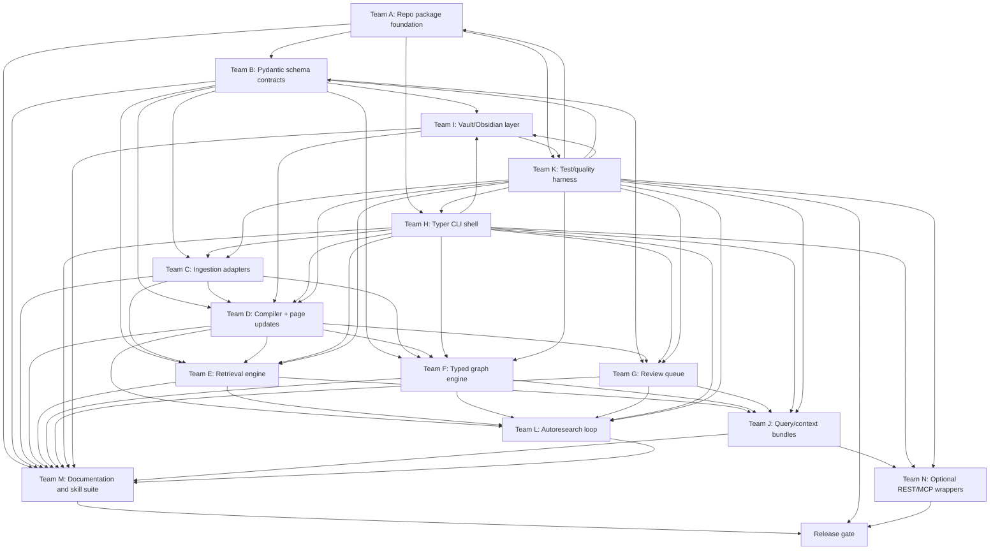

# Nerdbot Parallel Subagent Task Graph

> Use this as the execution coordination document for a multi-agent Codex run. Each team should work on separate files where possible, publish interfaces early, and avoid blocking other teams except at explicit integration gates.

## 1. Global constraints

<details open>
<summary><strong>Non-negotiables</strong></summary>

- Keep everything 100% OSS/free and local-first.
- Do not depend on the LLM-wiki tools directly. Reimplement the useful logic natively.
- Docling and OpenDataLoader PDF are allowed ingestion adapters; everything else must be Nerdbot-native.
- Typer CLI is the primary operator interface.
- REST and MCP are optional wrappers only after the core service layer is stable.
- Preserve the current Nerdbot safety stance: inventory first, additive repair first, explicit approval before destructive or high-impact changes.
- Preserve raw source immutability and provenance requirements.
- Maintain Obsidian compatibility: frontmatter, `[[wikilinks]]`, aliases, templates, safe `.obsidian/` handling.
- Do not rewrite user-authored canonical material without explicit approval and a rollback path.

</details>

## 2. Parallel workstream graph

<details open>
<summary><strong>Mermaid task graph</strong></summary>



</details>

## 3. Team charters

<details open>
<summary><strong>Team A — Repository and package foundation</strong></summary>

### Mission

Turn the current skill directory into a package-quality Python project without breaking existing skill behavior.

### Tasks

- Add `pyproject.toml` with `uv`-friendly dependency groups and CLI entrypoint `nerdbot=nerdbot.cli:app`.
- Create `src/nerdbot/` package with module skeletons.
- Move current scripts into `src/nerdbot/audit/` and keep backwards-compatible script wrappers in `scripts/`.
- Add `.gitignore` entries for `.DS_Store`, `__pycache__`, generated graph/search/index/cache artifacts, and local model caches.
- Add `README.md`, `AGENTS.md`, and basic `tests/` layout.
- Add `uv.lock` only if the repo convention expects lockfiles.

### Deliverables

- Package imports cleanly.
- `uv run nerdbot --help` works.
- Existing `scripts/kb_bootstrap.py`, `scripts/kb_inventory.py`, `scripts/kb_lint.py` still run or clearly delegate.

### Acceptance tests

```bash
uv sync --all-extras
uv run python -c "import nerdbot"
uv run nerdbot --help
uv run pytest tests/test_package_smoke.py -q
```

</details>

<details>
<summary><strong>Team B — Schema and artifact contracts</strong></summary>

### Mission

Define the durable schema layer that every other team uses.

### Tasks

- Implement Pydantic v2 models for:
  - `NerdbotConfig`, `VaultConfig`, `IngestionConfig`, `RetrievalConfig`, `ResearchConfig`.
  - `SourceRecord`, `NormalizedDocument`, `SourceFragment`, `CitationAnchor`.
  - `WikiPageMeta`, `ClaimRecord`, `PageUpdatePlan`.
  - `GraphNode`, `GraphEdge`, `KnowledgeGraph`.
  - `ReviewItem`, `PatchManifest`, `OperationRecord`.
  - `RetrievalHit`, `RetrievalBundle`, `SearchExplain`.
- Generate JSON schema files into `schema/` for managed vaults.
- Add version fields and migration hooks.
- Add slug/path normalization helpers.

### Deliverables

- `src/nerdbot/models/*.py`.
- `nerdbot schema export` command.
- Schema docs in `references/schema-contracts.md`.

### Acceptance tests

```bash
uv run pytest tests/test_models.py -q
uv run nerdbot schema export tests/fixtures/minimal-vault --dry-run
```

</details>

<details>
<summary><strong>Team C — Ingestion adapters</strong></summary>

### Mission

Implement a source normalization pipeline with Docling-first and OpenDataLoader-PDF-specialist support.

### Tasks

- Implement adapter protocol: `can_handle`, `convert`, `extract_metadata`, `emit_fragments`, `healthcheck`.
- Implement Docling adapter.
- Implement OpenDataLoader PDF adapter.
- Implement native markdown/text adapter.
- Optional: implement MarkItDown fallback only behind explicit extra/config.
- Add source fingerprinting, manifest updates, extraction artifact writes, and citation anchors.
- Add prompt-injection/hide-text warning fields for PDF/HTML where detectable.
- Add large-file pointer/stub behavior.
- Add dry-run mode.

### Deliverables

- `src/nerdbot/ingest/`.
- CLI commands `nerdbot ingest add`, `nerdbot ingest convert`, `nerdbot ingest queue`, `nerdbot ingest run`.
- Fixtures for PDF, markdown, HTML, DOCX if available.

### Acceptance tests

```bash
uv run pytest tests/test_ingest_* -q
uv run nerdbot ingest add tests/fixtures/sources/example.md --root /tmp/nb --dry-run --json
uv run nerdbot ingest add tests/fixtures/sources/example.pdf --adapter docling --root /tmp/nb --dry-run --json
```

</details>

<details>
<summary><strong>Team D — Native wiki compiler</strong></summary>

### Mission

Compile normalized sources into durable wiki pages, indexes, hot cache, and source maps.

### Tasks

- Implement source summary generation workflow.
- Implement concept/entity/claim candidate extraction interfaces.
- Implement deterministic page selection/update planner.
- Implement page templates and frontmatter preservation.
- Implement duplicate detection and alias handling.
- Implement contradiction detection scaffolding and queueing.
- Implement `wiki/index.md`, `wiki/overview.md`, `wiki/hot.md`, `wiki/purpose.md`, `indexes/source-map.md`, `indexes/coverage.md` updates.
- Generate patch manifests first; auto-apply only low-risk changes.
- Append activity and operation logs.

### Deliverables

- `src/nerdbot/compiler/`.
- CLI commands `nerdbot compile plan`, `nerdbot compile run`, `nerdbot compile hot`, `nerdbot compile index`.
- Updated page templates in `assets/`.

### Acceptance tests

```bash
uv run pytest tests/test_compiler_* -q
uv run nerdbot compile plan tests/fixtures/compiled-vault --json
uv run nerdbot compile run tests/fixtures/compiled-vault --dry-run --json
```

</details>

<details>
<summary><strong>Team E — Native retrieval engine</strong></summary>

### Mission

Build Nerdbot’s own hybrid retrieval stack: lexical, optional semantic, graph, temporal, rerank, RRF.

### Tasks

- Implement SQLite state/search DB and FTS5 indexing.
- Implement BM25/lexical search over pages and fragments.
- Implement graph expansion lane using Team F graph output.
- Implement temporal lane using frontmatter/source/operation dates.
- Implement RRF fusion.
- Implement query intent heuristics and lane weighting.
- Implement optional local semantic lane with LanceDB or sqlite-vec behind an extra.
- Implement `--explain` output.

### Deliverables

- `src/nerdbot/retrieval/`.
- CLI commands `nerdbot search`, `nerdbot context topic`, `nerdbot context page`.

### Acceptance tests

```bash
uv run pytest tests/test_retrieval_* -q
uv run nerdbot search "test query" --root tests/fixtures/search-vault --explain --json
```

</details>

<details>
<summary><strong>Team F — Native typed graph engine</strong></summary>

### Mission

Build a typed knowledge graph from Nerdbot artifacts and render/export it locally.

### Tasks

- Implement deterministic extraction from frontmatter, wikilinks, markdown links, embeds, citations, source manifests, and claims.
- Implement source-structure graph nodes from Docling/OpenDataLoader fragments.
- Implement typed edge relation enum.
- Implement graph validation.
- Implement community detection with NetworkX or an OSS optional algorithm.
- Implement gap/bridge/orphan/contradiction graph reports.
- Implement `graph.json`, `graph.graphml`, optional `graph.cypher`, and local `graph.html`.

### Deliverables

- `src/nerdbot/graph/`.
- CLI commands `nerdbot graph build`, `nerdbot graph render`, `nerdbot graph inspect`, `nerdbot graph communities`, `nerdbot graph gaps`.

### Acceptance tests

```bash
uv run pytest tests/test_graph_* -q
uv run nerdbot graph build tests/fixtures/graph-vault --validate --json
uv run nerdbot graph render tests/fixtures/graph-vault
```

</details>

<details>
<summary><strong>Team G — Review queue and safe patch application</strong></summary>

### Mission

Make all nontrivial writes reviewable, explainable, and rollback-aware.

### Tasks

- Implement `PatchManifest` persistence.
- Implement `ReviewItem` queue storage in JSONL.
- Implement risk classifier.
- Implement approve/reject/apply/list/show/explain commands.
- Implement conflict detection against current file hashes.
- Implement rollback metadata.
- Integrate with compiler, research, vault normalization, and migration workflows.

### Deliverables

- `src/nerdbot/review/`.
- CLI commands `nerdbot review list/show/approve/reject/apply/explain`.

### Acceptance tests

```bash
uv run pytest tests/test_review_* -q
uv run nerdbot review list tests/fixtures/review-vault --json
```

</details>

<details>
<summary><strong>Team H — Typer CLI and UX</strong></summary>

### Mission

Provide the user-facing CLI shell and consistent output/error behavior.

### Tasks

- Build command tree with Typer groups.
- Implement common options: `--root`, `--config`, `--json`, `--dry-run`, `--yes`, `--plan-only`, `--verbose`, `--quiet`.
- Add rich progress and structured errors.
- Add command autocompletion support.
- Add `doctor`, `status`, `init`, `schema export`, and wrappers around every service.
- Ensure all commands can run in headless CI.

### Deliverables

- `src/nerdbot/cli.py` and command modules.
- CLI docs in README and `references/cli.md`.

### Acceptance tests

```bash
uv run nerdbot --help
uv run nerdbot ingest --help
uv run nerdbot graph --help
uv run pytest tests/test_cli_* -q
```

</details>

<details>
<summary><strong>Team I — Obsidian vault compatibility</strong></summary>

### Mission

Make generated vaults pleasant and safe in Obsidian.

### Tasks

- Port and extend current Obsidian guidance.
- Implement frontmatter parser/updater that preserves ordering where practical.
- Implement wikilink resolver and alias index.
- Implement template generation under `.obsidian/templates`.
- Implement volatile `.obsidian` safety policy.
- Implement dashboard markdown pages.
- Implement optional canvas generation after graph engine stabilizes.
- Implement vault normalization plan/apply commands.

### Deliverables

- `src/nerdbot/vault/`.
- CLI commands `nerdbot vault normalize`, `nerdbot vault templates`, `nerdbot vault canvas`.

### Acceptance tests

```bash
uv run pytest tests/test_vault_* -q
uv run nerdbot vault normalize tests/fixtures/mixed-vault --plan-only --json
```

</details>

<details>
<summary><strong>Team J — Query and context workflows</strong></summary>

### Mission

Turn retrieval into useful grounded answers and optional saved query artifacts.

### Tasks

- Implement query planner.
- Read `wiki/index.md`, `wiki/hot.md`, `purpose.md`, relevant pages, and context bundles.
- Verify citation anchors when needed.
- Emit answer with confidence and gaps.
- Optionally save answers to `wiki/questions/` or `wiki/syntheses/` through review queue.
- Add no-mutation-by-default enforcement.

### Deliverables

- `src/nerdbot/query/` or retrieval-integrated query service.
- CLI `nerdbot query ask`.

### Acceptance tests

```bash
uv run pytest tests/test_query_* -q
uv run nerdbot query ask "What is X?" --root tests/fixtures/query-vault --json
```

</details>

<details>
<summary><strong>Team L — Autoresearch and watch mode</strong></summary>

### Mission

Implement a conservative, free/OSS source discovery and ingest loop plus raw-inbox watch mode.

### Tasks

- Implement research plan model and CLI.
- Implement source candidate fetching from user URLs, RSS, sitemaps, arXiv/Crossref/OpenAlex/PubMed where appropriate.
- Implement source quality scoring and review queue integration.
- Implement no-paid-API policy and tests.
- Implement watch mode with debouncing and crash-safe queueing.
- Integrate research output with ingestion, compiler, graph, coverage, hot cache, and logs.

### Deliverables

- `src/nerdbot/research/` and `src/nerdbot/watch/`.
- CLI `nerdbot research plan/fetch/run/ingest` and `nerdbot watch`.

### Acceptance tests

```bash
uv run pytest tests/test_research_* tests/test_watch_* -q
uv run nerdbot research plan "test topic" --root tests/fixtures/research-vault --json
```

</details>

<details>
<summary><strong>Team K — Tests, evals, security, and packaging</strong></summary>

### Mission

Make the overhaul safe to merge.

### Tasks

- Add pytest fixtures and golden files.
- Convert existing `evals/*.json` into updated skill-level eval fixtures.
- Add regression tests for current script behavior.
- Add path traversal, symlink, and destructive-write safety tests.
- Add ingestion idempotence tests.
- Add retrieval/graph/query evals.
- Add docs-link and template-placeholder lint tests.
- Add CI commands and release checklist.

### Deliverables

- `tests/`, updated `evals/`, `references/testing.md`, CI docs.

### Acceptance tests

```bash
uv run ruff check .
uv run ruff format --check .
uv run ty check .
uv run pytest -q
```

</details>

<details>
<summary><strong>Team M — Documentation and internal skill suite</strong></summary>

### Mission

Update every supporting skill/reference/doc so the implementation is comprehensible to humans and agents.

### Tasks

- Rewrite top-level `SKILL.md` as orchestrator/router.
- Add internal skill files:
  - `skills/ingest/SKILL.md`
  - `skills/compile/SKILL.md`
  - `skills/query/SKILL.md`
  - `skills/graph/SKILL.md`
  - `skills/research/SKILL.md`
  - `skills/review/SKILL.md`
  - `skills/vault/SKILL.md`
  - `skills/audit/SKILL.md`
- Update all current `references/*.md`.
- Add new references for schema, CLI, ingestion adapters, retrieval, graph, review, research, testing, and OSS dependency policy.
- Update assets/templates.
- Document the split between WAgents and Nerdbot: WAgents remains agents-repo scope helper tooling; Nerdbot is the full LLM-wiki knowledge system.

### Deliverables

- Updated docs and assets.
- No stale references to pre-overhaul command names.

</details>

<details>
<summary><strong>Team N — Optional REST/MCP wrappers</strong></summary>

### Mission

Expose Nerdbot through optional wrappers only after the CLI/service layer is stable.

### Tasks

- Add `interfaces/rest.py` using FastAPI only if enabled by extra.
- Add `interfaces/mcp.py` only if enabled by extra.
- Expose read-only operations first: status, search, query, read page, graph inspect, lint.
- Add mutating operations only with review queue requirements.
- Add auth/key/local-only defaults for REST.
- Add tests proving wrappers call service methods and cannot bypass policy.

### Deliverables

- Optional `nerdbot serve rest` and `nerdbot serve mcp`.
- Interface docs.

</details>

## 4. Integration gates

<details open>
<summary><strong>Gate 1 — Package and schema</strong></summary>

May proceed when:

- Package imports.
- CLI help works.
- Models validate.
- Existing scripts are ported/wrapped.
- Baseline tests pass.

</details>

<details>
<summary><strong>Gate 2 — Ingest to normalized source artifacts</strong></summary>

May proceed when:

- At least markdown/text and one Docling-supported file fixture convert to normalized fragments.
- Manifest, source-map, and activity logs update in dry-run and apply modes.
- Source hashes are stable.

</details>

<details>
<summary><strong>Gate 3 — Compile to reviewable wiki pages</strong></summary>

May proceed when:

- Source summary, index, coverage, and hot cache can be generated.
- Page patches are generated before writes.
- Risky changes enter review queue.
- Re-run is idempotent.

</details>

<details>
<summary><strong>Gate 4 — Retrieval and graph</strong></summary>

May proceed when:

- Search DB builds from fixture vault.
- BM25, graph, and temporal lanes work.
- Graph JSON validates.
- `graph.html` renders locally.
- Query answers include path/citation provenance.

</details>

<details>
<summary><strong>Gate 5 — Autoresearch, watch, docs, release</strong></summary>

May proceed when:

- Autoresearch can plan and fetch only free/open/user-approved sources.
- Watch mode queues changed inbox files without races.
- Docs and skill files match CLI behavior.
- Full quality suite passes.

</details>

## 5. Risk register

<details open>
<summary><strong>Major risks and mitigations</strong></summary>

| Risk | Mitigation |
|---|---|
| Scope explosion | Implement milestones in order; optional REST/MCP after CLI core. |
| Ingestion libraries heavy or unstable | Adapter protocol, feature extras, health checks, fallback adapters. |
| Graph becomes decorative | Require graph insights, validation, retrieval lane integration, and graph-report output. |
| Autoresearch becomes cloud/search-API dependent | Explicit no-paid-API policy; source adapters for URLs/RSS/sitemaps/open APIs only. |
| Review queue becomes friction | Auto-apply low-risk patches; queue only medium/high-risk or ambiguous changes. |
| Obsidian compatibility breaks files | Frontmatter-preserving writes, wikilink resolver tests, volatile `.obsidian` protections. |
| Generated pages drift from sources | Citation anchors, claim records, provenance audit, source hashes, stale-claim lint. |
| CLI and skill docs diverge | Team M docs gate plus CLI docs generated from Typer where possible. |
| Optional interfaces bypass policy | REST/MCP call the same services; tests assert no direct writes. |

</details>
