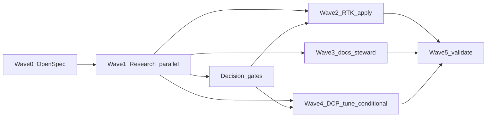

# Design

## Program Pipeline

The Token Efficacy Program follows a **research → decision → apply → docs** pipeline. No apply or install step runs until upstream research artifacts and decision gates approve the category.

### Research → Decision

| ID | Work | Skills | Output |
| --- | --- | --- | --- |
| R1 | Category winners | `/research compare` | Per-layer decision matrix (winner, runner-up, why, non-stacking vs RTK + DCP) |
| R2 | MCP strategy | `/research` + `/host-panel` | Cruxes: groups vs compressor vs registry split |
| R3 | Standing context | `/research` + `/review` | Trim candidates (skills, rules, descriptions) |
| R4 | Landscape track | `/research track token-oss-landscape` | Journal + STATE block in `~/.claude/research/` |
| R5 | DCP evidence | Log review | `~/.config/opencode/logs/dcp/`, `/dcp stats`, token-monitor findings |

Research tier: **Standard**. Plan gate before retrieval. Recommendations may cite tools but **must not** prescribe installs until Wave 5 decision gates.

### Decision → Apply

| Category | Install / apply only if |
| --- | --- |
| Session proxy | R1 winner + no DCP regression + explicit approval |
| MCP compressor | R2 crux resolved + single-server pilot approved |
| Code MCP | R3 shows Read-heavy pain + R1 winner |
| Claude-only pruner | R1 winner for Claude layer + user sign-off |
| RTK fleet hooks | Doctor ok + maintainer approval for live apply (locked decision: yes) |

**Rule:** one primary tool per layer; measure with `rtk gain` + DCP stats before stacking.

### Apply → Docs

`/docs-steward` Mode A publishes:

- `AGENTS.md` — token budget, layer taxonomy, decision gates, RTK/DCP/MCPHub pointers
- Harness-config MDX hub under `docs/src/content/docs/harness-config/`
- Regenerated README and catalog via `wagents readme` + `wagents docs generate --no-installed`
- Sync projections via `scripts/sync_agent_stack.py --apply --targets repo`

## Layer Taxonomy

Eight context layers govern token efficacy. Each layer has a current owner and a post-program target.

| Layer | Current owner | Post-program target | Compare set (R1) |
| --- | --- | --- | --- |
| Shell dedup | RTK binary + repo policy | Live fleet hooks (Wave 2) | RTK vs LeanCTX (overlap check only) |
| Session pruners | OpenCode DCP | Tuned if R5 warrants (Wave 4) | Sleev vs DCP vs Cozempic vs context-mode |
| Cross-harness proxy | None installed | R1 winner, gated | Headroom vs Sleev vs LeanCTX |
| MCP schema tax | `harness` group | R2 outcome | mcp-compressor vs Tool Attention vs groups-only |
| Code reads | Policy-only | R1 winner if R3 shows pain | jCodeMunch vs symbol-index MCPs vs policy-only |
| Standing context | ~980 tok global + skill descs | Trim list from R3 | N/A (review-driven) |
| Docs / maintainer hub | Partial AGENTS.md | Full hub (Wave 3) | N/A |
| Landscape tracking | Ad hoc | R4 journal + quarterly workflow | `/research track token-oss-landscape` |

## Ownership And Boundaries

Inherited from [`integrate-rtk-harness-fleet`](../integrate-rtk-harness-fleet/design.md):

- RTK owns local hooks, `RTK.md`, and `~/.config/opencode/plugins/rtk.ts`.
- Repo owns policy (`config/rtk-integration.json`), doctor/sync CLI, validation, and public docs.
- `opencode.json` must not list RTK as a plugin.
- Shared instructions must not include `@RTK.md`.

Extended for this program:

- DCP canonical source: `config/opencode-dcp.jsonc` (model-neutral).
- MCP posture: `config/mcp-registry.json` + MCPHub groups; compressor installs require R2 gate.
- Research journals live under `~/.claude/research/`; repo cites outcomes in docs, not raw local paths in tracked instruction files.

## Parallel Task Graph

Same-file writers serialize; read-only research and validation fan out.

| Node | Wave | Lane | Depends On | Writer | Deliverable |
| --- | --- | --- | --- | --- | --- |
| O00 | W0 | openspec-scaffold | none | yes: `openspec/changes/token-efficacy-program/**` | proposal, design, tasks, validation-matrix, affected-surfaces, spec deltas |
| V00 | W0 | openspec-validate | O00 | no | `wagents openspec validate` green for this change |
| R1 | W1 | category-compare | O00 | no | R1 decision matrix |
| R2 | W1 | mcp-host-panel | O00 | no | R2 MCP strategy crux doc |
| R3 | W1 | standing-context | O00 | no | R3 trim candidate list |
| R4 | W1 | landscape-track | O00 | no | R4 journal + STATE |
| R5 | W1 | dcp-evidence | O00 | no | R5 log/stats summary |
| DG0 | W1 | decision-gates | R1,R2,R3,R4,R5 | no | Gate table with approve/deny per category |
| T040 | W2 | sync-with-rtk | DG0,V00 | yes: `scripts/sync_agent_stack.py` | `--with-rtk` / `RTK_ENABLED=1` |
| T041 | W2 | grok-rtk-shim | DG0,T040 | yes: grok hook shim | Custom Grok RTK hook after schema proof |
| T042 | W2 | rtk-catalog-docs | DG0 | yes: docs authoring | RTK catalog/docs row |
| T043 | W2 | no-rtk-include | DG0 | yes: validation | `@RTK.md` grep/validate in shared corpus |
| T044 | W2 | rtk-gain-history | T040 | no | `rtk gain --history` review lane |
| RTK0 | W2 | rtk-doctor | DG0 | no | `wagents rtk doctor --format json` |
| RTK1 | W2 | rtk-live-apply | RTK0,T040 | no | `rtk sync --apply` fleet platforms |
| RTK2 | W2 | rtk-gain-graph | RTK1 | no | `rtk gain --graph` baseline |
| D00 | W3 | docs-steward | R1,R2,R3,DG0 | yes: AGENTS.md, harness-config MDX | Token posture hub |
| D01 | W3 | readme-generate | D00 | no | `wagents readme` |
| D02 | W3 | docs-generate-build | D00 | no | `wagents docs generate` + `docs build` |
| D03 | W3 | sync-projections | D00 | no | `sync_agent_stack.py --apply --targets repo` |
| DCP0 | W4 | dcp-tune | R5,DG0 | yes: `config/opencode-dcp.jsonc` | Conditional threshold tune |
| V01 | W5 | rtk-doctor | RTK1,D00 | no | `wagents rtk doctor --format json` |
| V02 | W5 | rtk-gain | RTK2 | no | `wagents rtk gain --graph` |
| V03 | W5 | dcp-stats | DCP0 | no | DCP stats / log spot-check |
| V04 | W5 | repo-validate | all writers | no | `wagents validate` |
| V05 | W5 | pytest-rtk | T043,T044 | no | `pytest tests/test_rtk_cli.py -q` |
| V06 | W5 | docs-check | D02 | no | `wagents docs build` + `readme --check` |
| V07 | W5 | openspec-final | all | no | `wagents openspec validate` |

## Stop Rules

- Do not run `wagents rtk sync --apply` during Wave 0 or Wave 1.
- Do not install Sleev, Headroom, Cozempic, mcp-compressor, jCodeMunch, or other surveyed OSS until decision gates approve.
- Do not add `@RTK.md` to shared instruction sources.
- Do not add RTK to `opencode.json` plugin array.
- Do not tune DCP per-model limits (`compress.modelMaxLimits` / `compress.modelMinLimits`).
- Stop Wave 4 DCP edits if R5 shows no compaction pain or threshold mismatch.

## Baseline vs Target

| Layer | Now | After program |
| --- | --- | --- |
| Shell | RTK binary + repo policy | Live fleet hooks (Wave 2) |
| Session | OpenCode DCP | Tuned if logs warrant (Wave 4) |
| MCP | `harness` group | Research outcome (R2) |
| Standing context | ~980 tok global + skill descs | Trim list from R3 |
| Docs | Partial in AGENTS.md | Full hub via docs-steward (Wave 3) |
