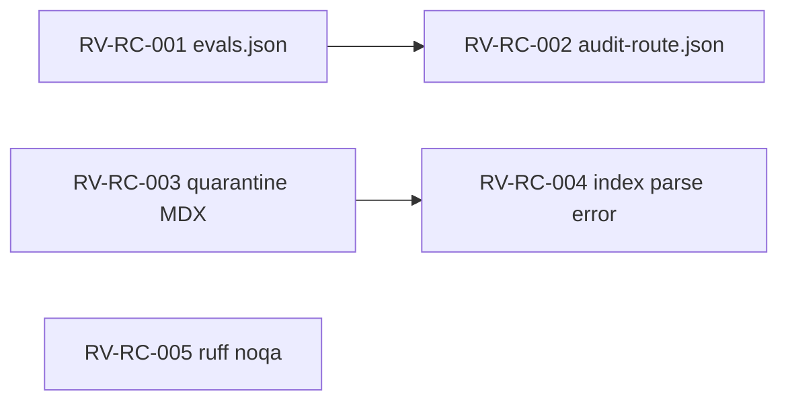

# Repo Cleanup Review Findings

Generated: 2026-06-29 (W2 judge merge)

## Findings matrix

| ID | Sev | Wave | Status | Path | Description |
| --- | --- | --- | --- | --- | --- |
| RV-RC-001 | P0 | W-F2 | **fixed** | `skills/harness-master/evals/evals.json` | `skills-source-audit-route` expected_output cited deleted `config/external-skills.md` |
| RV-RC-002 | P0 | W-F2 | **fixed** | `skills/harness-master/evals/skills-source-audit-route.json` | `expected_behavior` cited legacy catalog SSOT |
| RV-RC-003 | P1 | W-F1 | **fixed** | `scripts/validate/collectors/quarantine.py` | Quarantine scanned index only; authoring MDX bypass |
| RV-RC-004 | P2 | W-F1 | **fixed** | `scripts/validate/collectors/quarantine.py` | Corrupt catalog index silently skipped slug checks |
| RV-RC-005 | P3 | W-F4 | **fixed** | `scripts/validate/collectors/authoring.py` | Unused `noqa: E402` directives (ruff RUF100) |
| RV-RC-006 | P2 | W-F3 | **accepted deferral** | `openspec/changes/*` (22 active plus `archive/`) | G5 closed by owner-confirmation policy: archive when each change owner confirms completion |
| RV-RC-007 | P2 | W-F1 | **accepted deferral** | `wagents/external_skills.py` | Runtime merges authoring+index (authoring wins); transitional per OpenSpec; index freshness gated by `catalog index --check` |
| RV-RC-008 | P3 | W-F4 | **accepted deferral** | `tests/test_validate_collectors.py` | Stub unit tests; integration coverage exists in `test_validate_repo.py` |
| RV-RC-009 | P3 | W-F4 | **accepted deferral** | `.pre-commit-config.yaml` vs `ci.yml` | CI-only gates (skills sync dry-run, portability pytest); intentional depth split |
| RV-RC-010 | P4 | — | **wontfix** | `kb/raw/**`, `openspec/changes/archive/**` | Historical captures referencing legacy MD; not runtime |
| RV-RC-011 | P4 | — | **wontfix** | `openspec/changes/integrate-apm-package-manager/audit/*` | Planning audit artifacts; update when APM change closes |

## Seed verification

| Seed | Result |
| --- | --- |
| SEED-01 harness evals | **confirmed → fixed** (RV-RC-001/002) |
| SEED-02 OpenSpec stale | **deferred** (RV-RC-006) |
| SEED-03 G7 validate modular | **pass** — extract complete; quarantine extended |
| SEED-04 fail-open strict=False | **deferred** — by design for docs paths; sync uses strict=True |
| SEED-05 integrate-apm notes | **wontfix** until APM change archives |
| SEED-06 HAND-MAINTAINED stale | **pass** — compose 397/397 |
| SEED-07 test_rendering guard | **pass** |
| SEED-08 README/CONTRIBUTING | **pass** — readme --check green |
| SEED-09 skills sync dry-run | verify in W4 |
| SEED-10 quarantine blocklist | **fixed** — authoring scan added |
| SEED-11 source_kind edge cases | **pass** — existing tests |
| SEED-12 mixed bundles | **pass** — 1490 A / 9 B paths |

## Fix DAG

## Strengths (judge rollup)

- Legacy `config/external-skills.md` removed from runtime; validate passes
- Validate modularization (`wagents/commands/validate.py` + 8 collectors)
- Docs compose 100% (397/397)
- Instructions/rules clean of legacy MD references
- Quarantine now enforces register + index + authoring MDX
