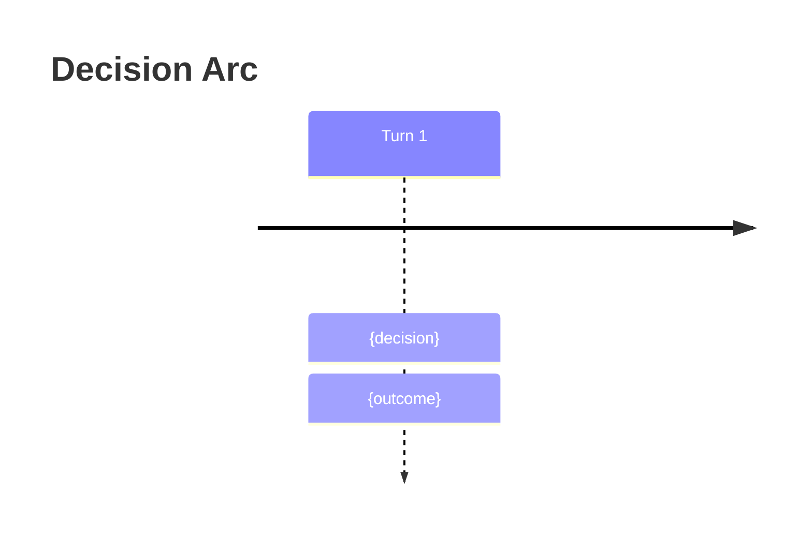

# Output Formats — Core

Always-needed display templates. Read when producing any wargame output.

Output templates using the Roguelike Layout pattern — box-drawn cards, Unicode resource bars, heavy borders (━━━) for turn boundaries, standard borders (┌──┐) for content cards, double borders (╔══╗) for urgent alerts. Read when producing any wargame output.

## Classification Display

```
CLASSIFICATION
| Dimension                       | Score | Reasoning                                     |
|---------------------------------|-------|-----------------------------------------------|
| Adversary / competing interests | {0-2} | {one-line justification for this score}        |
| Reversibility                   | {0-2} | {one-line justification}                       |
| Time pressure                   | {0-2} | {one-line justification}                       |
| Stakeholder count               | {0-2} | {one-line justification}                       |
| Information completeness        | {0-2} | {one-line justification}                       |
| **Total**                       | **{N}/10** |                                           |

Tier: {Clear | Complicated | Complex | Chaotic}
  0-3 Clear · 4-6 Complicated · 7-8 Complex · 9-10 Chaotic
Recommended mode: {Quick Analysis | Structured Analysis | Interactive Wargame}
Difficulty: {optimistic | realistic | adversarial | worst-case}

### Why This Tier
{2-3 sentences explaining which dimensions drove the score. Name the highest-scoring dimensions.}

### What Would Change
{1-2 sentences: "If [specific condition changed], [dimension] would drop to [score], moving this to [lower tier]."}

> Proceed with {mode} at {difficulty}? Override tier or difficulty? [yes/no]
```

## Quick Analysis Brief (Clear tier)

```
# Quick Analysis Brief
**Decision:** {restatement}
## Key Assumptions
- {assumption — and how it could be wrong}
## Frameworks Applied (2-3)
1. **{Framework}** — {one-line finding}
## Analysis
{Narrative with Unicode decision tree where useful:}
  ┌─ {condition} → {outcome A}
  └─ {condition} → {outcome B}
## Recommendation
**Action:** {what to do}
- Confidence: `{High | Medium | Low}`
- Key assumption: {the one that matters most}
- Watch signal: {what would change this recommendation}
```

## Structured Analysis Brief (Complicated tier)

```
# Structured Analysis Brief
**Decision:** {restatement}
## Key Assumptions
- {assumption — vulnerability}
## Stakeholders
| Stakeholder | Interest | Power | Position |
|-------------|----------|-----------|----------|
| {name}      | {goal}   | High      | Supportive |
## Frameworks Applied (3-5, ACH matrix if applicable)
1. **{Framework}** — {finding}
2. **ACH Matrix**
   | Hypothesis | Evidence A | Evidence B | Evidence C |
   |------------|-----------|-----------|-----------|
   | H1         | ++        | -         | 0         |
## Options
| # | Option | Upside | Downside | Feasibility |
|---|--------|--------|----------|-------------|
| 1 | {opt}  | {pro}  | {con}    | `High`      |
## Ranking
1. **{Option}** — {rationale}
## Decision Triggers
- If {signal} → switch to {option}
## Pre-mortem
> It is 6 months later and this decision failed. Most likely reasons:
> 1. {failure mode}
```

## Wargame Turn Display (Complex/Chaotic tier)

Combines Turn Header, Intelligence Brief, Actor Cards, and Decision Cards. Target 40-80 lines per turn.

Use the Turn Header Display for the status bar at top.
Use the Intelligence Brief Display for the situation brief.
Use the Actor Card Display for each actor.
Use the Decision Card Display for each option.

Prompt line:
```
> Choose A/B/C, describe a custom action, or type ? for commands.
```

## Monte Carlo Results

Label as exploratory — illustrative, not predictive.

```
## Monte Carlo Summary (exploratory)
| Outcome     | Frequency | Key Driver       |
|-------------|-----------|------------------|
| {outcome A} | `42%`     | {differentiator} |
| {outcome B} | `35%`     | {differentiator} |
| {outcome C} | `23%`     | {differentiator} |
- Confidence interval: `{low}% – {high}%` for primary outcome
- Most sensitive variable: {what swings results most}
- **Caveat:** Heuristic estimates, not statistical simulations.
```

When rendering Monte Carlo in terminal, include histogram bars:

```
  {outcome A}    ████████████████████ {N}%
  {outcome B}    ██████████████░░░░░░ {N}%
  {outcome C}    ████████░░░░░░░░░░░░ {N}%

  ├───────┼───────┼───────┼───────┼───────┤
  0%     20%     40%     60%     80%    100%
```

## AAR Display

```
# After-Action Review
## Decision Timeline
| Turn | Decision | Outcome | Surprise? |
|------|----------|---------|-----------|
| 1    | {choice} | {what happened} | — |
## What Worked
- {pattern} — Evidence: {from which turn}
## What Failed
- {pattern} — Evidence: {from which turn}
## Biases Detected
- **Human:** {anchoring, sunk cost, etc.} — seen at Turn {N}
- **LLM:** {false confidence, symmetry bias, etc.} — seen at Turn {N}
## Paths Not Taken
- Turn {N}: {rejected option} → likely would have {counterfactual}
## Actor Performance
| Actor | Archetype | Consistency | Drift? | Notes |
|-------|-----------|-------------|--------|-------|
| {name} | {archetype} | `High/Med/Low` | {yes/no} | {persona fidelity notes} |
## Transferable Insights
1. {principle extracted from this scenario}
## Decision Principles
- {reusable heuristic derived from this wargame}
```

Mermaid timeline for visual summary (include when exporting journal):



## Journal Entry Structure

Journal frontmatter: per SKILL.md State Management section.

```
# Wargame Journal — {date}

## Turn Log
{Each turn display in sequence}

## After-Action Review
{AAR display}

## Next Moves
{Action Bridge}

<!-- STATE
actors:
  - name: {actor}
    resources: {resource_map}
    stance: {stance}
active_injects: [{inject_ids}]
-->
```

## Decision Criteria Lens

Shown after criteria elicitation. Used to annotate analysis outputs in all modes.

```
## Your Decision Criteria
| Rank | Criterion | Weight |
|------|-----------|--------|
| 1    | {criterion} | Primary |
| 2    | {criterion} | Primary |
| 3    | {criterion} | Secondary |
| ...  | ...       | Secondary |

Criteria applied: options and recommendations annotated with alignment to your top criteria.
To re-rank: type `criteria` at any decision point.
```

## Action Bridge

Mandatory after every recommendation, ranking, or AAR. Three moves graduated by commitment level.

```
## Next Moves
### 1. PROBE (this week)
**Action:** {specific reversible action testing the key assumption}
- Tests: {the most uncertain assumption or highest-EVPI variable from analysis}
- Watch for: {specific signal that confirms or disconfirms}

### 2. POSITION (this month)
**Action:** {advance recommended path while preserving optionality}
- Advances: {specific aspect of the recommended option}
- Preserves: {the identified fallback or alternative option}

### 3. COMMIT (when triggered)
**Action:** {decisive action capturing the identified upside}
- Captures: {specific value from analysis}
- Trigger: {decision trigger from analysis — the condition that makes this the right moment}
```

Each move references specific analysis outputs — Probe targets the most uncertain assumption or highest-EVPI variable, Position preserves the identified fallback, Commit connects to Decision Triggers.

## Turn Header Display

Rich status bar replacing plain `# Turn N of M`.

```
━━━━━━━━━━━━━━━━━━━━━━━━━━━━━━━━━━━━━━━━━━━━━━━━━━━━━━━━━━━━━━
  TURN {N} of {M} — {PHASE NAME}          [▓▓▓▓▓▓░░░░] {pct}%
  Difficulty: {level}  │  Active inject: {title or "none"}
━━━━━━━━━━━━━━━━━━━━━━━━━━━━━━━━━━━━━━━━━━━━━━━━━━━━━━━━━━━━━━
```

Phase names: "Opening Moves" (T1), "Developing Situation" (mid), "Escalation Phase" (inject active), "Decisive Turn" (penultimate), "Endgame" (final).

## Decision Card Display

Box-drawn option cards replacing flat table.

```
┌─ {LETTER} ───────────────────────────────────────────────────┐
│  {description}                                                │
│  Domain: {domain}    Risk: ▓▓▓░░ {risk_pct}                  │
│  Impact: {impact}                                             │
│  Criteria: {c1} ●●●  {c2} ●○○  {c3} ●○○                     │
│  ↑ {success}% success / ↓ {failure}% failure                  │
└──────────────────────────────────────────────────────────────┘
```

Mark "Do nothing" options with `[ACTIVE CHOICE — requires justification]`.

## Actor Card Display

Styled cards with archetype badges and trend arrows.

```
┌─ {NAME} ({ROLE}) ◆ {ARCHETYPE} ────────────────────────────┐
│  {Resource1}: ▓▓▓▓▓▓▓░░░ {value}%  {↗↘→} (was {prev}%)     │
│  {Resource2}: ▓▓▓▓▓▓▓▓░░ {value}%  {↗↘→}                    │
│  Stance: {stance} │ Last: {last_action}                       │
│  Risk posture: {posture} │ Attention: {style}                 │
│  Belief about {Other}: {qualitative assessment}               │
└──────────────────────────────────────────────────────────────┘
```

## Gallery Display

Styled scenario gallery for empty args.

```
╭─────────────────────────────────────────────────────────────╮
│                    DECISION INTELLIGENCE                     │
│                    ━━━━━━━━━━━━━━━━━━━━                     │
│        Strategic analysis for consequential decisions         │
╰─────────────────────────────────────────────────────────────╯

  1  ▌{Domain}    "{scenario}"          {Tier}
  2  ▌{Domain}    "{scenario}"          {Tier}
  ...

  ─ ─ ─ ─ ─ ─ ─ ─ ─ ─ ─ ─ ─ ─ ─ ─ ─ ─ ─ ─ ─ ─ ─ ─ ─ ─ ─ ─

  Pick a number, paste your own scenario, or type "guide me"
```

## Inject Alert Display

Double-bordered alert replacing simple box.

```
╔══════════════════════════════════════════════════════════════╗
║  INJECT — {event title}                                     ║
╠══════════════════════════════════════════════════════════════╣
║  {event description — 2-3 sentences}                         ║
║                                                              ║
║  DILEMMA: {option A}                                         ║
║       vs  {option B}                                         ║
║                                                              ║
║  Respond by Turn {N} or {consequence}                        ║
╚══════════════════════════════════════════════════════════════╝
```

## Intelligence Brief Display

For situation brief styling.

```
╭── INTELLIGENCE BRIEF ────────────────────────────────────────╮
│                                                              │
│  SITUATION: {narrative}                                      │
│                                                              │
│  ASSESSMENT: {probability assessment}                        │
│  Key signal to watch: {signal}                               │
│                                                              │
│  UNKNOWNS: {what you don't know}                             │
│  Your information advantage: {what you know that they don't} │
╰──────────────────────────────────────────────────────────────╯
```

## Context Research Display

For intelligent intake research phase.

```
╭── CONTEXT RESEARCH ──────────────────────────────────────────╮
│                                                              │
│  Based on "{user's input}", here's what I found:             │
│                                                              │
│  • {Key development or trend}                                │
│  • {Relevant dynamics}                                       │
│  • {Common decision scenarios}                               │
│                                                              │
╰──────────────────────────────────────────────────────────────╯
```

## Scenario Understanding Display

For intelligent intake confirmation phase.

```
╭── SCENARIO UNDERSTANDING ────────────────────────────────────╮
│                                                              │
│  SCENARIO: {1-2 sentence specific scenario}                  │
│  KEY ACTORS: {who's involved}                                │
│  CORE TENSION: {what makes this hard}                        │
│  STAKES: {what's at risk}                                    │
│  TIMELINE: {urgency}                                         │
│                                                              │
│  Does this capture it? [yes / adjust / start over]           │
╰──────────────────────────────────────────────────────────────╯
```

## Command Menu Display

Shown when user types `?`. Categorized layout.

```
╭── COMMANDS ──────────────────────────────────────────────────╮
│                                                              │
│  ANALYSIS                          TOOLS                     │
│  red team .... challenge option    sensitivity . param sweep │
│  what if ..... counterfactual      delphi ...... expert panel│
│  explore N ... Monte Carlo         forecast .... base rates  │
│  calibrate ... probability audit   cause ....... causal map  │
│                                                              │
│  STRATEGY                          SESSION                   │
│  negotiate ... BATNA/ZOPA          criteria .... rank values │
│  options ..... real options        status ...... snapshot    │
│  morph ....... scenario space      verbose ..... output level│
│                                    research .... web intel   │
│                                    export ...... dashboard   │
│                                                              │
│  NAVIGATION (wargame)              JOURNAL                   │
│  rewind [N] .. restore turn       meta ........ fitness rpt │
│  branches .... manage timelines   compare ..... side-by-side│
│                                    summary ..... journal brief│
│                                    ? ........... this menu   │
│                                                              │
╰──────────────────────────────────────────────────────────────╯
```

## Journal List Display

Shown when user types `list` or `list [filter]`.

```
┌─────────────────────────────────────────────────────────────────┐
│ # │ Date       │ Scenario                     │ Tier   │ Status │
├───┼────────────┼──────────────────────────────┼────────┼────────┤
│ 1 │ 2026-02-17 │ Supplier acquisition crisis   │ Complex│ Active │
│ 2 │ 2026-02-15 │ Dual job offers               │ Compli.│ Done   │
│ 3 │ 2026-02-14 │ Product recall response        │ Chaotic│ Done   │
└───┴────────────┴──────────────────────────────┴────────┴────────┘
> resume [# | keyword], list [active | domain | tier]
```

Columns: #, Date (from filename), Scenario (from frontmatter `scenario`), Tier (abbreviated if needed), Status (`Active` for In Progress, `Done` for Complete, `Abandoned`).

## Completion Banner Display

Shown after AAR or final analysis.

```
━━━━━━━━━━━━━━━━━━━━━━━━━━━━━━━━━━━━━━━━━━━━━━━━━━━━━━━━━━━━━━
  ANALYSIS COMPLETE — Saved to {filepath}
  Mode: {mode} │ Turns: {N/M} │ Tier: {tier}

  Next: resume {slug} │ export │ /wargame (new scenario)
━━━━━━━━━━━━━━━━━━━━━━━━━━━━━━━━━━━━━━━━━━━━━━━━━━━━━━━━━━━━━━
```

## Status Snapshot Display

Triggered by `status` command. Condensed mid-game state without advancing the turn.

```
━━━━━━━━━━━━━━━━━━━━━━━━━━━━━━━━━━━━━━━━━━━━━━━━━━━━━━━━━━━━━━
  STATUS SNAPSHOT — Turn {N} of {M}
  Difficulty: {level}  │  Active inject: {title or "none"}
━━━━━━━━━━━━━━━━━━━━━━━━━━━━━━━━━━━━━━━━━━━━━━━━━━━━━━━━━━━━━━

  ACTORS
  {name} ({archetype}) — {stance} — {key_resource}: ▓▓▓▓▓▓░░ {pct}%
  ...

  CRITERIA (ranked)
  1. {criterion}  2. {criterion}  3. {criterion}

  RECENT EVENTS
  - Turn {N-1}: {one-line summary}
  - Turn {N-2}: {one-line summary}

  ACTIVE INJECTS: {inject titles or "none"}

  ─ ─ ─ ─ ─ ─ ─ ─ ─ ─ ─ ─ ─ ─ ─ ─ ─ ─ ─ ─ ─ ─ ─ ─ ─ ─ ─ ─
  Type your decision or ? for commands.
```

Show only top-3 ranked criteria. For actors, show only their primary resource and current stance. Total output target: 15-25 lines.

## Rewind Display

Triggered by `rewind [N]` command. Shows branch point and restored state.

```
╭── REWIND ────────────────────────────────────────────────────────╮
│                                                                  │
│  Rewinding to Turn {T} (from Turn {current})                     │
│  Branch: Turn {T} Alternative                                    │
│                                                                  │
│  STATE RESTORED                                                  │
│  {actor}: {key_resource}: ▓▓▓▓▓▓▓░░░ {pct}%                     │
│  ...                                                             │
│                                                                  │
│  DIVERGENCE POINT                                                │
│  Original choice: {what was chosen at Turn T}                    │
│  Now replaying from this decision.                               │
│                                                                  │
│  Original timeline preserved above branch marker.                │
╰──────────────────────────────────────────────────────────────────╯
```

After displaying, proceed directly to the restored turn's decision menu.

## Style Rules

- **Blockquotes** — narrative voice only (situation briefs, intelligence reports)
- **Tables** — structured comparisons (actors, options, outcomes)
- **Bold** — actor names in all contexts
- **Inline code** — metrics, probabilities, resource levels
- **Turn length** — 40-80 lines per turn display for scannability

### Box-Drawing System

| Element | Border | Usage |
|---------|--------|-------|
| Turn boundaries | `━━━` (heavy solid) | Start/end of turn, completion banner |
| Section separators | `─ ─ ─` (light dashed) | Between major sections within a turn |
| Urgency alerts | `╔══╗` (double) | Inject alerts, fatal flaw verdicts |
| Standard panels | `┌──┐` (single) | Decision cards, actor cards, option boxes |
| Soft callouts | `╭──╮` (rounded) | Intelligence briefs, research results, info panels |

### Accessibility

- All Unicode visualizations include text equivalents (resource bars show both `▓▓▓░░` AND `60%`)
- Color is never the only differentiator — text labels accompany all color coding
- Box-drawing is decorative — content must be readable without it
- Semantic HTML in dashboard (`role`, `aria-label`)
