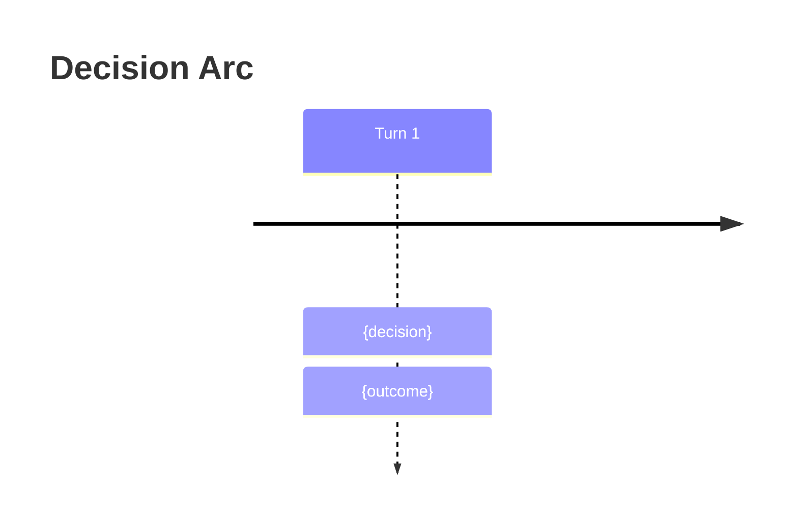

# Output Formats

Output templates using the Roguelike Layout pattern. Read when producing any wargame output.

## Classification Display

```
CLASSIFICATION
| Dimension                       | Score | Reasoning                                     |
|---------------------------------|-------|-----------------------------------------------|
| Adversary / competing interests | {0-2} | {one-line justification for this score}        |
| Reversibility                   | {0-2} | {one-line justification}                       |
| Time pressure                   | {0-2} | {one-line justification}                       |
| Stakeholder count               | {0-2} | {one-line justification}                       |
| Information completeness        | {0-2} | {one-line justification}                       |
| **Total**                       | **{N}/10** |                                           |

Tier: {Clear | Complicated | Complex | Chaotic}
  0-3 Clear · 4-6 Complicated · 7-8 Complex · 9-10 Chaotic
Recommended mode: {Quick Analysis | Structured Analysis | Interactive Wargame}
Difficulty: {optimistic | realistic | adversarial | worst-case}

### Why This Tier
{2-3 sentences explaining which dimensions drove the score. Name the highest-scoring dimensions.}

### What Would Change
{1-2 sentences: "If [specific condition changed], [dimension] would drop to [score], moving this to [lower tier]."}

> Proceed with {mode} at {difficulty}? Override tier or difficulty? [yes/no]
```

## Quick Analysis Brief (Clear tier)

```
# Quick Analysis Brief
**Decision:** {restatement}
## Key Assumptions
- {assumption — and how it could be wrong}
## Frameworks Applied (2-3)
1. **{Framework}** — {one-line finding}
## Analysis
{Narrative with Unicode decision tree where useful:}
  ┌─ {condition} → {outcome A}
  └─ {condition} → {outcome B}
## Recommendation
**Action:** {what to do}
- Confidence: `{High | Medium | Low}`
- Key assumption: {the one that matters most}
- Watch signal: {what would change this recommendation}
```

## Structured Analysis Brief (Complicated tier)

```
# Structured Analysis Brief
**Decision:** {restatement}
## Key Assumptions
- {assumption — vulnerability}
## Stakeholders
| Stakeholder | Interest | Power | Position |
|-------------|----------|-----------|----------|
| {name}      | {goal}   | High      | Supportive |
## Frameworks Applied (3-5, ACH matrix if applicable)
1. **{Framework}** — {finding}
2. **ACH Matrix**
   | Hypothesis | Evidence A | Evidence B | Evidence C |
   |------------|-----------|-----------|-----------|
   | H1         | ++        | -         | 0         |
## Options
| # | Option | Upside | Downside | Feasibility |
|---|--------|--------|----------|-------------|
| 1 | {opt}  | {pro}  | {con}    | `High`      |
## Ranking
1. **{Option}** — {rationale}
## Decision Triggers
- If {signal} → switch to {option}
## Pre-mortem
> It is 6 months later and this decision failed. Most likely reasons:
> 1. {failure mode}
```

## Wargame Turn Display (Complex/Chaotic tier)

Combines Turn Header, Intelligence Brief, Actor Cards, and Decision Cards. Target 40-80 lines per turn.

Use the Turn Header Display for the status bar at top.
Use the Intelligence Brief Display for the situation brief.
Use the Actor Card Display for each actor.
Use the Decision Card Display for each option.

Prompt line:
```
> Choose A/B/C, describe a custom action, or type ? for commands.
```

## Inject Display

```
┌──────────────────────────────────────┐
│ ⚡ INJECT — {event title}           │
│ {what happened — 2-3 sentences}      │
│ Dilemma: {A} vs {B}                  │
│ You have until Turn {N} to respond.  │
└──────────────────────────────────────┘
```

## Monte Carlo Results

Label as exploratory — illustrative, not predictive.

```
## Monte Carlo Summary (exploratory)
| Outcome     | Frequency | Key Driver       |
|-------------|-----------|------------------|
| {outcome A} | `42%`     | {differentiator} |
| {outcome B} | `35%`     | {differentiator} |
| {outcome C} | `23%`     | {differentiator} |
- Confidence interval: `{low}% – {high}%` for primary outcome
- Most sensitive variable: {what swings results most}
- **Caveat:** Heuristic estimates, not statistical simulations.
```

When rendering Monte Carlo in terminal, include histogram bars:

```
  {outcome A}    ████████████████████ {N}%
  {outcome B}    ██████████████░░░░░░ {N}%
  {outcome C}    ████████░░░░░░░░░░░░ {N}%

  ├───────┼───────┼───────┼───────┼───────┤
  0%     20%     40%     60%     80%    100%
```

## AAR Display

```
# After-Action Review
## Decision Timeline
| Turn | Decision | Outcome | Surprise? |
|------|----------|---------|-----------|
| 1    | {choice} | {what happened} | — |
## What Worked
- {pattern} — Evidence: {from which turn}
## What Failed
- {pattern} — Evidence: {from which turn}
## Biases Detected
- **Human:** {anchoring, sunk cost, etc.} — seen at Turn {N}
- **LLM:** {false confidence, symmetry bias, etc.} — seen at Turn {N}
## Paths Not Taken
- Turn {N}: {rejected option} → likely would have {counterfactual}
## Actor Performance
| Actor | Archetype | Consistency | Drift? | Notes |
|-------|-----------|-------------|--------|-------|
| {name} | {archetype} | `High/Med/Low` | {yes/no} | {persona fidelity notes} |
## Transferable Insights
1. {principle extracted from this scenario}
## Decision Principles
- {reusable heuristic derived from this wargame}
```

Mermaid timeline for visual summary (include when exporting journal):



## Journal Entry Structure

```
---
scenario: "{title}"
tier: {Clear | Complicated | Complex | Chaotic}
mode: {Quick Analysis | Structured Analysis | Interactive Wargame}
difficulty: {optimistic | realistic | adversarial | worst-case}
status: {In Progress | Complete | Abandoned}
created: {YYYY-MM-DDTHH:MM:SS}
updated: {YYYY-MM-DDTHH:MM:SS}
turns: {completed}/{total}
criteria: [{ranked criteria list}]
actors: [{actor names}]
tags: [{domain tags}]
---
# Wargame Journal — {date}

## Turn Log
{Each turn display in sequence}

## After-Action Review
{AAR display}

## Next Moves
{Action Bridge}

{/* STATE
actors:
  - name: {actor}
    resources: {resource_map}
    stance: {stance}
active_injects: [{inject_ids}]
*/}
```

## Decision Criteria Lens

Shown after criteria elicitation. Used to annotate analysis outputs in all modes.

```
## Your Decision Criteria
| Rank | Criterion | Weight |
|------|-----------|--------|
| 1    | {criterion} | Primary |
| 2    | {criterion} | Primary |
| 3    | {criterion} | Secondary |
| ...  | ...       | Secondary |

Criteria applied: options and recommendations annotated with alignment to your top criteria.
To re-rank: type `criteria` at any decision point.
```

## Action Bridge

Mandatory after every recommendation, ranking, or AAR. Three moves graduated by commitment level.

```
## Next Moves
### 1. PROBE (this week)
**Action:** {specific reversible action testing the key assumption}
- Tests: {the most uncertain assumption or highest-EVPI variable from analysis}
- Watch for: {specific signal that confirms or disconfirms}

### 2. POSITION (this month)
**Action:** {advance recommended path while preserving optionality}
- Advances: {specific aspect of the recommended option}
- Preserves: {the identified fallback or alternative option}

### 3. COMMIT (when triggered)
**Action:** {decisive action capturing the identified upside}
- Captures: {specific value from analysis}
- Trigger: {decision trigger from analysis — the condition that makes this the right moment}
```

Each move references specific analysis outputs — Probe targets the most uncertain assumption or highest-EVPI variable, Position preserves the identified fallback, Commit connects to Decision Triggers.

## Red Team Display

Triggered by `red team` or `challenge` command. One per decision point.

```
## Red Team — Case Against: {preferred option}

### Weakest Assumptions
| Assumption | Vulnerability | If Wrong |
|------------|---------------|----------|
| {assumption 1} | {how it could fail} | {consequence} |
| {assumption 2} | {how it could fail} | {consequence} |
| {assumption 3} | {how it could fail} | {consequence} |

### Attack Vectors
1. **{Actor} could:** {specific, scenario-grounded action that undermines the preferred option}
2. **{Actor} could:** {second attack vector}
3. **{Actor} could:** {third attack vector}

### Historical Analog
**Case:** {real-world example where similar strategy failed}
**Parallel:** {what makes this analogous}
**Outcome:** {what happened}

### Counter-Recommendation
**Alternative:** {strongest alternative option}
**Blind spot it addresses:** {what the preferred option misses}

### Verdict: {Fatal Flaw | Significant Concern | Cosmetic Only}
{1-2 sentence justification}
```

Verdict box styling by severity:
- Fatal Flaw → `╔══╗` double border (danger)
- Significant Concern → `┌──┐` standard border (warning)
- Cosmetic Only → `╭──╮` rounded border (info)

## Counterfactual Display

Triggered by `what if <condition>` command. Maximum 3 per decision.

```
## What If: {condition}

### Effect Chain
- **First-order:** {direct, immediate impact}
- **Second-order:** {how actors and systems respond}
- **Third-order:** {emergent effects from interactions}

### Impact Per Option
| Option | Effect | Revised Risk | Direction |
|--------|--------|-------------|-----------|
| {A}    | {how this option is affected} | {new risk %} | ↑ stronger / ↓ weaker / → unchanged |
| {B}    | {how this option is affected} | {new risk %} | ↑ / ↓ / → |

### Revised Recommendation
{Does this change the recommended option? If yes, explain the threshold crossed. If no, explain why the recommendation is robust to this condition.}

> {If condition is wide-ranging: "This condition has systemic effects. Consider `explore N` for full Monte Carlo instead."}
```

## Sensitivity Panel

Shown after Monte Carlo results. Highlights highest-value information to gather.

```
### Information Value
If you could know ONE thing with certainty, the most valuable would be:
→ **{variable name}**
- Current expected outcome: `{range with variable uncertain}`
- If resolved: `{range with variable known}`
- Suggested investigation: {specific action to gather this information}
```

## Sensitivity Analysis Display

Triggered by `sensitivity` command.

```
## Sensitivity Analysis

Baseline outcome: {recommendation}

| Variable | Pessimistic → Optimistic | Outcome Swing |
|----------|--------------------------|---------------|
| {variable 1} | {pessimistic} → {optimistic} | ████████ High |
| {variable 2} | {pessimistic} → {optimistic} | █████░░░ Med  |
| {variable 3} | {pessimistic} → {optimistic} | ████░░░░ Med  |
| {variable 4} | {pessimistic} → {optimistic} | ██░░░░░░ Low  |

Most sensitive: {variable}
  If {condition}, switch from {Option A} to {Option B}.
  Investment to resolve: {specific action}
```

## Delphi Panel Display

Triggered by `delphi` or `experts` command.

```
## Delphi Panel

| Expert | Domain | Assessment | Confidence |
|--------|--------|------------|------------|
| {name} | {domain} | {assessment} | `{N}%` |

### Convergence
{shared assessment across experts}

### Divergence
{key disagreement and reasoning}

### Crux
If {factual question} is true → {Expert A}'s view prevails.
If false → {Expert B}'s view prevails.
Resolution cost: {how to find out}
```

## Forecast Display

Triggered by `forecast` or `base rate` command.

```
## Reference Class Forecast

**Prediction:** {what we're estimating}
**Reference class:** {category} — base rate: `{N}%`

### Adjustments
| Factor | Direction | Magnitude | Adjusted |
|--------|-----------|-----------|----------|
| {factor} | ↑/↓ | ±{N}% | `{N}%` |

**Final estimate:** `{N}%` (range: `{low}%` – `{high}%`)
**Calibration gap:** `{difference}` — {interpretation}
```

## Negotiation Analysis Display

Triggered by `negotiate` or `batna` command.

```
## Negotiation Analysis

### Parties
| Party | BATNA | Reservation | Aspiration | Power |
|-------|-------|-------------|------------|-------|
| {party} | {fallback} | {minimum} | {ideal} | {H/M/L} |

### Zone of Possible Agreement
ZOPA width: {narrow / moderate / wide}
{description of overlap}

### Value Creation Opportunities
- {issue where parties value differently}

### Recommended Strategy
1. {opening move}  2. {key concession to offer}  3. {key concession to seek}  4. {walk-away signal}
```

## Calibration Audit Display

Triggered by `calibrate` command.

```
## Calibration Audit

| Estimate | Value | Base Rate? | Decomposed? | Flag |
|----------|-------|------------|-------------|------|
| {prediction} | `{N}%` | {Yes/No} | {Yes/No} | {✓/⚠} |

### Corrections
- {estimate}: Base rate {N}%. After adjustments: `{N}%` (from `{N}%`)

### Overall Calibration
Your estimates skew {overconfident / underconfident / well-calibrated}.
Average correction: {direction and magnitude}.
```

## Real Options Display

Triggered by `options` or `optionality` command.

```
## Real Options Analysis

| Option | Creates | Destroys | Net Optionality | Exercise Trigger |
|--------|---------|----------|-----------------|------------------|
| {option} | {future choices} | {foreclosed} | `{High/Med/Low}` | {when to commit} |

### Optionality Ranking (under current uncertainty)
1. {option} — preserves {what}, costs {opportunity cost}

### Recommendation
Uncertainty level: {high / moderate / low}
When uncertainty is {level}: {preserve optionality / commit early}
```

## Causal Map Display

Triggered by `cause` or `causal` command.

```
## Causal Map

### Key Variables
1. {variable} — {current state}

### Causal Links
{A} ──(+)──→ {B}     (A increases B)
{B} ──(-)──→ {C}     (B decreases C)

### Feedback Loops
- ↻ **Reinforcing:** {A} → {B} → {A} — {description}
- ↺ **Balancing:** {C} → {D} → {C} — {description}

### Intervention Points
Best leverage: {variable} — influences {N} downstream variables
```

## Morphological Analysis Display

Triggered by `morph` or `scenarios` command.

```
## Morphological Analysis

### Dimensions
| Dimension | Value 1 | Value 2 | Value 3 |
|-----------|---------|---------|---------|
| {dimension} | {val} | {val} | {val} |

### Scenario Space
{N} combinations → {M} consistent → {K} clusters

### Key Scenarios
| # | Combo | Scenario | Probability | Best Move |
|---|-------|----------|-------------|-----------|
| 1 | {combo} | {narrative} | `{N}%` | {option} |

### Wild Card
{most surprising viable scenario} — probability `{N}%` but impact: {extreme}

### Robust Moves
{options performing well across 3+ clusters}
```

## Turn Header Display

Rich status bar replacing plain `# Turn N of M`.

```
━━━━━━━━━━━━━━━━━━━━━━━━━━━━━━━━━━━━━━━━━━━━━━━━━━━━━━━━━━━━━━
  TURN {N} of {M} — {PHASE NAME}          [▓▓▓▓▓▓░░░░] {pct}%
  Difficulty: {level}  │  Active inject: {title or "none"}
━━━━━━━━━━━━━━━━━━━━━━━━━━━━━━━━━━━━━━━━━━━━━━━━━━━━━━━━━━━━━━
```

Phase names: "Opening Moves" (T1), "Developing Situation" (mid), "Escalation Phase" (inject active), "Decisive Turn" (penultimate), "Endgame" (final).

## Decision Card Display

Box-drawn option cards replacing flat table.

```
┌─ {LETTER} ───────────────────────────────────────────────────┐
│  {description}                                                │
│  Domain: {domain}    Risk: ▓▓▓░░ {risk_pct}                  │
│  Impact: {impact}                                             │
│  Criteria: {c1} ●●●  {c2} ●○○  {c3} ●○○                     │
│  ↑ {success}% success / ↓ {failure}% failure                  │
└──────────────────────────────────────────────────────────────┘
```

Mark "Do nothing" options with `[ACTIVE CHOICE — requires justification]`.

## Actor Card Display

Styled cards with archetype badges and trend arrows.

```
┌─ {NAME} ({ROLE}) ◆ {ARCHETYPE} ────────────────────────────┐
│  {Resource1}: ▓▓▓▓▓▓▓░░░ {value}%  {↗↘→} (was {prev}%)     │
│  {Resource2}: ▓▓▓▓▓▓▓▓░░ {value}%  {↗↘→}                    │
│  Stance: {stance} │ Last: {last_action}                       │
│  Risk posture: {posture} │ Attention: {style}                 │
│  Belief about {Other}: {qualitative assessment}               │
└──────────────────────────────────────────────────────────────┘
```

## Gallery Display

Styled scenario gallery for empty args.

```
╭─────────────────────────────────────────────────────────────╮
│                    DECISION INTELLIGENCE                     │
│                    ━━━━━━━━━━━━━━━━━━━━                     │
│        Strategic analysis for consequential decisions         │
╰─────────────────────────────────────────────────────────────╯

  1  ▌{Domain}    "{scenario}"          {Tier}
  2  ▌{Domain}    "{scenario}"          {Tier}
  ...

  ─ ─ ─ ─ ─ ─ ─ ─ ─ ─ ─ ─ ─ ─ ─ ─ ─ ─ ─ ─ ─ ─ ─ ─ ─ ─ ─ ─

  Pick a number, paste your own scenario, or type "guide me"
```

## Inject Alert Display

Double-bordered alert replacing simple box.

```
╔══════════════════════════════════════════════════════════════╗
║  INJECT — {event title}                                     ║
╠══════════════════════════════════════════════════════════════╣
║  {event description — 2-3 sentences}                         ║
║                                                              ║
║  DILEMMA: {option A}                                         ║
║       vs  {option B}                                         ║
║                                                              ║
║  Respond by Turn {N} or {consequence}                        ║
╚══════════════════════════════════════════════════════════════╝
```

## Intelligence Brief Display

For situation brief styling.

```
╭── INTELLIGENCE BRIEF ────────────────────────────────────────╮
│                                                              │
│  SITUATION: {narrative}                                      │
│                                                              │
│  ASSESSMENT: {probability assessment}                        │
│  Key signal to watch: {signal}                               │
│                                                              │
│  UNKNOWNS: {what you don't know}                             │
│  Your information advantage: {what you know that they don't} │
╰──────────────────────────────────────────────────────────────╯
```

## Context Research Display

For intelligent intake research phase.

```
╭── CONTEXT RESEARCH ──────────────────────────────────────────╮
│                                                              │
│  Based on "{user's input}", here's what I found:             │
│                                                              │
│  • {Key development or trend}                                │
│  • {Relevant dynamics}                                       │
│  • {Common decision scenarios}                               │
│                                                              │
╰──────────────────────────────────────────────────────────────╯
```

## Scenario Understanding Display

For intelligent intake confirmation phase.

```
╭── SCENARIO UNDERSTANDING ────────────────────────────────────╮
│                                                              │
│  SCENARIO: {1-2 sentence specific scenario}                  │
│  KEY ACTORS: {who's involved}                                │
│  CORE TENSION: {what makes this hard}                        │
│  STAKES: {what's at risk}                                    │
│  TIMELINE: {urgency}                                         │
│                                                              │
│  Does this capture it? [yes / adjust / start over]           │
╰──────────────────────────────────────────────────────────────╯
```

## Command Menu Display

Shown when user types `?`. Categorized layout.

```
╭── COMMANDS ──────────────────────────────────────────────────╮
│                                                              │
│  ANALYSIS                          TOOLS                     │
│  red team .... challenge option    sensitivity . param sweep │
│  what if ..... counterfactual      delphi ...... expert panel│
│  explore N ... Monte Carlo         forecast .... base rates  │
│  calibrate ... probability audit   cause ....... causal map  │
│                                                              │
│  STRATEGY                          SESSION                   │
│  negotiate ... BATNA/ZOPA          criteria .... rank values │
│  options ..... real options        export ...... dashboard   │
│  morph ....... scenario space      ? ........... this menu   │
│                                                              │
╰──────────────────────────────────────────────────────────────╯
```

## Completion Banner Display

Shown after AAR or final analysis.

```
━━━━━━━━━━━━━━━━━━━━━━━━━━━━━━━━━━━━━━━━━━━━━━━━━━━━━━━━━━━━━━
  ANALYSIS COMPLETE — Saved to {filepath}
  Mode: {mode} │ Turns: {N/M} │ Tier: {tier}

  Next: resume {slug} │ export │ /wargame (new scenario)
━━━━━━━━━━━━━━━━━━━━━━━━━━━━━━━━━━━━━━━━━━━━━━━━━━━━━━━━━━━━━━
```

## Style Rules

- **Blockquotes** — narrative voice only (situation briefs, intelligence reports)
- **Tables** — structured comparisons (actors, options, outcomes)
- **Bold** — actor names in all contexts
- **Inline code** — metrics, probabilities, resource levels
- **Turn length** — 40-80 lines per turn display for scannability

### Box-Drawing System

| Element | Border | Usage |
|---------|--------|-------|
| Turn boundaries | `━━━` (heavy solid) | Start/end of turn, completion banner |
| Section separators | `─ ─ ─` (light dashed) | Between major sections within a turn |
| Urgency alerts | `╔══╗` (double) | Inject alerts, fatal flaw verdicts |
| Standard panels | `┌──┐` (single) | Decision cards, actor cards, option boxes |
| Soft callouts | `╭──╮` (rounded) | Intelligence briefs, research results, info panels |

### Accessibility

- All Unicode visualizations include text equivalents (resource bars show both `▓▓▓░░` AND `60%`)
- Color is never the only differentiator — text labels accompany all color coding
- Box-drawing is decorative — content must be readable without it
- Semantic HTML in dashboard (`role`, `aria-label`)
