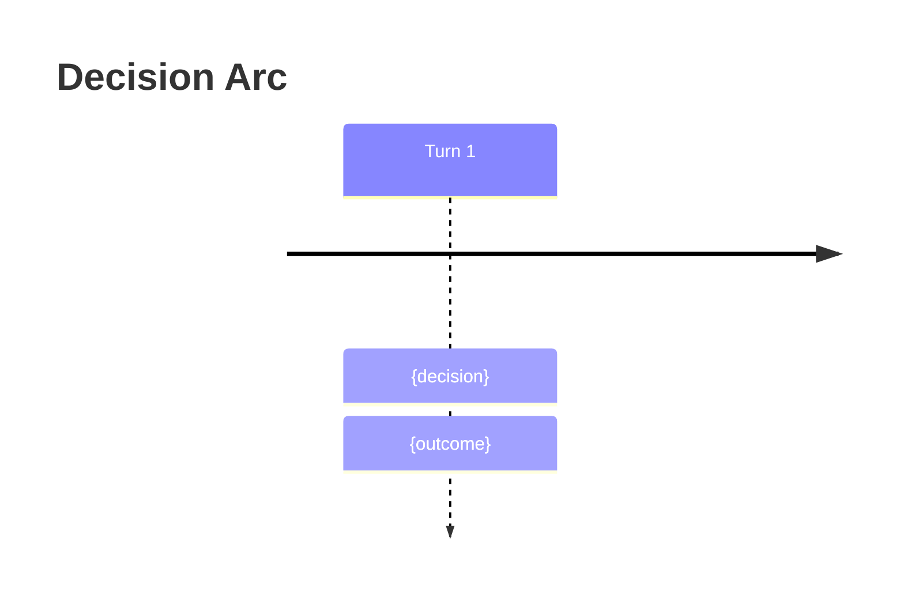

# Output Formats

Output templates using the Roguelike Layout pattern. Read when producing any wargame output.

## Classification Display

```
CLASSIFICATION
| Dimension                       | Score |
|---------------------------------|-------|
| Adversary / competing interests | {0-2} |
| Reversibility                   | {0-2} |
| Time pressure                   | {0-2} |
| Stakeholder count               | {0-2} |
| Information completeness        | {0-2} |
| **Total**                       | **{N}/10** |

Tier: {Clear | Complicated | Complex | Chaotic}
  0-3 Clear · 4-6 Complicated · 7-8 Complex · 9-10 Chaotic
Recommended mode: {Quick Analysis | Structured Analysis | Interactive Wargame}
> Proceed with {mode}, or specify a different mode?
```

## Quick Analysis Brief (Clear tier)

```
# Quick Analysis Brief
**Decision:** {restatement}
## Key Assumptions
- {assumption — and how it could be wrong}
## Frameworks Applied (2-3)
1. **{Framework}** — {one-line finding}
## Analysis
{Narrative with Unicode decision tree where useful:}
  ┌─ {condition} → {outcome A}
  └─ {condition} → {outcome B}
## Recommendation
**Action:** {what to do}
- Confidence: `{High | Medium | Low}`
- Key assumption: {the one that matters most}
- Watch signal: {what would change this recommendation}
```

## Structured Analysis Brief (Complicated tier)

```
# Structured Analysis Brief
**Decision:** {restatement}
## Key Assumptions
- {assumption — vulnerability}
## Stakeholders
| Stakeholder | Interest | Power | Position |
|-------------|----------|-----------|----------|
| {name}      | {goal}   | High      | Supportive |
## Frameworks Applied (3-5, ACH matrix if applicable)
1. **{Framework}** — {finding}
2. **ACH Matrix**
   | Hypothesis | Evidence A | Evidence B | Evidence C |
   |------------|-----------|-----------|-----------|
   | H1         | ++        | -         | 0         |
## Options
| # | Option | Upside | Downside | Feasibility |
|---|--------|--------|----------|-------------|
| 1 | {opt}  | {pro}  | {con}    | `High`      |
## Ranking
1. **{Option}** — {rationale}
## Decision Triggers
- If {signal} → switch to {option}
## Pre-mortem
> It is 6 months later and this decision failed. Most likely reasons:
> 1. {failure mode}
```

## Wargame Turn Display (Complex/Chaotic tier)

The Roguelike Layout. Target 40-80 lines per turn.

```
# Turn {N} of {TOTAL} — {Phase Name}
`[████████░░░░░░░░] Turn {N}/{TOTAL}`
> **SITUATION BRIEF:** {narrative — what just happened,
> what pressures are mounting, what is ambiguous}
## Actor Status
| Actor | Resources | Stance | Last Action |
|-------|-----------|--------|-------------|
| **You** | `████░` 80% | —       | {move}   |
| **{B}** | `███░░` 60% | Hawk    | {action} |
| **{C}** | `██░░░` 40% | Neutral | {action} |
## This Turn's Actions
**{Actor B}** (Hawk): {what they did and why it matters}
**{Actor C}** (Neutral): {what they did}
## Your Decision
| # | Action | Domain | Risk | Expected Impact |
|---|--------|--------|------|-----------------|
| **A** | {option} | {domain} | Low    | {result} |
| **B** | {option} | {domain} | Medium | {result} |
| **C** | {option} | {domain} | High   | {result} |
> Choose A, B, or C — or describe a different action.
```

## Inject Display

```
┌──────────────────────────────────────┐
│ ⚡ INJECT — {event title}           │
│ {what happened — 2-3 sentences}      │
│ Dilemma: {A} vs {B}                  │
│ You have until Turn {N} to respond.  │
└──────────────────────────────────────┘
```

## Monte Carlo Results

Label as exploratory — illustrative, not predictive.

```
## Monte Carlo Summary (exploratory)
| Outcome     | Frequency | Key Driver       |
|-------------|-----------|------------------|
| {outcome A} | `42%`     | {differentiator} |
| {outcome B} | `35%`     | {differentiator} |
| {outcome C} | `23%`     | {differentiator} |
- Confidence interval: `{low}% – {high}%` for primary outcome
- Most sensitive variable: {what swings results most}
- **Caveat:** Heuristic estimates, not statistical simulations.
```

## AAR Display

```
# After-Action Review
## Decision Timeline
| Turn | Decision | Outcome | Surprise? |
|------|----------|---------|-----------|
| 1    | {choice} | {what happened} | — |
## What Worked
- {pattern} — Evidence: {from which turn}
## What Failed
- {pattern} — Evidence: {from which turn}
## Biases Detected
- **Human:** {anchoring, sunk cost, etc.} — seen at Turn {N}
- **LLM:** {false confidence, symmetry bias, etc.} — seen at Turn {N}
## Paths Not Taken
- Turn {N}: {rejected option} → likely would have {counterfactual}
## Transferable Insights
1. {principle extracted from this scenario}
## Decision Principles
- {reusable heuristic derived from this wargame}
```

Mermaid timeline for visual summary (include when exporting journal):



## Journal Entry Structure

```
# Wargame Journal — {date}
**Scenario:** {title}  **Tier:** {Complex | Chaotic}
**Status:** {In Progress | Complete}  **Turns:** {completed}/{total}
---
## Turn Log
{Each turn display in sequence}
## After-Action Review
{AAR display from above}
```

## Style Rules

- **Blockquotes** — narrative voice only (situation briefs, intelligence reports).
- **Tables** — structured comparisons (actors, options, outcomes).
- **Bold** — actor names in all contexts.
- **Inline code** — metrics, probabilities, resource levels.
- **Turn length** — 40-80 lines per turn display for scannability.
