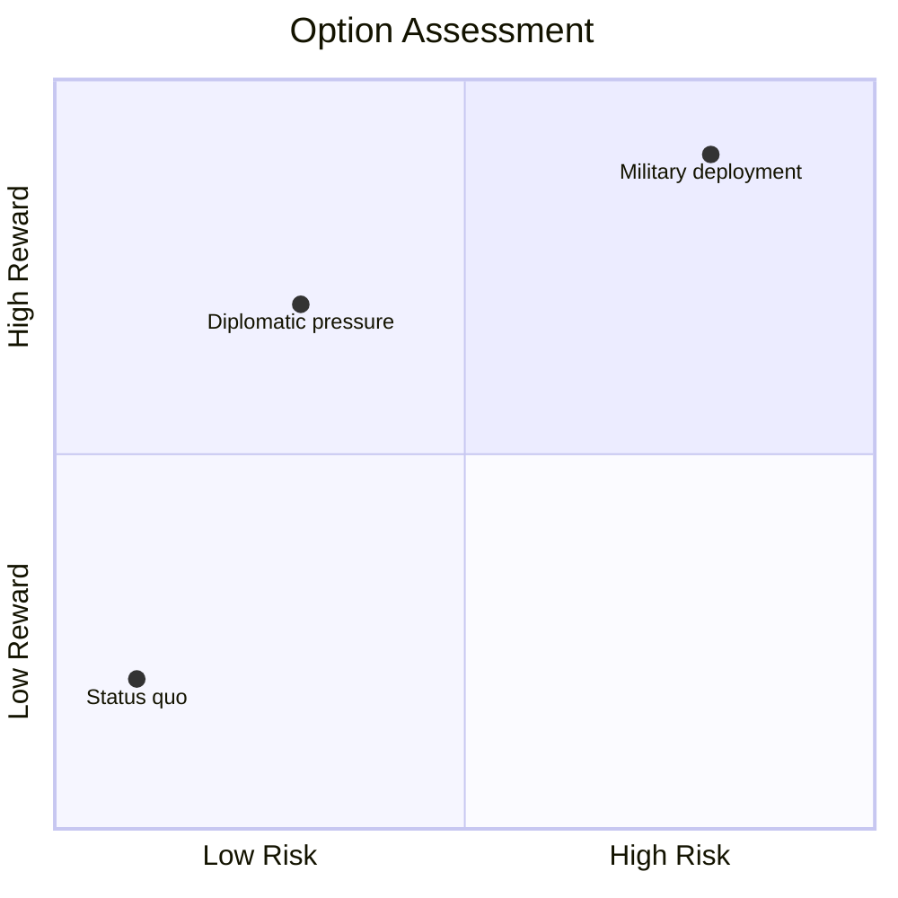
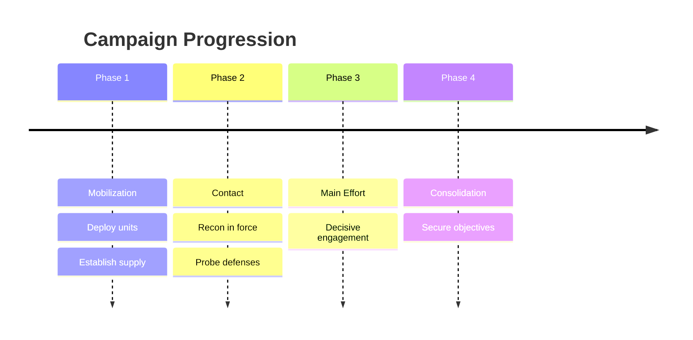

# Visualizations

Three-tier system. Select the highest available tier.

## Tier 1 — Unicode (Zero Dependencies)

Render directly in code blocks. No tools required.

- **Decision tree:** `╭─CHOICE─╮ → ┌─OPT A─┐ ┌─OPT B─┐` with risk/gain per branch
- **2x2 matrix** (SWOT, priority): `┌──────┬──────┐ / ├──────┼──────┤ / └──────┴──────┘`
- **Force map:** `SUPPORT ◄────► OPPOSE` with `████`/`░░░░` bar weights per stakeholder
- **Timeline:** `T1 ──●── T2 ──●── T3` with event labels below each node
- **Resource bars:** `Military: ▓▓▓▓▓▓▓▓░░ 80%` — one line per dimension
- **Actor table** with bar indicators:

```
| Actor    | Mil  | Econ | Pol  | Morale | Posture   |
|----------|------|------|------|--------|-----------|
| Blue     | ████░| ███░░| ████░| ▓▓▓▓░  | Offensive |
| Red      | ███░░| ██░░░| ███░░| ▓▓░░░  | Defensive |
```

## Tier 2 — Diagrams (Auto-detect Tools)

Check availability with `command -v mmdc` and `command -v dot`.

```bash
mmdc -i /tmp/wargame.mmd -o /tmp/wargame.svg && open /tmp/wargame.svg
dot -Tsvg /tmp/wargame.dot -o /tmp/wargame.svg && open /tmp/wargame.svg
```

## Tier 3 — Rich Rendering (Playwright MCP)

Generate a dark-theme (`#0f172a` background) responsive HTML dashboard to
`/tmp/wargame-dashboard-{turn}.html` with: scenario header, metric cards per actor
(name, resource %, progress bar), decision history timeline with current turn
highlighted. All CSS inline. Then:

```
mcp__playwright__browser_navigate(url: "file:///tmp/wargame-dashboard-{turn}.html")
mcp__playwright__browser_take_screenshot(fullPage: true)
```

Only generate when user explicitly requests a dashboard.

## Mermaid Recipes

### Option Assessment (Quadrant Chart)



### Campaign Phases (Timeline)



## When to Generate Each Type

| Trigger | Visualization | Tier | Destination |
|---------|--------------|------|-------------|
| Every turn | Actor status table + resource bars | 1 | Terminal |
| Key decision point | Quadrant chart | 2 | Journal `.mmd` |
| Actor interaction | Sequence diagram | 2 | Journal `.mmd` |
| State change | State diagram | 2 | Journal `.mmd` |
| Post-game AAR | Timeline + decision tree | 2 | Journal `.mmd` |
| On request | HTML dashboard via Playwright | 3 | Screenshot to terminal |
