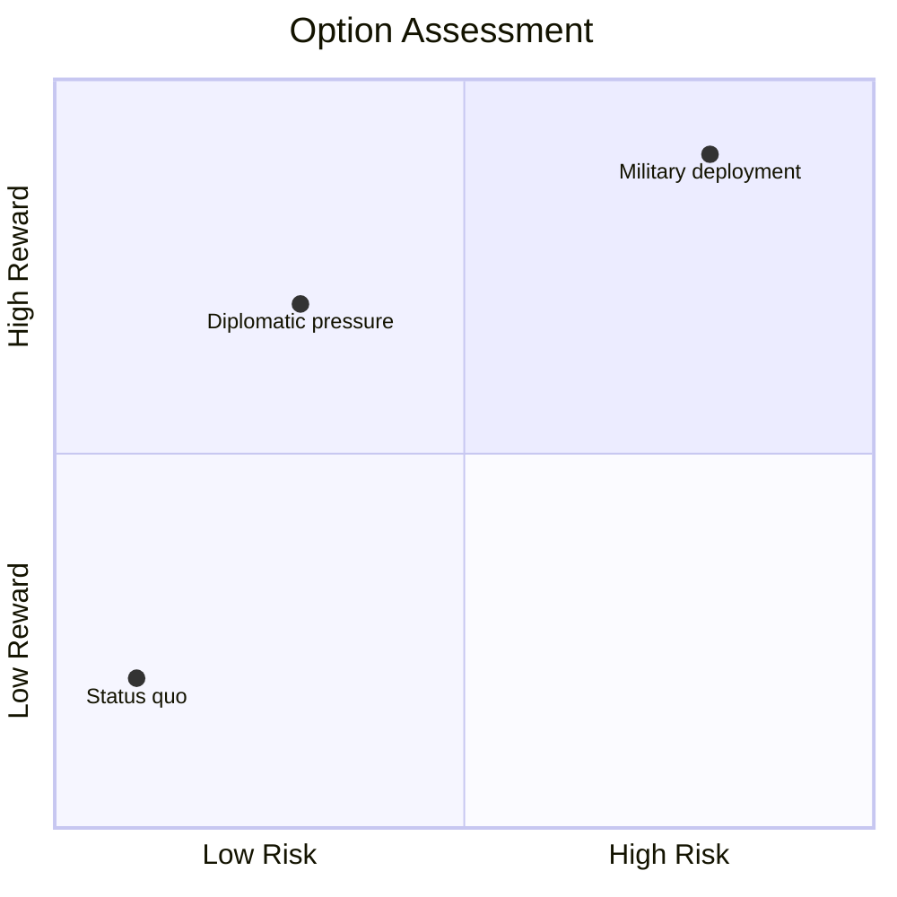
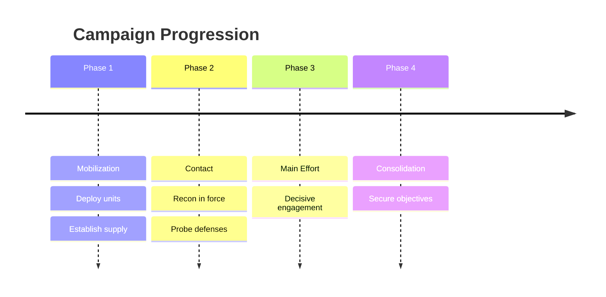
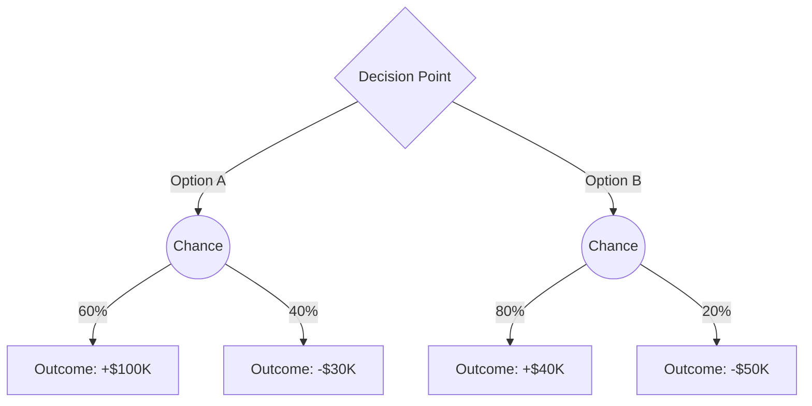
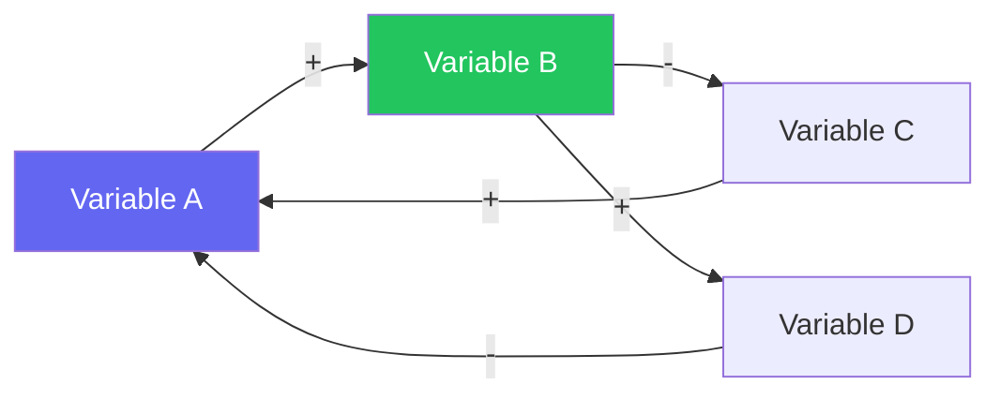

# Visualizations

Three-tier system. Select the highest available tier.

## Design Principles

Anti-slop stance. Dashboards and visualizations must be functional, not decorative.

- **No purple gradients** — Use the token palette (`--ok`, `--warn`, `--bad`, `--accent`). Never add gradients for aesthetics alone.
- **system-ui fonts only** — `system-ui, -apple-system, sans-serif` for body, `ui-monospace` for data. No custom font loads.
- **Functional color** — Every color encodes meaning (tier, severity, trend direction). Decorative color is removed.
- **Information density** — Maximize data-to-ink ratio. Prefer tables and bars over charts that waste space. One number with context beats a fancy visualization.
- **Progressive disclosure** — Show summary by default, detail on interaction (`<details>`, popovers). Never dump all data at once.
- **Accessibility first** — Text labels accompany all color coding. Resource bars show both `▓▓▓░░` AND `60%`. Semantic HTML (`role`, `aria-label`).

## Tier 1 — Unicode (Zero Dependencies)

Render directly in code blocks. No tools required.

- **Decision tree:** `╭─CHOICE─╮ → ┌─OPT A─┐ ┌─OPT B─┐` with risk/gain per branch
- **2x2 matrix** (SWOT, priority): `┌──────┬──────┐ / ├──────┼──────┤ / └──────┴──────┘`
- **Force map:** `SUPPORT ◄────► OPPOSE` with `████`/`░░░░` bar weights per stakeholder
- **Timeline:** `T1 ──●── T2 ──●── T3` with event labels below each node
- **Resource bars:** `Military: ▓▓▓▓▓▓▓▓░░ 80%` — one line per dimension
- **Actor table** with bar indicators:

```
| Actor    | Mil  | Econ | Pol  | Morale | Posture   |
|----------|------|------|------|--------|-----------|
| Blue     | ████░| ███░░| ████░| ▓▓▓▓░  | Offensive |
| Red      | ███░░| ██░░░| ███░░| ▓▓░░░  | Defensive |
```

## Tier 2 — Diagrams (Auto-detect Tools)

Check availability with `command -v mmdc` and `command -v dot`.

```bash
mmdc -i /tmp/wargame.mmd -o /tmp/wargame.svg && open /tmp/wargame.svg
dot -Tsvg /tmp/wargame.dot -o /tmp/wargame.svg && open /tmp/wargame.svg
```

## Tier 3 — Rich Rendering (Playwright MCP)

Generate a dark-theme (`#0f172a` background) responsive HTML dashboard to
`/tmp/wargame-dashboard-{turn}.html` with: scenario header, metric cards per actor
(name, resource %, progress bar), decision history timeline with current turn
highlighted. All CSS inline. Then:

```
mcp__playwright__browser_navigate(url: "file:///tmp/wargame-dashboard-{turn}.html")
mcp__playwright__browser_take_screenshot(fullPage: true)
```

Only generate when user explicitly requests a dashboard.

## Tier 3b — Composable HTML Template

Single-file template at `templates/dashboard.html` supporting multiple views via the `view` property in the JSON data block.

| View | Sections Rendered | When to Generate |
|------|-------------------|------------------|
| `classification` | Score bars, tier badge, reasoning | After classification (on `export`) |
| `turn` | Actors, options, inject, situation brief | Each wargame turn (on `export`) |
| `analysis` | Grid (ACH/matrix/stakeholder subview) | Structured Analysis (on `export`) |
| `aar` | Timeline, insights, paths not taken, action bridge | After AAR (on `export`) |
| Compound: `classification aar` | Full summary | `export` / `dashboard` command |

The LLM writes only the JSON data block inside `<script id="data" type="application/json">`. The template's JS renders it deterministically. This eliminates fragile HTML token substitution.

### JSON-in-Script Rendering Pattern

```html
<!-- LLM generates this file by: -->
<!-- 1. Copy templates/dashboard.html -->
<!-- 2. Replace the JSON block inside <script id="data"> with scenario data -->
<!-- 3. Save to /tmp/wargame-dashboard-{turn}.html -->
<!-- Template JS handles all rendering from the data object -->
<!-- Self-validating: malformed JSON → <pre> fallback with error message -->
```

See `templates/dashboard.html` for the full data contract and supported view configurations.

### JSON Data Contract

When generating dashboard JSON, reference `references/dashboard-schema.md` for the full data contract. Do not read the HTML/CSS/JS in the template — the schema file documents every field per view type.

### Cross-Platform Rendering Flow

1. **Playwright available** (`mcp__playwright__browser_navigate`): Navigate to file URL → screenshot → display in terminal
2. **Browser available** (`open` / `xdg-open` / `wslview`): Open file URL in default browser
3. **Neither available**: Fall back to Tier 1 Unicode rendering (always works)

Detect capability at export time. Prefer Playwright for consistent screenshots; fall back gracefully.

## Mermaid Recipes

### Option Assessment (Quadrant Chart)



### Campaign Phases (Timeline)



### Decision Tree (Flowchart)



### Causal Diagram



Use `+` for reinforcing links, `-` for dampening links. Highlight intervention points with accent colors.

## When to Generate Each Type

| Trigger | Visualization | Tier | Destination |
|---------|--------------|------|-------------|
| Every turn | Actor status table + resource bars | 1 | Terminal |
| Key decision point | Quadrant chart | 2 | Journal `.mmd` |
| Actor interaction | Sequence diagram | 2 | Journal `.mmd` |
| State change | State diagram | 2 | Journal `.mmd` |
| Post-game AAR | Timeline + decision tree | 2 | Journal `.mmd` |
| On request | HTML dashboard via Playwright | 3 | Screenshot to terminal |
| `export` / `dashboard` command | Composable HTML dashboard | 3b | `/tmp/wargame-dashboard-{turn}.html` |
| Decision tree branching | Flowchart (decision tree) | 2 | Journal `.mmd` |
| Causal analysis | Causal diagram | 2 | Journal `.mmd` |
